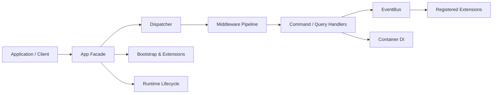
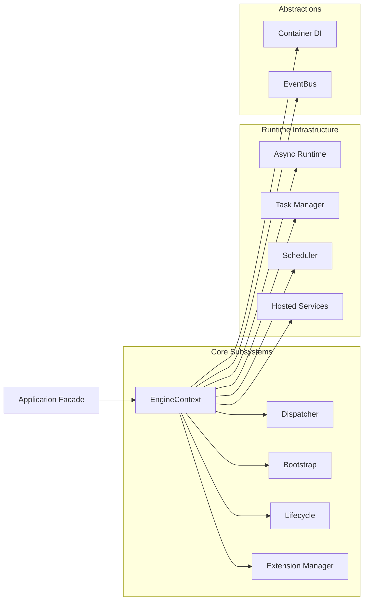
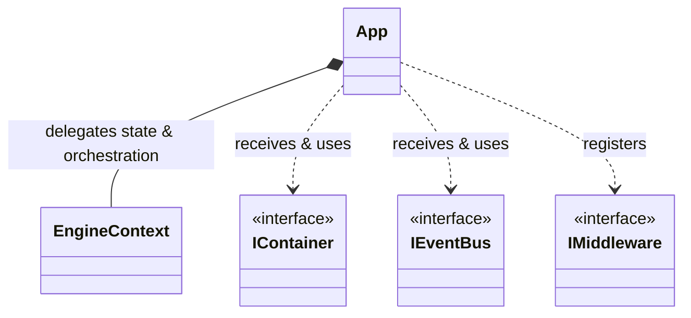
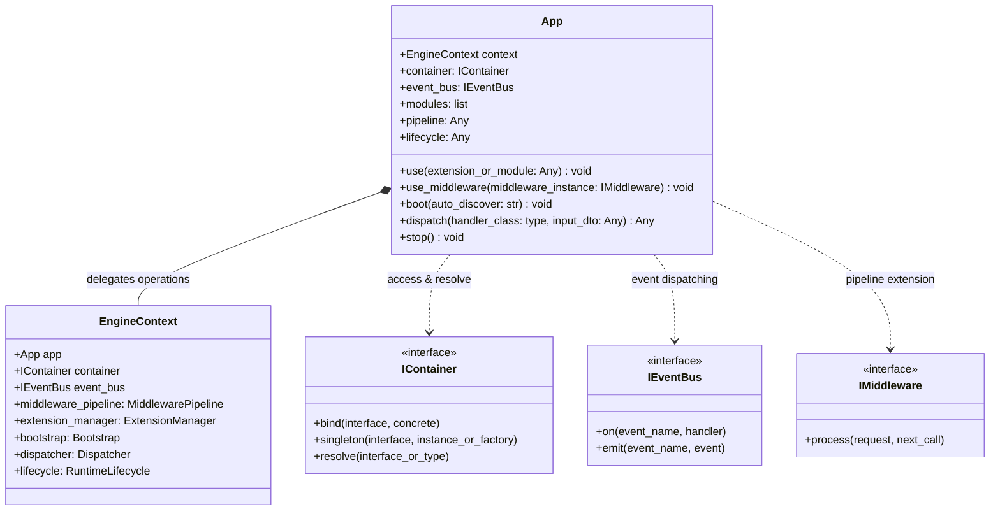

# Architecture Design

AI cần hiểu project trước khi code.

## Architecture Overview Diagram

## Extension Model

Extensions act as plugins that hook into the Engine's lifecycle (`initialize`, `start`, `stop`, `dispose`).
They can register background daemon threads (e.g., `WebsocketBroadcaster` in `AuditExtension`) and listen to the `EventBus` to stream telemetry or intercept commands asynchronously without blocking the main engine thread.

## Tool Dashboard Architecture (PySide6)

Tools built around the engine (like `audit_dashboard`) strictly follow Clean Architecture:

- **Domain**: Core UI models and interfaces (`IConnector`).
- **Application**: Use Cases (`ReceiveAuditUseCase`) orchestrating data flow.
- **Infrastructure**: Concrete adapters (`WebsocketConnector`) communicating with the engine.
- **Presentation**: PySide6 Widgets (`MainWindow`) reacting to state updates via Qt Signals.

## EngineContext Subsystem Composition

## Class Diagrams (`App` Facade)

### High-Level Class Dependency Diagram

### Detailed Class Diagram

