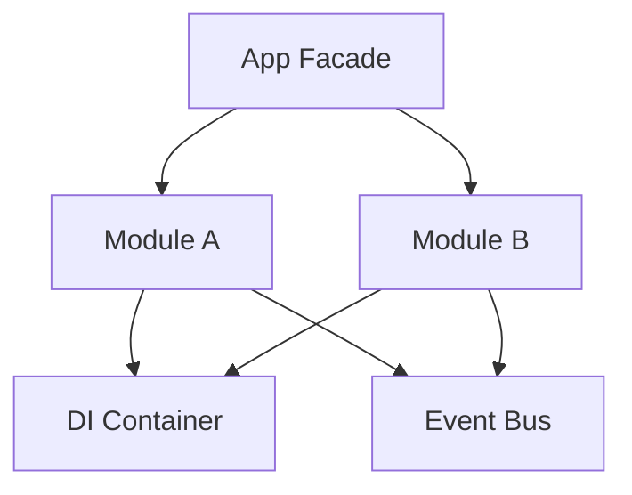

# Modules & Submodules Definition

## Subsystem Architecture

Modules in Sagittarius Engine are independent organizational units (like plugins) that encapsulate controllers, services, repositories, and domain logic.

## Module Lifecycle (`IModule`)

Every module implements `sagittarius_engine.interfaces.IModule` and follows this lifecycle:

1. **`register(app: App) -> None`**: 
   Called first. Used to register components (services, repositories, command handlers) into the Dependency Injection (DI) Container.
2. **`boot(app: App) -> None`**: 
   Called after all modules are registered. Used to initialize connections, register event listeners to the `EventBus`, or start background tasks.

## Submodule Map Example (from `student_management`)
* **Module**: `StudentModule`
* **Purpose**: Encapsulates all logic for adding, searching, and generating reports for Students.
* **Dependencies**: Needs `IEventBus` and `ITaskManager` (resolved via DI).
* **Public API**: `IAddStudentUseCase`, `IGenerateReportUseCase`, etc.
* **Owner**: `examples/student_management`
