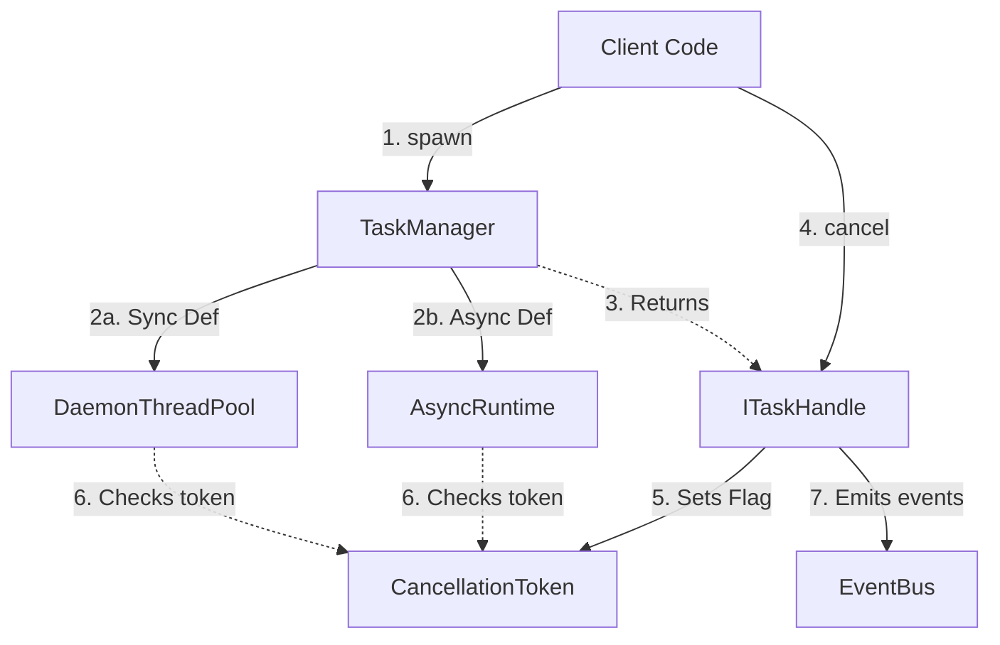

# Task Manager (Runtime Tasks)

The `TaskManager` module in the Sagittarius Engine is a unified, robust runtime subsystem responsible for spawning, tracking, and coordinating background execution (both synchronous threads and asynchronous coroutines).

---

## 1. Overview

In Clean Architecture, background processing is often a complex infrastructure concern that pollutes domain logic if not properly abstracted. The `TaskManager` solves this by providing the `ITaskManager` port. High-level modules (like Hosted Services or Use Cases) can rely on `ITaskManager` to spawn background workloads, track their progress, and cooperatively cancel them, without worrying about thread pools or asyncio event loops.

The `TaskManager` is deeply integrated with the `EventBus`, automatically emitting telemetry events (`TaskStarted`, `TaskCompleted`, `TaskFailed`, `TaskProgressUpdated`) which are essential for the Engine's `AuditExtension`.

---

## 2. How it works



- **Daemon Executors**: The `TaskManager` utilizes a custom `DaemonThreadPoolExecutor`. Unlike the standard `ThreadPoolExecutor`, this custom executor explicitly marks worker threads as daemon threads. This guarantees that if the main application thread crashes or exits, background tasks will not artificially keep the process alive indefinitely.
- **Unified Spawning**: The `.spawn()` method accepts either a standard `def` callable or an `async def` coroutine. It intelligently detects the type and schedules it appropriately (using the thread pool for sync, or `AsyncRuntime` for async).
- **Cooperative Cancellation**: When `.cancel()` is called on a Task Handle, it does *not* forcefully kill the underlying OS thread (which is unsafe in Python). Instead, it sets a boolean flag inside a `CancellationToken`. The background worker must periodically check `token.is_cancelled` to cleanly exit.
- **Event-Driven Lifecycle**: Every state transition of a `BackgroundTask` emits a corresponding `BaseEvent` over the engine's `EventBus`.

---

## 3. Components & API

### Core Interfaces
- **`ITaskManager`**: The core manager.
  - `spawn(callable, name=None, token=None) -> ITaskHandle`: Spawns a background worker.
- **`ITaskHandle`**: The strongly-typed reference to a spawned task. Provides IDE auto-completion for checking state.
  - `.status`: Returns the current `TaskState` ('pending', 'running', 'completed', 'failed', 'cancelled').
  - `.progress`: A float from `0.0` to `100.0`.
  - `.cancel()`: Triggers the cancellation token.
- **`CancellationToken`**: An object passed into workers allowing them to detect cancellation requests (`.is_cancelled`).

### Concrete Implementations
- **`TaskManager`**: The concrete infrastructure implementation of `ITaskManager` that lives inside the `EngineContext`.
- **`BackgroundTask`**: The concrete class implementing `ITaskHandle`. Wraps `concurrent.futures.Future`.
- **`DaemonThreadPoolExecutor`**: A customized thread pool for safe daemonized thread creation.

---

## 4. Usage Guide

### Spawning a Simple Task
You can spawn a task from any component that has access to the `IEngineContext`:

```python
def my_background_worker():
    print("Doing heavy work...")
    time.sleep(5)
    print("Done!")

def some_use_case(context: IEngineContext):
    handle = context.tasks.spawn(my_background_worker, name="HeavyWorkTask")
    print(f"Task spawned with ID: {handle.id}")
```

### Advanced Usage: Cancellation and Progress Tracking
If your worker function accepts a parameter named `token` or `on_progress_update`, the `TaskManager` will automatically inject them:

```python
from sagittarius_engine.runtime.tasks.cancellation_token import CancellationToken
from typing import Callable

def data_processing_worker(token: CancellationToken, on_progress_update: Callable[[float, str], None]):
    total_items = 100
    for i in range(total_items):
        # 1. Cooperative Cancellation Check
        if token.is_cancelled:
            print("Cancellation requested! Exiting gracefully...")
            return

        # Do work
        time.sleep(0.1) 
        
        # 2. Report Progress
        progress = ((i + 1) / total_items) * 100
        on_progress_update(progress, f"Processed item {i}")

def some_controller(context: IEngineContext):
    # Spawn the task
    handle = context.tasks.spawn(data_processing_worker, name="DataProcessor")
    
    # Check progress later
    print(f"Current progress: {handle.progress}%")
    
    # Cancel if it takes too long
    handle.cancel()
```

---

## 5. Common Misconceptions

### ❌ Misconception 1: Calling `handle.cancel()` forcefully kills the background thread immediately.
✅ **Truth**: Python does not allow forcefully killing threads safely (as it can leave locks acquired or data corrupted). `.cancel()` merely signals a `CancellationToken`. The background function *must* periodically check `token.is_cancelled` and explicitly `return` to terminate successfully. If the worker is stuck in an infinite `while True` loop and never checks the token, it will run forever.

### ❌ Misconception 2: Uncaught exceptions inside a background task will crash the entire Engine.
✅ **Truth**: The `TaskManager` intercepts all exceptions raised inside the worker function. The application will not crash. Instead, the `TaskManager` will store the exception in `handle.error`, change `handle.status` to `TaskState.FAILED`, and broadcast a `TaskFailed` event over the `EventBus` so monitors (like the Audit Dashboard) can log it.

### ❌ Misconception 3: You have to manually pass the `CancellationToken` in the `args` when calling `.spawn()`.
✅ **Truth**: You don't. The `TaskManager` uses Python's `inspect` module to dynamically read the signature of your target function. If your function requires arguments named `token` or `on_progress_update`, the engine injects them automatically behind the scenes. Just define them in your function signature!
