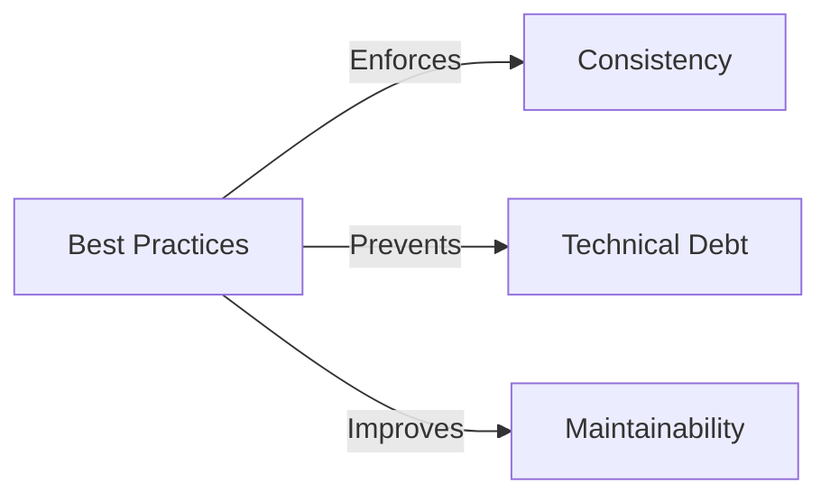

> Applies to Sagittarius Engine v1.x

# Best Practices

## Overview

This guide collects recommended conventions and patterns for building large, maintainable applications with Sagittarius Engine. Adhering to these best practices ensures that your codebase remains scalable, predictable, and easy to navigate for other developers.

## Why

Consistent architecture is the foundation of long-term maintainability. Following established patterns prevents technical debt, reduces lifecycle bugs, and ensures optimal performance.

## When to Use

Use these practices when:
- Designing the architecture for a new Sagittarius application.
- Refactoring an existing monolithic codebase into modular extensions.
- Conducting code reviews.

## When NOT to Use

Do NOT strictly adhere to these practices if:
- You are writing a quick, throw-away script or prototype where architectural purity impedes rapid discovery.

## Architecture



## How it Works

Best practices are not enforced by the compiler; they are architectural rules applied by the development team. 

## Examples

### Structuring an Extension

```python
from sagittarius_engine import IExtension, ExtensionDescriptor, EngineContext
# Use clean, separate domain logic rather than inline implementation
from my_app.domain.services import MyDomainService

class CleanExtension(IExtension):
    @property
    def descriptor(self) -> ExtensionDescriptor:
        return ExtensionDescriptor(name="CleanExample")

    def register(self, context: EngineContext) -> None:
        # Register the domain service, keeping framework code thin
        pass

    def boot(self, context: EngineContext) -> None:
        pass

    def shutdown(self, context: EngineContext) -> None:
        pass
```

## Design Trade-offs

*Why favor convention over configuration?*

Sagittarius Engine relies heavily on conventions (e.g., standard lifecycle hooks, explicit extension dependencies) rather than magic decorators or auto-discovery. While this requires slightly more boilerplate upfront, the trade-off is massive gains in traceability and debugging speed for large applications.

## Best Practices

### Application Structure

| DO | DON'T |
|----|-------|
| Group code by feature or domain (e.g., `users/`, `billing/`). | Group code entirely by technical layer (e.g., all controllers in one folder). |
| Keep the entry point (`main.py`) minimal. | Put heavy initialization logic directly in the global scope. |

### Extensions

| DO | DON'T |
|----|-------|
| Create extensions for distinct logical boundaries. | Create a single "God Extension" that registers everything. |
| Use `optional_dependencies` for loose coupling. | Create circular dependencies between extensions. |

### Dependency Injection

| DO | DON'T |
|----|-------|
| Prefer Constructor Injection for all domain services. | Use global state or singletons manually outside the container. |
| Depend on abstractions/interfaces. | Depend on concrete database implementations. |

### Dispatcher (CQRS)

| DO | DON'T |
|----|-------|
| Separate Commands (mutate state) from Queries (read state). | Put complex side-effects into Queries. |
| Keep Handlers focused on a single Use Case. | Call a Command Handler directly from another Command Handler. |

### Events

| DO | DON'T |
|----|-------|
| Use events for cross-domain notifications. | Use events for required, sequential workflows where return values are needed. |

### Hosted Services

| DO | DON'T |
|----|-------|
| Return from `start()` quickly to avoid blocking the engine boot. | Put an infinite `while True:` loop directly inside `start()`. |
| Respect the `CancellationToken` inside background loops. | Ignore the token and rely on forceful process termination. |

### TaskManager & Scheduler

| DO | DON'T |
|----|-------|
| Ensure scheduled jobs are stateless. | Assume a scheduled job will never overlap with itself. |
| Offload slow IO to the TaskManager. | Block the main thread with `time.sleep()`. |

### Async Runtime

| DO | DON'T |
|----|-------|
| Await coroutines efficiently. | Block the async event loop with heavy CPU calculations. |

### Shutdown

| DO | DON'T |
|----|-------|
| Always call `app.stop()` in a `finally` block or context manager. | Leave background threads running as orphans. |

### Testing

| DO | DON'T |
|----|-------|
| Test domain logic independently of the Engine. | Boot the entire engine for every simple unit test. |
| Use the provided test fixtures for integration tests. | Mock the Engine internals unnecessarily. |

## Anti-Patterns

### Global State Leakage
```python
# ❌ Never do this
global_context = None

class BadExtension(IExtension):
    def boot(self, context):
        global global_context
        global_context = context
```
*Why it is discouraged:* It breaks isolation, makes unit testing impossible, and defeats the purpose of Dependency Injection.

## Common Mistakes

- **Ignoring the DI Container**: Instantiating classes manually with `Service()` instead of letting the container resolve dependencies. This breaks middleware and interceptors.

## Troubleshooting

If your architecture feels tangled, see the [Troubleshooting](troubleshooting.md) guide for help resolving dependency graphs and lifecycle issues.

## Related Guides

- [Architecture](architecture.md)
- [Performance](performance.md)

## Related API Reference

- *(None)*

## See Also

- [Concepts: Dependency Injection](../concepts/dependency_injection.md)

> [Found an issue? Edit this page on GitHub.](#)
