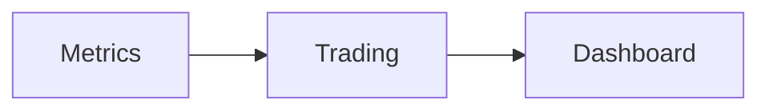

> Applies to Sagittarius Engine v1.x

# Extension Dependencies

This is an advanced topic. Before reading this, make sure you are familiar with [Your First Extension](../getting-started/first_extension.md).

---

## What is an Extension Dependency?

Extensions can declare that they depend on other extensions. The engine uses this information to:

- Start dependencies **before** the extension that requires them
- Stop the extension **before** its dependencies during shutdown
- Detect and reject **circular dependencies** at boot time

This allows complex plugin systems to self-organize without manual ordering.

---

## Declaring Dependencies

Use `ExtensionDescriptor` to declare dependencies:

```python
from sagittarius_engine import IExtension, ExtensionDescriptor, EngineContext


class MetricsExtension(IExtension):

    @property
    def descriptor(self) -> ExtensionDescriptor:
        return ExtensionDescriptor(name="Metrics")

    def register(self, context: EngineContext) -> None:
        pass

    def boot(self, context: EngineContext) -> None:
        print("Metrics started")

    def shutdown(self, context: EngineContext) -> None:
        print("Metrics stopped")


class TradingExtension(IExtension):

    @property
    def descriptor(self) -> ExtensionDescriptor:
        return ExtensionDescriptor(
            name="Trading",
            dependencies=["Metrics"],  # Metrics must start first
        )

    def register(self, context: EngineContext) -> None:
        pass

    def boot(self, context: EngineContext) -> None:
        print("Trading started")

    def shutdown(self, context: EngineContext) -> None:
        print("Trading stopped")
```

---

## Topological Sort

When `app.boot()` is called, the engine builds a dependency graph and sorts extensions using topological ordering:



Given this graph, the boot order will always be:

1. `Metrics`
2. `Trading`
3. `Dashboard`

Regardless of the order in which `app.use()` was called.

---

## Priority

When two extensions have no dependency relationship, `priority` breaks the tie:

```python
ExtensionDescriptor(name="Analytics", priority=10)  # starts earlier
ExtensionDescriptor(name="Reporting", priority=5)   # starts later
```

Higher priority value = earlier start.

---

## Optional Dependencies

Declare `optional_dependencies` for extensions that may or may not be present:

```python
ExtensionDescriptor(
    name="Dashboard",
    dependencies=["Trading"],
    optional_dependencies=["Analytics"],
)
```

If `Analytics` is not registered, the engine ignores it. If it is registered, it will start before `Dashboard`.

---

## Rollback on Failure

If any extension fails during `boot()`, the engine automatically stops and disposes all previously started extensions in reverse order.

---

## Common Mistakes

**Declaring a dependency that is never registered**
This will raise an error at boot time. Use `optional_dependencies` for conditional integrations.

**Circular dependency**
```
A depends on B
B depends on A
```
The engine detects this cycle and raises an error at boot time.

---

> [Found an issue? Edit this page on GitHub.](https://github.com/your-repo/edit/main/docs/advanced/extension_dependencies.md)
