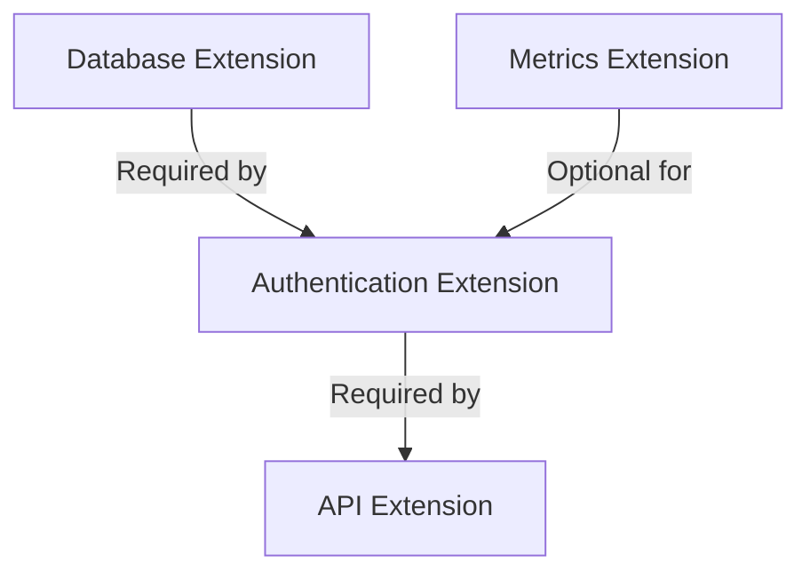

> Applies to Sagittarius Engine v1.x

# Extension Dependencies

## Overview

Extensions are the building blocks of a Sagittarius Engine application. In medium-to-large applications, extensions rarely operate in isolation. They form a complex dependency graph. The Engine's Kernel automatically resolves this graph using topological sorting to ensure extensions start and stop in a safe, deterministic order.

## Why

As an application grows, manually orchestrating the initialization sequence of databases, message brokers, caching layers, and HTTP servers becomes fragile. A single ordering mistake can cause startup crashes or partial data corruption during shutdown. Extension dependencies offload the responsibility of deterministic ordering from the developer to the engine.

## When to Use

Use extension dependencies when:
- Extension B relies on the services provided by Extension A.
- Extension B needs Extension A to be fully started before Extension B can begin its own background tasks.

## When NOT to Use

Do NOT use extension dependencies when:
- Two extensions only communicate asynchronously via the Event Bus and do not care which one starts first.

## Architecture



## How it Works

When `app.boot()` is called, the Kernel performs the following steps:
1. **Graph Construction**: Reads the `dependencies` and `optional_dependencies` from every registered `ExtensionDescriptor`.
2. **Cycle Detection**: Verifies that no circular dependencies exist.
3. **Topological Sort**: Sorts the extensions so that every dependency is placed before the extension that requires it.
4. **Priority Resolution**: If two extensions have no dependency relationship, they are ordered based on their `priority` value (higher priority starts earlier).
5. **Startup Ordering**: Calls `register()` and `boot()` sequentially.
6. **Shutdown Ordering**: When `app.stop()` is called, `shutdown()` is executed in exact reverse topological order.

## Examples

### Declaring a Strict Dependency

```python
from sagittarius_engine import IExtension, ExtensionDescriptor, EngineContext

class AuthenticationExtension(IExtension):
    @property
    def descriptor(self) -> ExtensionDescriptor:
        return ExtensionDescriptor(
            name="Authentication",
            dependencies=["Database"] # Database must start first
        )

    def register(self, context: EngineContext) -> None:
        pass

    def boot(self, context: EngineContext) -> None:
        print("Auth Extension started.")

    def shutdown(self, context: EngineContext) -> None:
        print("Auth Extension stopped.")
```

## Design Trade-offs

*Why explicit string-based dependency declarations instead of type-based injection ordering?*

Sagittarius Engine requires extensions to declare dependencies via string names in the `ExtensionDescriptor` rather than inferring ordering from constructor injection.
This design allows the Kernel to build the entire dependency graph *before* instantiating any heavy services or resolving the container. It prevents the engine from getting stuck halfway through instantiation if a cycle exists, and allows for robust cycle-detection prior to execution.

## Best Practices

- **Use Optional Dependencies**: If your extension can integrate with another extension but does not strictly require it to function, use `optional_dependencies`. If the optional dependency is registered, it will start first. If it is missing, the engine will safely ignore it.
- **Isolate Domains**: Group closely related functionality into a single extension rather than creating dozens of micro-extensions that all depend on each other.
- **Fail Fast**: The engine's cycle detection occurs at boot time. Always run your integration tests after modifying extension dependencies.

## Anti-Patterns

### Circular Dependencies
Do not create architectural cycles.
```
AuthExtension depends on UserExtension
UserExtension depends on AuthExtension
```
*Why it is discouraged:* The Engine cannot resolve which extension should start first, leading to a `ModuleRegistrationError` at boot time. You must break the cycle by extracting the shared interface or using the Event Bus to decouple them.

## Common Mistakes

- **Depending on Unregistered Extensions**: Declaring a strict dependency in `dependencies` that is never passed to `app.use()`. The application will refuse to boot.
- **Assuming `app.use()` Order Matters**: Calling `app.use(B)` before `app.use(A)` does not force B to start before A. The topological graph dictates the absolute order.

## Related Guides

- [Application Lifecycle](../runtime/application_lifecycle.md)
- [Architecture](architecture.md)

## Related API Reference

- [ExtensionDescriptor](../api/extension.md)

## See Also

- [Concepts: Extensions](../concepts/extensions.md)
- [Concepts: Lifecycle](../concepts/lifecycle.md)

> [Found an issue? Edit this page on GitHub.](https://github.com/anhembedded/Sagittarius-Engine/edit/main/docs/advanced/extension_dependencies.md)
