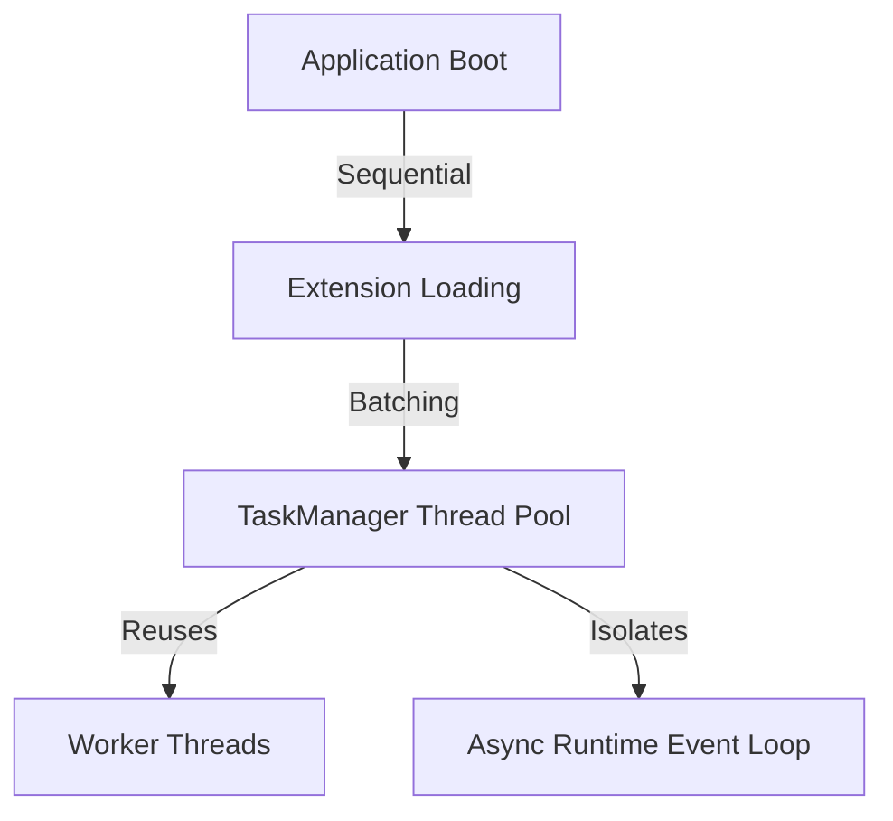

> Applies to Sagittarius Engine v1.x

# Performance

## Overview

Sagittarius Engine is designed to be lightweight, but as applications scale to handle thousands of requests, background jobs, or complex extension graphs, performance becomes a critical concern. This guide covers how to optimize startup speed, runtime execution, and memory management.

## Why

Understanding performance characteristics prevents resource exhaustion, ensures predictable execution times, and minimizes the cost of running large-scale Python applications.

## When to Use

Use this guide when:
- Your application boot time exceeds acceptable thresholds.
- Background tasks are blocking each other or causing latency spikes.
- You are scaling the application for production workloads.

## When NOT to Use

Do NOT use this guide:
- For premature optimization before you have profiled your application.
- To optimize raw mathematical computations (use C-extensions or specific math libraries instead).

## Architecture



## How it Works

### Startup Optimization
The Engine resolves the dependency graph and sequentially loads extensions. The `ExtensionDescriptor` evaluation must be instantaneous. Heavy initialization logic should be deferred to the `boot()` phase, or even better, executed asynchronously after the engine starts.

### Thread Reuse & Task Batching
The `TaskManager` utilizes a thread pool to avoid the expensive OS overhead of creating and destroying threads for every background job. When spawning multiple small jobs, task batching (grouping work into a single task) reduces context-switching overhead.

### Avoiding Blocking the Async Runtime
The `AsyncRuntime` runs a single event loop. If a coroutine executes CPU-bound blocking code, it freezes the entire event loop, destroying async performance. 

### Memory Ownership
Long-running applications must manage memory carefully. Hosted Services and background tasks must not accumulate unbounded state (e.g., growing lists or unclosed connections). The Engine guarantees that tasks completed by the `TaskManager` have their metadata cleaned up to prevent memory leaks.

## Examples

### Task Batching

```python
from sagittarius_engine import App
from sagittarius_engine.infrastructure.container.std_container import StdLibContainer
from sagittarius_engine.infrastructure.event_bus.memory_event_bus import MemoryEventBus

def process_batch(items):
    for item in items:
        # Process item
        pass
    print("Batch processed.")

def main():
    container = StdLibContainer()
    event_bus = MemoryEventBus()
    app = App(container, event_bus)
    app.boot()
    
    # Efficient: Spawn one task for a batch
    batch = list(range(1000))
    app.context.tasks.spawn(process_batch, items=batch)
    
    app.stop()
```

## Design Trade-offs

*Why a Thread Pool instead of Process Pool for TaskManager?*

Sagittarius uses a thread pool for its `TaskManager` to optimize for IO-bound work and lightweight background tasks while sharing the same memory space and DI container. While a Process Pool would bypass the Python GIL for pure CPU-bound work, the serialization cost (pickling arguments) and memory overhead of copying the engine state to new processes make it unsuitable for general-purpose runtime infrastructure. For heavy CPU workloads, developers are encouraged to use explicit multiprocess architecture rather than relying on the internal `TaskManager`.

## Best Practices

- **Defer Heavy Boot Logic**: If an extension connects to a slow external API, do not block `boot()`. Start a background task instead so the engine can finish starting.
- **Pre-allocate Thread Pools**: Configure the `TaskManager` thread pool size based on your expected IO concurrency to avoid thread exhaustion.
- **Yield Frequently**: In long-running background tasks, check the `CancellationToken` and yield control (if async) frequently.

## Anti-Patterns

### Blocking the Async Runtime
Running CPU-heavy synchronous code inside an `async def` function.
```python
import time
# ❌ Never do this
async def heavy_computation():
    time.sleep(5)  # Freezes the entire AsyncRuntime Event Loop!
```
*Why it is discouraged:* `time.sleep` blocks the OS thread. Because `asyncio` is single-threaded, no other async coroutines can execute until it finishes.

## Common Mistakes

- **Extension Loading Cost**: Performing complex I/O (like reading large files) inside the `register()` method instead of `boot()`.
- **Spawning Micro-tasks**: Spawning 10,000 separate tasks to add numbers instead of spawning 1 task to add 10,000 numbers.

## Troubleshooting

See the [Troubleshooting](troubleshooting.md) guide for resolving performance bottlenecks.

## Related Guides

- [Troubleshooting](troubleshooting.md)
- [Architecture](architecture.md)

## Related API Reference

- [TaskManager](../api/task_manager.md)

## See Also

- [Concepts: Runtime](../concepts/runtime.md)

> [Found an issue? Edit this page on GitHub.](#)
