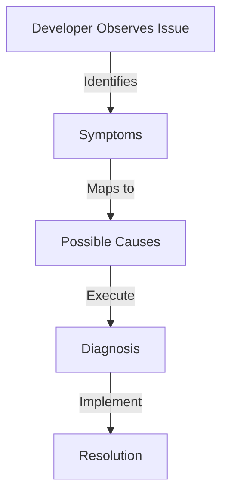

> Applies to Sagittarius Engine v1.x

# Troubleshooting

## Overview

This guide provides a structured approach to diagnosing and resolving the most common architectural and runtime issues developers encounter when building large applications with Sagittarius Engine.

## Why

Complex applications fail in complex ways. By formalizing troubleshooting steps for known failure modes, developers can reduce debugging time and prevent recurrent architectural mistakes.

## When to Use

Use this guide when:
- The application crashes during `app.boot()`.
- Background tasks or extensions exhibit unpredictable behavior.
- The application hangs during shutdown.

## When NOT to Use

Do NOT use this guide for:
- Debugging domain-specific logic errors in your custom extensions.
- Syntax errors or basic Python exceptions.

## Architecture

## How it Works

The Engine employs "Fail Fast" semantics during boot and cooperative cancellation during shutdown. Understanding these state transitions is key to troubleshooting.

## Examples

*(See the Troubleshooting sections below for concrete examples of issues and resolutions.)*

## Design Trade-offs

*Why Fail Fast instead of Degraded Mode?*

If a strictly required extension fails to boot, Sagittarius Engine immediately aborts the startup sequence and rolls back. This design ensures that the application never runs in a corrupted, half-initialized state. The trade-off is that transient infrastructure issues (like a brief database outage at boot) will cause the application process to exit, requiring the external process manager (like systemd or Kubernetes) to handle the restart policy.

## Best Practices

- Always ensure logging is properly configured. The Engine logs critical state transitions.
- Use explicit dependencies rather than relying on priority whenever possible.

## Anti-Patterns

### Ignoring the Root Cause
Restarting the application in a loop without diagnosing the dependency cycle or blocked thread that caused the initial failure.

## Common Mistakes

- Not checking logs for `ModuleRegistrationError` when an extension fails to load.

## Troubleshooting

### Issue 1: Application Won't Boot

**Symptoms**
- The application exits immediately with a `ModuleRegistrationError` or `DependencyResolutionError`.
- Logs indicate the boot sequence aborted.

**Possible Causes**
- An extension declared a dependency that is not registered in the `App`.
- Circular dependencies exist between extensions.
- The DI container cannot resolve a required constructor argument.

**Diagnosis**
- Inspect the stack trace for the specific extension that triggered the fault.
- Review the `dependencies` list in the `ExtensionDescriptor`.

**Resolution**
- Ensure all required dependencies are passed to `app.use()`.
- If a cycle exists, extract shared interfaces or use the Event Bus to decouple them.

**Prevention**
- Use `optional_dependencies` if the extension is not strictly required.
- Add integration tests that boot the entire application in a CI pipeline.

**Related Guides**
- [Extension Dependencies](extension_dependencies.md)

---

### Issue 2: Hosted Service Not Stopping

**Symptoms**
- Calling `app.stop()` hangs indefinitely.
- The process must be killed with SIGKILL (e.g., `kill -9`).

**Possible Causes**
- A `HostedService` has a `while True:` loop inside `start()` that ignores the `CancellationToken`.
- A background thread is blocked on synchronous IO (like a socket read) without a timeout.

**Diagnosis**
- Run a thread dump or attach a debugger to see which thread is stuck.
- Check the implementation of the `stop()` method in your Hosted Services.

**Resolution**
- Modify the loop to check `token.is_cancellation_requested`.
- Implement timeouts for all blocking IO operations.

**Prevention**
- Always pass and respect the `CancellationToken`.

**Related Guides**
- [Cancellation Token](../runtime/cancellation_token.md)
- [Hosted Services](../runtime/hosted_services.md)

---

### Issue 3: Async Deadlocks

**Symptoms**
- The `AsyncRuntime` stops processing coroutines.
- Async operations hang indefinitely.

**Possible Causes**
- A coroutine executed blocking synchronous code (e.g., `time.sleep()`).
- Using `asyncio.run()` manually from within an already running event loop.

**Diagnosis**
- Inspect the coroutines submitted to the AsyncRuntime. Look for blocking network calls from standard libraries like `requests`.

**Resolution**
- Replace synchronous blocking calls with their asynchronous equivalents (e.g., `aiohttp` instead of `requests`).
- Offload unavoidable blocking code to the `TaskManager` thread pool.

**Prevention**
- Treat the `AsyncRuntime` event loop as a single shared resource. Never block it.

**Related Guides**
- [Async Runtime](../runtime/async_runtime.md)

---

### Issue 4: Background Task Leaks

**Symptoms**
- Memory usage grows unbounded over time.
- The `TaskManager` thread pool runs out of available workers.

**Possible Causes**
- Fire-and-forget tasks are executing infinite loops.
- Tasks are capturing large objects in closures and not releasing them.

**Diagnosis**
- Monitor thread counts. If the active thread count matches the pool limit continuously, tasks are not returning.

**Resolution**
- Ensure background functions return cleanly.
- Catch all exceptions within tasks to ensure they terminate gracefully.

**Prevention**
- Use short-lived, focused tasks for the `TaskManager`. Use `HostedServices` for continuous loops.

**Related Guides**
- [Task Manager](../runtime/task_manager.md)

## Related Guides

- [Performance](performance.md)
- [Best Practices](best_practices.md)

## Related API Reference

- *(None)*

## See Also

- [Concepts: Lifecycle](../concepts/lifecycle.md)

> [Found an issue? Edit this page on GitHub.](https://github.com/anhembedded/Sagittarius-Engine/edit/main/docs/advanced/troubleshooting.md)
