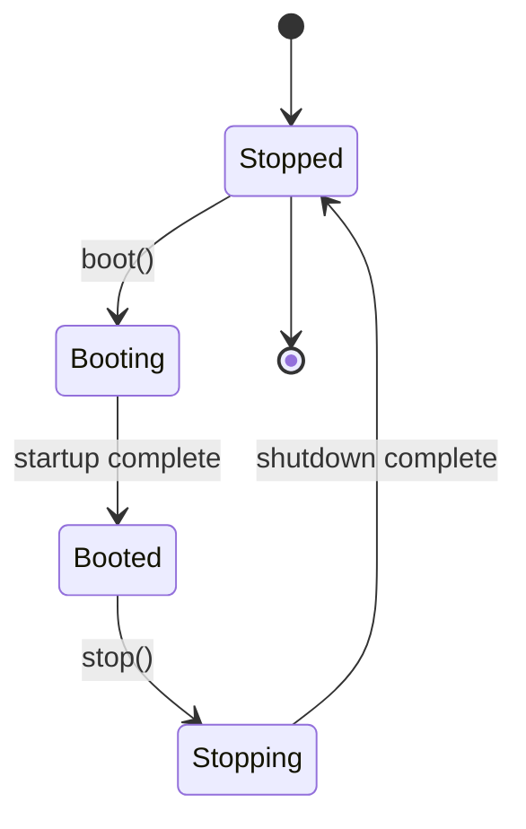
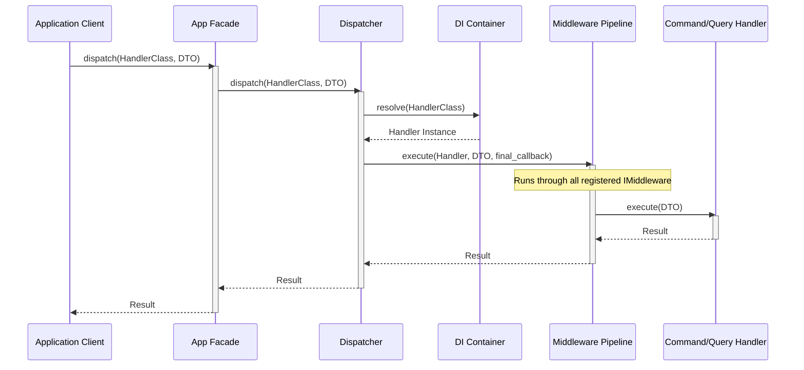
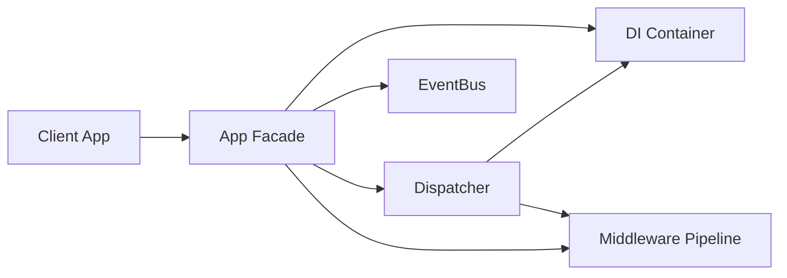
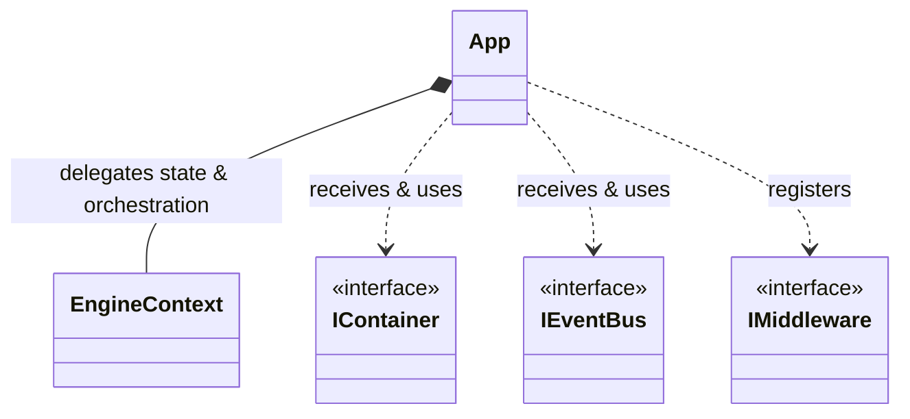
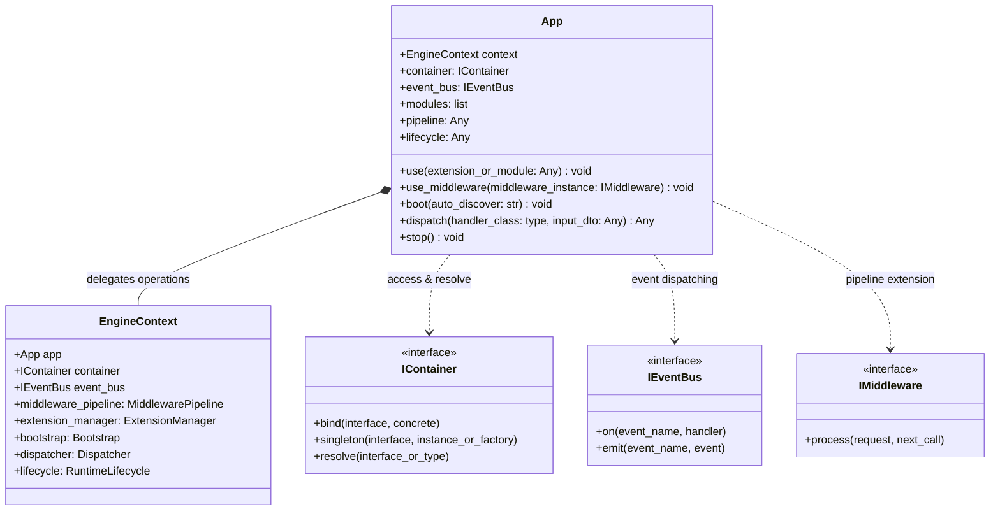

> Applies to Sagittarius Engine v1.x

# App

The `App` class is the primary entry point and orchestrator for the Sagittarius Engine. It initializes the dependency injection container, the event bus, and coordinates the boot and shutdown phases of the application host.

## Purpose

Use `App` to configure your composition root, load extensions, attach middleware pipelines, and trigger the boot sequence.

## Related APIs

- **[EngineContext](engine_context.md)**: Coordinates operations under the hood.
- **[IEventBus](event_bus.md)**: Manages communication between components.
- **[IExtension](extension.md)**: Extend App capabilities.

---

## Architecture Diagrams

### 1. Runtime Lifecycle State Diagram

The following diagram illustrates the application states managed by the engine's lifecycle:

### 2. Request Execution Sequence Diagram

The chronological runtime sequence of dispatching a command or query request:

### 3. Core Interface Relationships Flowchart

The following diagram maps how the `App` facade coordinates with other engine interfaces:

### 4. Class Diagrams

#### High-Level Class Dependency Diagram

#### Detailed Class Diagram

---

## Reference

::: sagittarius_engine.kernel.app.App

---

> [Found an issue? Edit this page on GitHub.](https://github.com/anhembedded/Sagittarius-Engine/edit/main/docs/api/app.md)
