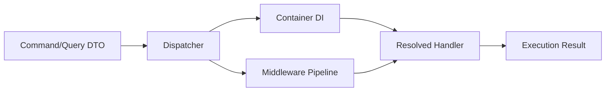
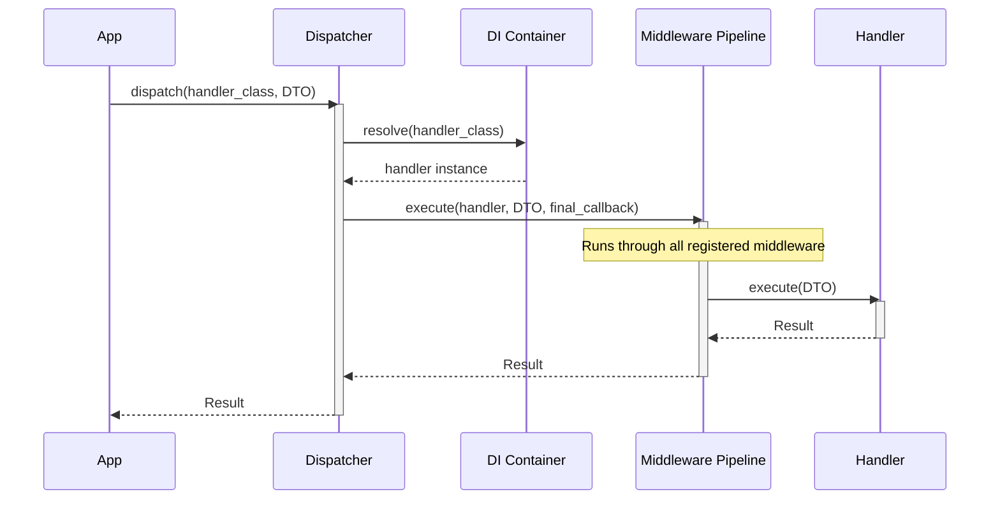
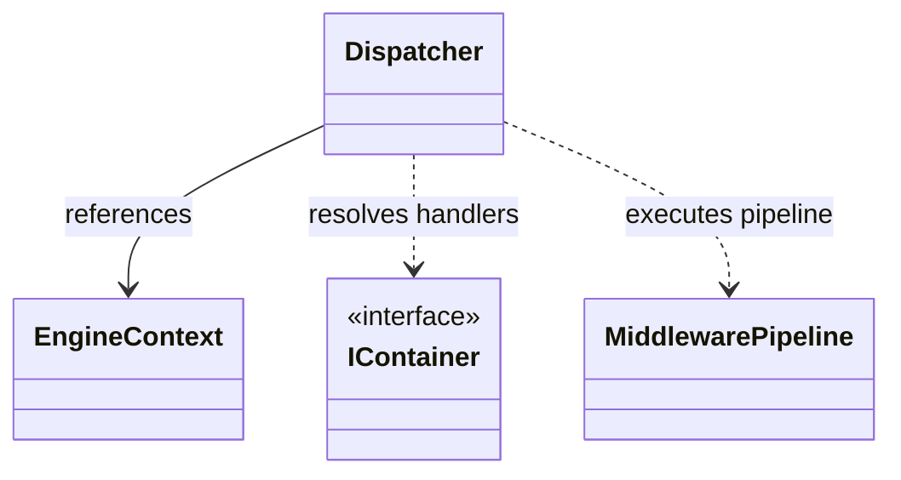
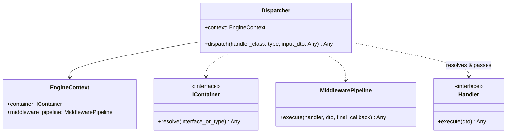

> Applies to Sagittarius Engine v1.x

# Dispatcher

The `Dispatcher` is responsible for routing command and query requests through the application's registered middleware pipeline before invoking the final request handler.

## Purpose

Use the `Dispatcher` (via `App.dispatch`) to execute commands and queries. This decouples request senders from their handlers.

## Related APIs

- **[App](app.md)**: Exposes the `dispatch` method directly.
- **[EngineContext](engine_context.md)**: Owns the dispatcher instance.

---

## Architecture Diagrams

### 1. Dispatch Workflow Flowchart

The following diagram shows how a command or query request routes through the `Dispatcher`:

### 2. Request Execution Sequence Diagram

The step-by-step sequence of dispatching a command or query:

### 3. Class Diagrams

#### High-Level Class Dependency Diagram

#### Detailed Class Diagram

---

## Reference

::: sagittarius_engine.kernel.dispatcher.Dispatcher

---

> [Found an issue? Edit this page on GitHub.](https://github.com/your-repo/edit/main/docs/api/dispatcher.md)
