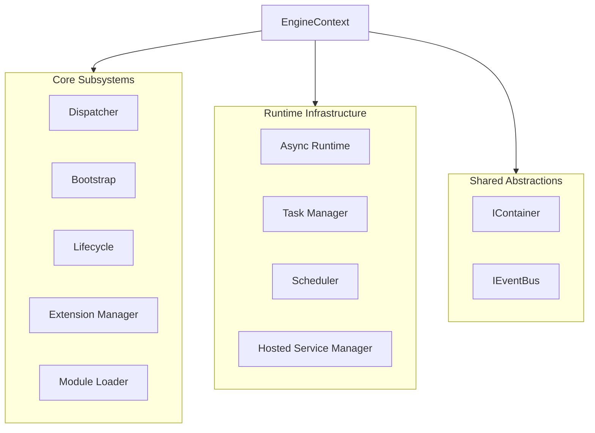
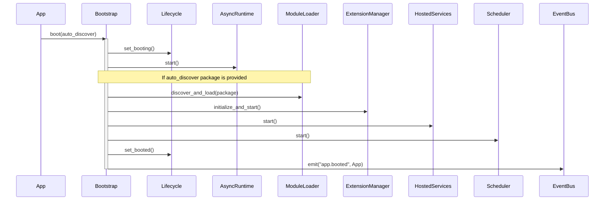
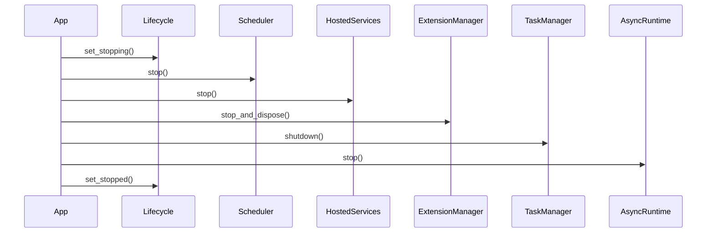
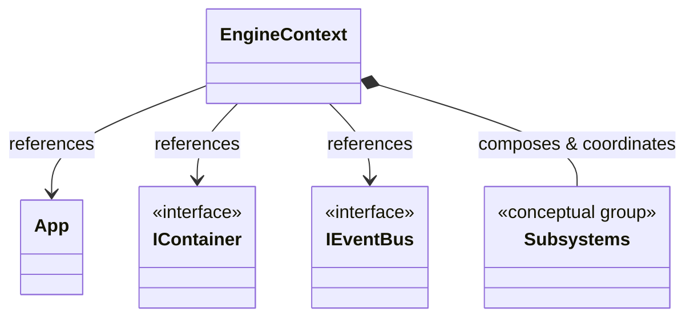
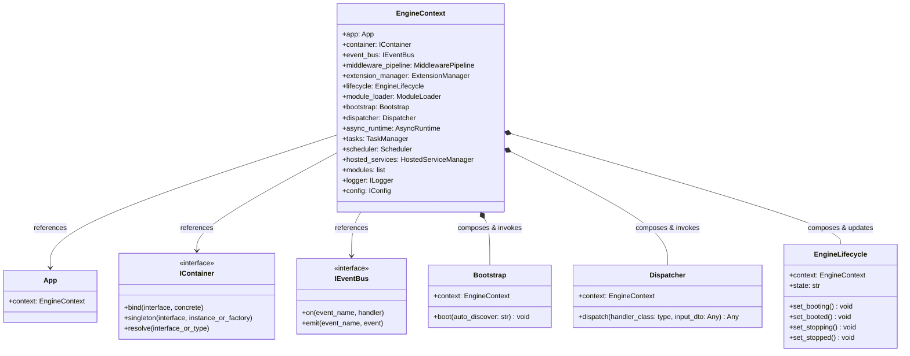

> Applies to Sagittarius Engine v1.x

# EngineContext

The `EngineContext` class acts as the shared composition root of the Sagittarius Engine. It maintains references to every internal subsystem, the dependency injection container, the event bus, and the extension manager.

## Purpose

`EngineContext` is passed to extensions during their lifecycle methods (`initialize`, `start`, `stop`, `dispose`) so they can resolve dependencies or interact with the engine.

## Related APIs

- **[App](app.md)**: Exposes the primary facade.
- **[IExtension](extension.md)**: Interacts with the context.
- **[Dispatcher](dispatcher.md)**: Dispatches requests using container services.

---

## Architecture Diagrams

### Composition Flowchart

The following diagram shows the subsystems composed and managed by `EngineContext`:

### Lifecycle Flow Diagrams

#### 1. Boot Sequence

The chronological runtime flow of booting the application via `EngineContext` subsystems:

#### 2. Shutdown Sequence

The chronological runtime flow of stopping the application gracefully:

### Class Diagrams

#### High-Level Class Dependency Diagram

#### Detailed Class Diagram

---

## Reference

::: sagittarius_engine.kernel.context.EngineContext

---

> [Found an issue? Edit this page on GitHub.](https://github.com/anhembedded/Sagittarius-Engine/edit/main/docs/api/engine_context.md)

