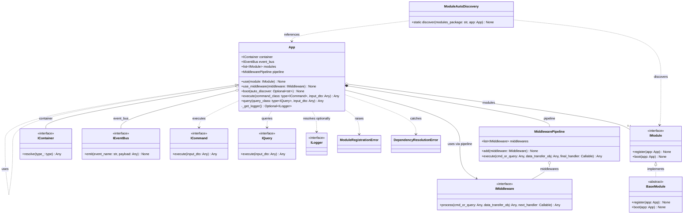
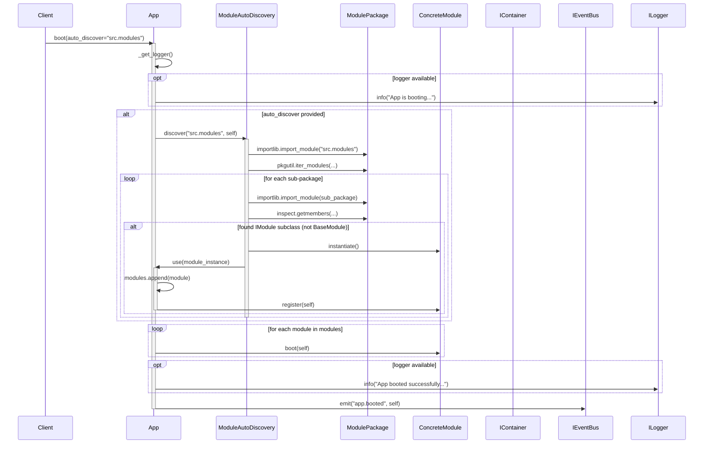
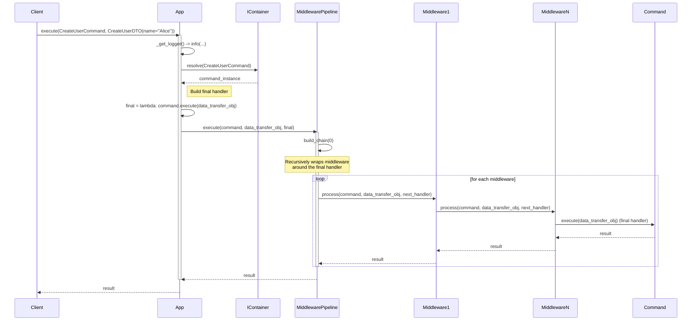

Below you’ll find a complete design of the `App` module using **Mermaid diagrams**.  
The design covers the static class structure, the boot sequence, and the command/query execution flow.

---

## 1. Class Diagram – Static Structure

**Key relationships explained:**
- `App` **owns** the `MiddlewarePipeline`, the list of modules, and holds references to the `IContainer` and `IEventBus`.
- `MiddlewarePipeline` maintains an ordered list of `IMiddleware` instances.
- `ModuleAutoDiscovery` scans packages and instantiates concrete `IModule` implementations (often `BaseModule` subclasses).
- The execution methods (`execute`, `query`) work with `ICommand` / `IQuery` interfaces, resolved through the container.

---

## 2. Sequence Diagram – Application Boot

**Flow highlights:**
- If `auto_discover` is given, `ModuleAutoDiscovery` scans the package, creates every valid `IModule` and calls `app.use()`, which immediately invokes `module.register()`.
- After discovery, all modules are booted (`module.boot(app)`).
- Finally an `app.booted` event is published.

---

## 3. Sequence Diagram – Command Execution

**Execution pattern:**
1. The command is resolved from the container (dependency injection).
2. A `final` callable is created that calls `command.execute(data_transfer_obj)`.
3. The `MiddlewarePipeline` builds a chain of onion‑like handlers, each `IMiddleware` can run logic before/after forwarding to the next handler.
4. The innermost handler is the command itself.
5. The result bubbles back through all middlewares and is returned to the client.

---

## Summary

- **Class diagram** captures all major classes, interfaces, and their dependencies.
- **Boot sequence** shows the auto‑discovery and module initialisation order.
- **Command execution** illustrates the middleware pipeline onion pattern.

These Mermaid diagrams fully describe the design of the `App` module as implemented in the provided code.