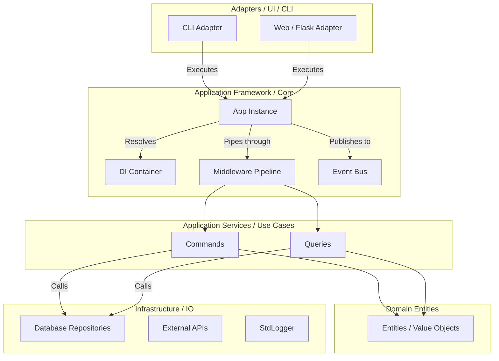

# Kiến trúc Tổng thể (Architecture)

Framework ứng dụng nguyên lý Clean Architecture kết hợp Event-Driven (Headless-first).

## 1. Biểu đồ tổng thể

## 2. Quy tắc hướng luồng
- **Hướng vào trong**: Tất cả mọi layer bên ngoài (Adapters, Infrastructure) phải phụ thuộc vào layer bên trong (Application, Domain).
- **Core.py**: Chứa toàn bộ giao diện (`ICommand`, `IEventBus`, `IContainer`...) và class trung tâm `App`. Nó độc lập và không chứa code cụ thể liên quan tới Infra (ví dụ: `print`, `logging`, `requests`).
- **Composition Root**: File `main.py` của ứng dụng đóng vai trò làm điểm lắp ráp (Composition Root). Ở đó ta gắn kết `MemoryEventBus`, `StdLibContainer` với `App`, rồi boot các `Module`.
