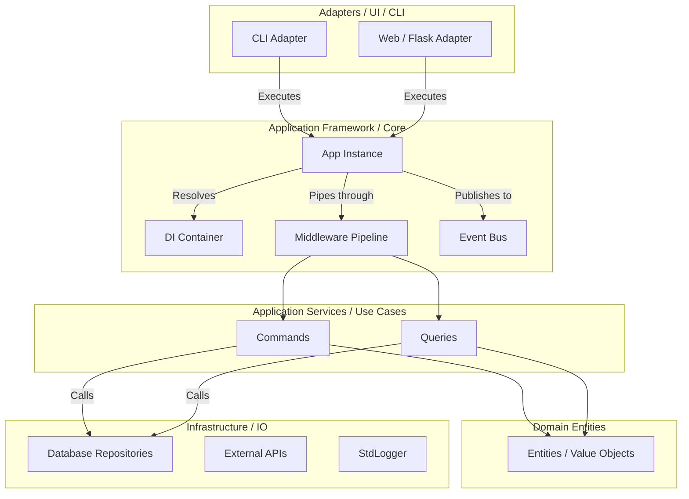
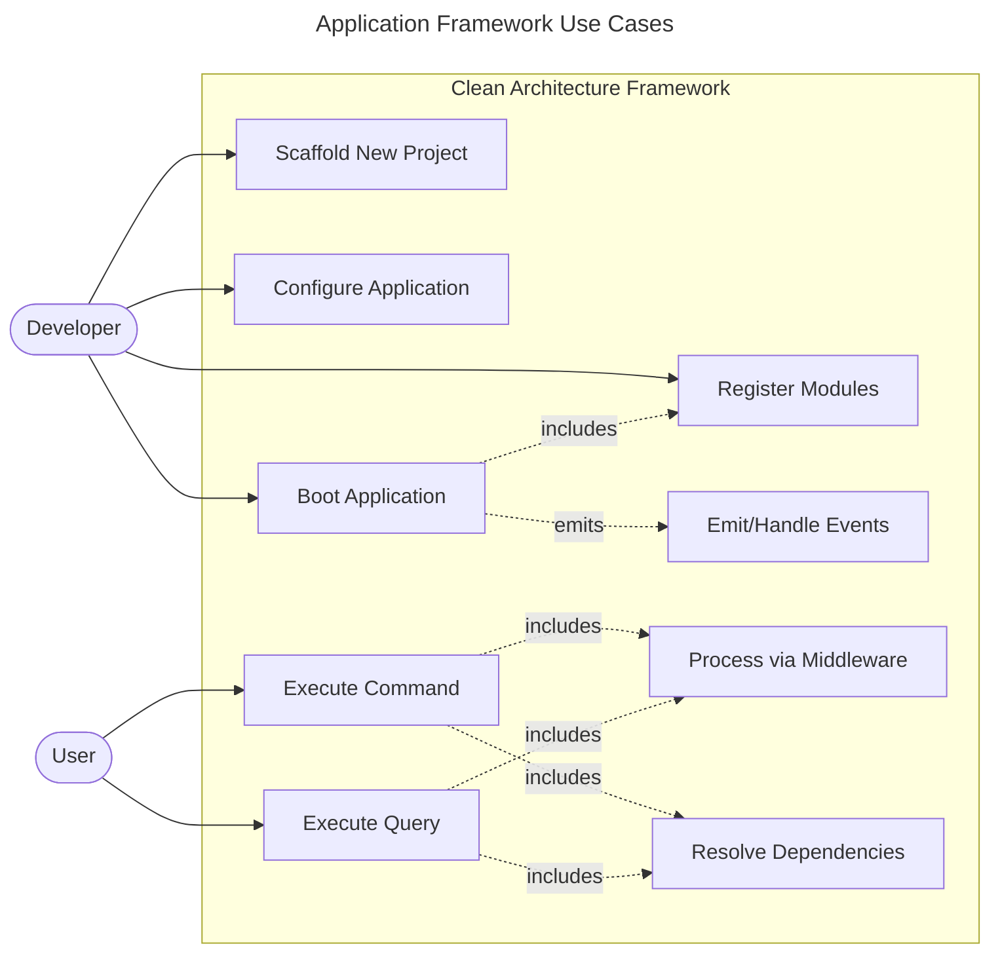
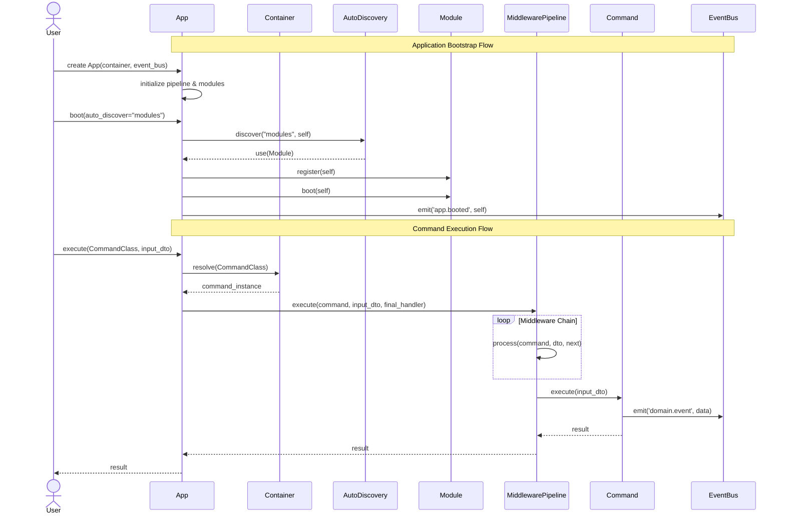
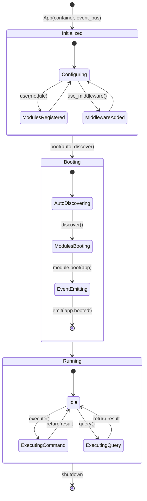
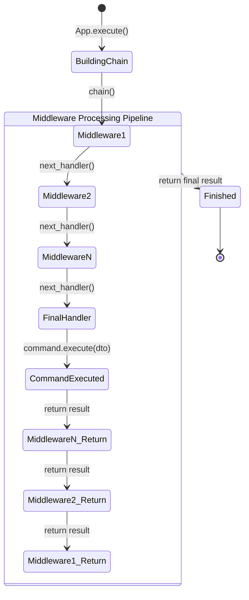

# Kiến trúc Tổng thể (Architecture)

Framework ứng dụng nguyên lý Clean Architecture kết hợp Event-Driven (Headless-first).

## 1. Biểu đồ tổng thể

## 2. Quy tắc hướng luồng
- **Hướng vào trong**: Tất cả mọi layer bên ngoài (Adapters, Infrastructure) phải phụ thuộc vào layer bên trong (Application, Domain).
- **Core.py**: Chứa toàn bộ giao diện (`ICommand`, `IEventBus`, `IContainer`...) và class trung tâm `App`. Nó độc lập và không chứa code cụ thể liên quan tới Infra (ví dụ: `print`, `logging`, `requests`).
- **Composition Root**: File `main.py` của ứng dụng đóng vai trò làm điểm lắp ráp (Composition Root). Ở đó ta gắn kết `MemoryEventBus`, `StdLibContainer` với `App`, rồi boot các `Module`.

## 3. Class Diagram (Core & Infrastructure)
Mô tả quan hệ giữa các Interfaces trong `core.py` và các Implementations trong `infra/`, `middleware/`.

```mermaid
classDiagram
    %% Interfaces
    class ICommand {
        <<interface>>
        +execute(input_dto: Any) Any
    }
    class IQuery {
        <<interface>>
        +execute(input_dto: Any) Any
    }
    class IModule {
        <<interface>>
        +register(app: App) None
        +boot(app: App) None
    }
    class IContainer {
        <<interface>>
        +bind(abstract: type, concrete: type) None
        +singleton(abstract: type, instance_or_factory: Union[Any, Callable]) None
        +resolve(abstract: type) T
    }
    class IEventBus {
        <<interface>>
        +emit(event_name: str, data: Any) None
        +on(event_name: str, handler: Callable) None
        +off(event_name: str, handler: Callable) None
    }
    class IMiddleware {
        <<interface>>
        +process(cmd_or_query: Any, dto: Any, next_handler: Callable) Any
    }
    class ILogger {
        <<interface>>
        +info(message: str) None
        +warning(message: str) None
        +error(message: str) None
        +debug(message: str) None
    }
    class IConfig {
        <<interface>>
        +get(key: str, default: Any) Any
        +set(key: str, value: Any) None
    }

    %% Base Implementations
    class BaseModule {
        +register(app: App) None
        +boot(app: App) None
    }
    IModule <|.. BaseModule

    class MiddlewarePipeline {
        -middlewares: list~IMiddleware~
        +add(middleware: IMiddleware) None
        +execute(cmd_or_query: Any, dto: Any, final_handler: Callable) Any
    }

    class App {
        -container: IContainer
        -event_bus: IEventBus
        -modules: list~IModule~
        -pipeline: MiddlewarePipeline
        +use(module: IModule) None
        +use_middleware(middleware: IMiddleware) None
        +boot(auto_discover: Optional[str]) None
        +execute(command_class: type, input_dto: Any) Any
        +query(query_class: type, input_dto: Any) Any
        -_get_logger() Optional[ILogger]
    }
    App o-- IContainer
    App o-- IEventBus
    App o-- IModule
    App o-- MiddlewarePipeline

    class ModuleAutoDiscovery {
        +discover(modules_package: str, app: App) None$
    }

    %% Infrastructure Implementations
    class StdLibContainer {
        -_bindings: dict
        -_instances: dict
        -_factories: dict
        +bind(abstract: type, concrete: type) None
        +singleton(abstract: type, instance_or_factory: Union[Any, Callable]) None
        +resolve(abstract: type) T
    }
    IContainer <|.. StdLibContainer

    class MemoryEventBus {
        -_handlers: dict
        -logger: Optional[ILogger]
        +emit(event_name: str, data: Any) None
        +on(event_name: str, handler: Callable) None
        +off(event_name: str, handler: Callable) None
    }
    IEventBus <|.. MemoryEventBus

    class ResilientEventBus {
        -inner_bus: IEventBus
        -max_retries: int
        -_dlq: list
        -logger: Optional[ILogger]
        -_handlers: dict
        +emit(event_name: str, data: Any) None
        +on(event_name: str, handler: Callable) None
        +off(event_name: str, handler: Callable) None
        +get_dlq() list
        +reprocess() None
    }
    IEventBus <|.. ResilientEventBus
    ResilientEventBus o-- IEventBus

    class StdLogger {
        -_logger: logging.Logger
        +info(message: str) None
        +warning(message: str) None
        +error(message: str) None
        +debug(message: str) None
    }
    ILogger <|.. StdLogger

    class DictConfig {
        -_config: dict
        +get(key: str, default: Any) Any
        +set(key: str, value: Any) None
    }
    IConfig <|.. DictConfig

    class ConfigSource {
        <<interface>>
        +read() dict
    }

    class ConfigManager {
        -_sources: list~ConfigSource~
        -_cache: dict
        -_loaded: bool
        +add_source(source: ConfigSource) None
        +get(key: str, default: Any) Any
        +set(key: str, value: Any) None
        -_load() None
    }
    IConfig <|.. ConfigManager
    ConfigManager o-- ConfigSource

    class DictSource {
        -data: dict
        +read() dict
    }
    ConfigSource <|.. DictSource

    class EnvSource {
        -prefix: str
        +read() dict
    }
    ConfigSource <|.. EnvSource

    class JsonSource {
        -filepath: str
        +read() dict
    }
    ConfigSource <|.. JsonSource

    %% Middleware Implementations
    class LoggingMiddleware {
        -container: IContainer
        +process(cmd_or_query: Any, dto: Any, next_handler: Callable) Any
    }
    IMiddleware <|.. LoggingMiddleware

    class TimingMiddleware {
        +process(cmd_or_query: Any, dto: Any, next_handler: Callable) Any
    }
    IMiddleware <|.. TimingMiddleware

    class ValidationMiddleware {
        +process(cmd_or_query: Any, dto: Any, next_handler: Callable) Any
    }
    IMiddleware <|.. ValidationMiddleware
```

## 4. Component Diagram (Phân chia package)
Mô tả sự chia cắt module/package bên trong thư mục `src`.

```mermaid
flowchart TB
    subgraph Core ["src/core.py (Core Abstractions)"]
        Interfaces["Interfaces (ICommand, IQuery, IModule, IContainer, IEventBus, IMiddleware, ILogger, IConfig)"]
        App["App (Facade & Orchestrator)"]
        MiddlewarePipeline["MiddlewarePipeline"]
        AutoDiscovery["ModuleAutoDiscovery"]
        BaseModule["BaseModule"]
        Exceptions["Exceptions (DependencyResolutionError, ModuleRegistrationError)"]

        App --> Interfaces
        App --> MiddlewarePipeline
        App --> AutoDiscovery
    end

    subgraph Infra ["src/infra/ (Infrastructure Impl)"]
        StdLibContainer["StdLibContainer"]
        MemoryEventBus["MemoryEventBus"]
        ResilientEventBus["ResilientEventBus"]
        StdLogger["StdLogger"]
        ConfigManager["ConfigManager & DictConfig"]
        ConfigSources["ConfigSources (Dict, Env, Json)"]

        StdLibContainer -.->|implements| Interfaces
        MemoryEventBus -.->|implements| Interfaces
        ResilientEventBus -.->|implements| Interfaces
        StdLogger -.->|implements| Interfaces
        ConfigManager -.->|implements| Interfaces
        ConfigManager --> ConfigSources
    end

    subgraph Middleware ["src/middleware/ (Application Middleware)"]
        LoggingMiddleware["LoggingMiddleware"]
        TimingMiddleware["TimingMiddleware"]
        ValidationMiddleware["ValidationMiddleware"]

        LoggingMiddleware -.->|implements| Interfaces
        TimingMiddleware -.->|implements| Interfaces
        ValidationMiddleware -.->|implements| Interfaces
    end

    subgraph Scaffold ["src/scaffold.py"]
        ProjectCreator["create_project()"]
    end

    %% Dependencies
    Infra --> Core
    Middleware --> Core
    Scaffold --> Core
    Scaffold --> Infra

    classDef core fill:#f9f,stroke:#333,stroke-width:2px;
    classDef infra fill:#bbf,stroke:#333,stroke-width:2px;
    classDef mid fill:#bfb,stroke:#333,stroke-width:2px;
    classDef scaffold fill:#fbf,stroke:#333,stroke-width:2px;

    class Core core;
    class Infra infra;
    class Middleware mid;
    class Scaffold scaffold;
```

## 5. Use Case Diagram
Mô tả các chức năng và cách tương tác chính với Framework.

## 6. Sequence Diagram: Application Bootstrap & Command Execution
Luồng khởi động (bootstrap) tự động nhận diện module, và luồng thực thi (execute command) thông qua Middleware Pipeline.

## 7. State Diagrams: App Lifecycle & Middleware Pipeline
Các trạng thái vòng đời của `App` và Pipeline Middleware khi xử lý luồng sự kiện.

**Vòng đời `App`:**

**Trạng thái Middleware Pipeline:**

