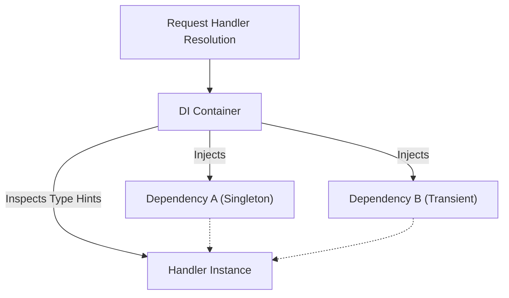

> Applies to Sagittarius Engine v1.x

# Dependency Injection

## What is Dependency Injection (DI)?

Dependency Injection is a design pattern used to implement Inversion of Control. Instead of components creating their own dependencies (like database connections or service classes), the dependencies are provided to them, typically via their constructor. 

In the Sagittarius Engine, DI is managed through the `EngineContext` and its underlying Container. The EngineContext serves as the shared runtime service registry, securely managing the lifetimes and resolution of all registered components.

## Why does it exist?

Without DI, components are tightly coupled to specific implementations:

```python
# Bad: Tightly coupled
class UserService:
    def __init__(self):
        self.db = SqlDatabase() # Hardcoded dependency
```

By using the EngineContext to manage DI, the Engine achieves:
- **Testability:** Dependencies can be easily mocked or stubbed out during unit testing.
- **Flexibility:** Implementations can be swapped (e.g., from a Memory database to a SQL database) without changing the business logic.
- **Lifecycle Management:** The container ensures singletons are only created once and disposed of correctly.

## When should I use it?

You should rely on DI for all infrastructural components, services, and handlers:
- Injecting repositories into handlers.
- Injecting the Event Bus into a service that needs to publish events.
- Resolving configuration settings.

## When should I NOT use it?

Do not use DI for:
- **Domain Entities:** Domain models (like a `User` or `Order` object) should not be registered in or resolved from the container.
- **Data Transfer Objects (DTOs):** Simple data structures meant to carry data across boundaries should be instantiated directly.

## How does it work?

During the Engine boot phase, Extensions register bindings (interfaces to concrete classes) with the Container. When a component (like a command handler) is resolved by the Dispatcher, the Container inspects its `__init__` type hints and recursively resolves all required dependencies.

### Resolution Flow



### Example Usage

```python
from sagittarius_engine import App

class IUserRepository:
    pass

class UserRepository(IUserRepository):
    pass

class UserService:
    # Dependencies are declared via type hints
    def __init__(self, repo: IUserRepository):
        self.repo = repo

def main():
    app = App()
    
    # In a real app, this is typically done inside an Extension
    # Registration binds the interface to the implementation
    app.context.container.bind(IUserRepository, UserRepository)
    app.context.container.bind(UserService, UserService)
    
    app.boot()
    
    # The container injects the IUserRepository automatically
    service = app.context.container.resolve(UserService)
```

## Best Practices

- **Constructor Injection Only:** Always inject dependencies via the `__init__` method. Do not use property injection or service locator patterns inside your application logic.
- **Program to Interfaces:** Bind abstractions (Interfaces or ABCs) to implementations, and depend on the abstraction.

## Common Mistakes

!!! warning "Service Locator Anti-Pattern"
    Do not inject the `EngineContext` or the Container itself into your application classes just so they can resolve things on the fly. This hides dependencies and makes testing difficult. Always explicitly declare dependencies in the constructor.

!!! warning "Missing Type Hints"
    The container relies entirely on Python type hints. If you omit type hints in your constructor, the container will not know what to inject and resolution will fail.

---

> [Found an issue? Edit this page on GitHub.](https://github.com/your-repo/edit/main/docs/concepts/dependency_injection.md)
