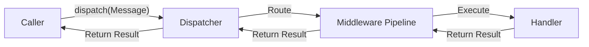

> Applies to Sagittarius Engine v1.x

# Dispatcher

## What is the Dispatcher?

The Dispatcher is the unified entry point for executing use cases and operations within the Sagittarius Engine. Rather than calling methods directly on instantiated classes, components create message objects (like Commands or Queries) and pass them to the Dispatcher. The Dispatcher then locates the correct handler, routes the message through the middleware pipeline, and returns the result.

## Why does it exist?

Directly calling methods tightly couples your application logic. If Component A calls `ComponentB.do_work()`, Component A must know exactly what Component B is and how to construct it.

The Dispatcher exists to provide **loose coupling** through a technique often referred to as the Mediator pattern. By relying on the Dispatcher:
- The sender doesn't need to know who handles the request.
- Cross-cutting concerns (like logging, validation, and transaction management) can be applied automatically via middleware.
- Handlers can be easily swapped, mocked, or extended without modifying the sender.

## When should I use it?

You should use the Dispatcher for:
- Executing primary business use cases.
- Crossing boundary layers (e.g., from an API controller into the business logic).
- Scenarios where you want automatic validation, logging, or timing applied to an operation.

## When should I NOT use it?

Do not use the Dispatcher for:
- Simple, internal helper functions.
- Domain model interactions (Entities should not dispatch commands).
- Broadcasting notifications to multiple listeners (use the Event Bus instead).

## How does it work?

When a message is dispatched, the EngineContext resolves the appropriate handler for the specific message type from the Dependency Injection container. The message is then passed through any configured middleware before reaching the handler.

### Execution Flow



### Example Usage

```python
from sagittarius_engine import App

# Assume MyCommand is a defined message type
def handle_request(app: App, command_data: dict):
    # Instead of instantiating the handler directly, we dispatch the command.
    # The dispatcher will find the handler and run middlewares automatically.
    result = app.dispatch(command_data)
    return result
```

## Best Practices

- **One Handler per Request:** The Dispatcher enforces exactly one handler per request type. If you need multiple listeners, that is an Event, not a Command.
- **Keep Messages Dumb:** Messages (Commands and Queries) should be simple data structures (DTOs) without business logic or side effects.

## Common Mistakes

!!! warning "Using Deprecated APIs"
    In older versions, the engine used separate `execute()` and `query()` methods. These are now deprecated. Always use `dispatch()` for all command and query routing.

!!! warning "Dispatching from Domain Entities"
    Domain models should be pure and ignorant of the Engine. Never inject the Dispatcher into a domain entity to trigger side effects.

---

> [Found an issue? Edit this page on GitHub.](https://github.com/your-repo/edit/main/docs/concepts/dispatcher.md)
