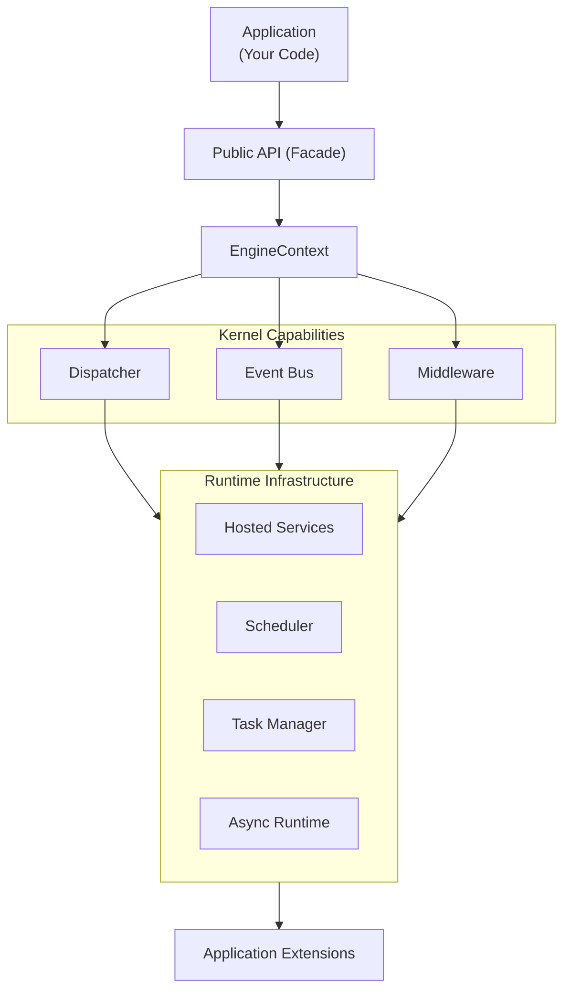

> Applies to Sagittarius Engine v1.x

# Engine Architecture

## What is Sagittarius Engine?

Sagittarius Engine is a lightweight, modular Python Application Engine. It is not a framework that forces a specific architecture (like Django or Clean Architecture), nor is it an ORM. Instead, it is a **runtime host** that provides reusable application capabilities such as dependency injection, event dispatching, and extension lifecycle management.

The Engine acts as the orchestrator of your application, providing the foundational infrastructure so you can focus on writing business logic using the architecture of your choice.

## Why does it exist?

Building production-ready applications in Python often requires assembling the same boilerplate: dependency injection containers, configuration loaders, logging setups, background task runners, and event buses. 

Sagittarius Engine exists to eliminate this boilerplate. It provides a cohesive, unified runtime environment where these components are pre-integrated and managed automatically, while remaining completely unopinionated about how your domain logic is structured.

## When should I use it?

Sagittarius Engine is ideal for applications that require structured, long-running processes or complex orchestration:

- Trading Bots
- Desktop Applications
- Long-running Services
- Background Workers
- Automation Scripts
- Event-driven Systems

## When should I NOT use it?

Do not use Sagittarius Engine if you are building:

- Tiny, one-file scripts where a full runtime is overkill.
- Simple CRUD web applications (where a specialized framework like FastAPI or Django is better suited).
- Systems that require a monolithic, heavily opinionated architecture.

## How is it organized?

The Engine separates responsibilities into distinct layers. Applications decide their own architecture, the Kernel provides core capabilities, the Runtime orchestrates execution, and Extensions integrate external technologies.

### Architecture Overview



### Example Usage

Here is a minimal example of booting the Engine:

```python
from sagittarius_engine import App
from sagittarius_engine.infrastructure.container.std_container import StdLibContainer
from sagittarius_engine.infrastructure.event_bus.memory_event_bus import MemoryEventBus

def main():
    container = StdLibContainer()
    event_bus = MemoryEventBus()
    app = App(container, event_bus)
    # Extensions and middlewares would be registered here
    app.boot()
    print("Engine has booted.")
    app.stop()

if __name__ == "__main__":
    main()
```

## Best Practices

- **Keep Domain Independent:** Rely on the Engine for runtime orchestration, but keep your core domain models and business logic independent of Engine APIs.
- **Use the Facade:** Always interact with the Engine through the public APIs exported from `sagittarius_engine`.

## Common Mistakes

!!! warning "Importing Internal Packages"
    Never import from internal packages like `sagittarius_engine.kernel.*` or `sagittarius_engine.infrastructure.*`. These are implementation details that may change without notice. Always use the public exports from the root package.

!!! warning "Treating the Engine as an MVC Framework"
    The Engine does not dictate how you handle requests, routes, or database access. It only provides the infrastructure. Trying to force it into a rigid web framework pattern will lead to friction.

---

> [Found an issue? Edit this page on GitHub.](https://github.com/anhembedded/Sagittarius-Engine/edit/main/docs/concepts/engine.md)
