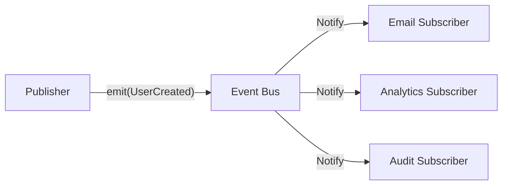

> Applies to Sagittarius Engine v1.x

# Event Bus

## What is the Event Bus?

The Event Bus is a publish-subscribe (Pub/Sub) messaging system built into the Sagittarius Engine. It allows components to broadcast events to zero or more subscribers without knowing who is listening. 

Unlike the Dispatcher (which routes a request to exactly one handler and returns a result), the Event Bus routes an event to all registered listeners asynchronously or synchronously, and does not return a result to the publisher.

## Why does it exist?

In complex systems, actions often trigger multiple side effects. For example, when a user is created, you might need to send a welcome email, update a reporting database, and trigger an analytics webhook. 

If the user-creation code directly calls these three services, it becomes tightly coupled and brittle. The Event Bus exists to decouple the occurrence of an event from the reactions to that event.

## When should I use it?

Use the Event Bus when:
- An action has occurred in the past (e.g., `UserCreated`, `OrderPlaced`).
- You need to trigger multiple, independent side effects.
- The publisher does not need to know the outcome of the listeners' actions.
- You are implementing Domain Events.

## When should I NOT use it?

Do not use the Event Bus for:
- Operations that require a response (use the Dispatcher instead).
- Core business validation that must succeed before an operation is considered complete.
- Procedural workflows where step B strictly depends on the output of step A.

## How does it work?

Components emit events (usually subclasses of a base event type) to the Event Bus. The Event Bus maintains a registry of subscribers mapped to event types or topics. When an event is emitted, the bus iterates through all matching subscribers and invokes their handler functions. Depending on the configuration, this can happen synchronously, on a thread pool, or on the async event loop.

### Publish-Subscribe Flow



### Example Usage

```python
from sagittarius_engine import App
from sagittarius_engine.infrastructure.container.std_container import StdLibContainer
from sagittarius_engine.infrastructure.event_bus.memory_event_bus import MemoryEventBus


class UserCreatedEvent:
    def __init__(self, username: str):
        self.username = username


def on_user_created(event: UserCreatedEvent):
    print(f"Side effect: sending email to {event.username}")


def main():
    container = StdLibContainer()
    event_bus = MemoryEventBus()
    app = App(container, event_bus)

    # Register a subscriber
    app.context.event_bus.on("user.created", on_user_created)

    app.boot()

    # Emit the event
    app.context.event_bus.emit("user.created", UserCreatedEvent("alice"))

    app.stop()


if __name__ == "__main__":
    main()
```

## Best Practices

- **Name Events in the Past Tense:** Events represent things that have already happened. Use names like `OrderShipped` rather than `ShipOrder`.
- **Keep Events Small:** Include only the necessary IDs or minimal data in the event payload. Listeners should fetch additional data if they need it.

## Common Mistakes

!!! warning "Expecting a Return Value"
    Event emission is inherently fire-and-forget. Never design a system where the publisher waits for the Event Bus to return a value from a subscriber. If you need a return value, use the Dispatcher.

!!! warning "Chaining Too Many Events"
    Avoid creating deep chains of events where Event A triggers Event B, which triggers Event C. This makes the system extremely difficult to trace and debug.

---

> [Found an issue? Edit this page on GitHub.](https://github.com/anhembedded/Sagittarius-Engine/edit/main/docs/concepts/event_bus.md)
