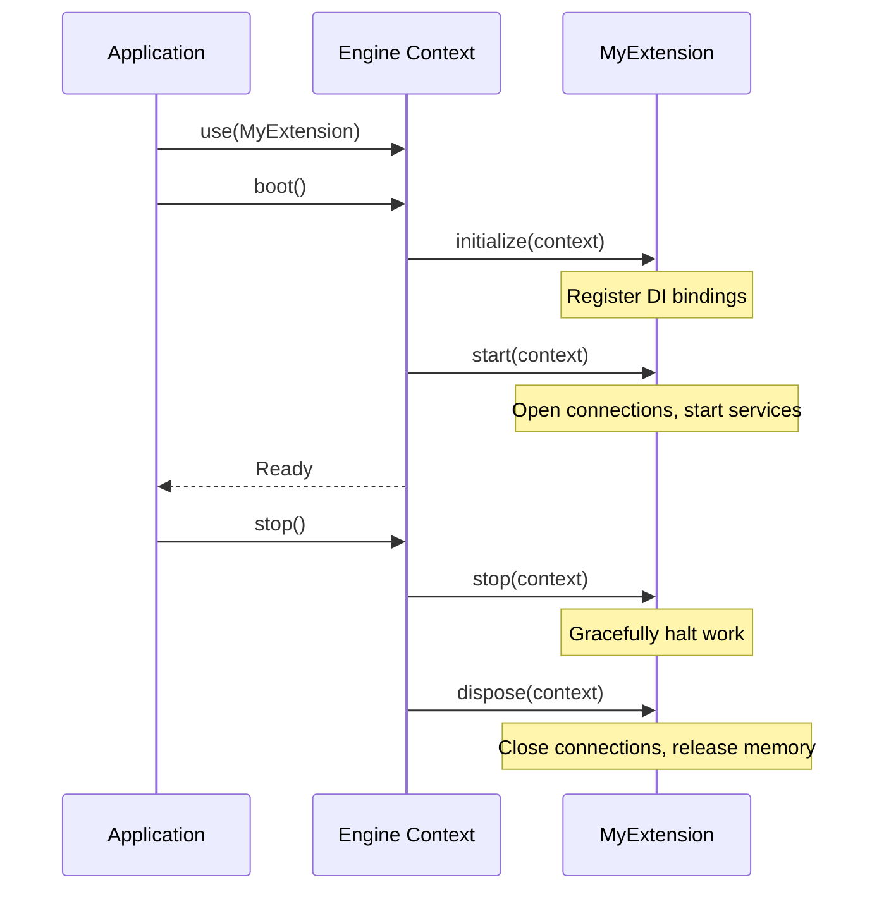

> Applies to Sagittarius Engine v1.x

# Extensions

## What is an Extension?

An Extension (historically referred to as a "Module" in older frameworks) is a first-class runtime plugin in the Sagittarius Engine. Extensions are the primary mechanism for adding capabilities, registering dependencies, hooking into the event bus, and starting hosted background services.

Extensions are highly structured objects that plug into the Engine's lifecycle, allowing external libraries and infrastructure code to integrate cleanly into your application.

## Why do they exist?

A core philosophy of the Sagittarius Engine is that the Kernel remains completely isolated from infrastructure concerns like database drivers, web frameworks, or message brokers. 

Extensions exist to bridge this gap. Instead of cluttering your main application file with hundreds of lines of configuration for SQLAlchemy, Redis, or Celery, you encapsulate that setup into an Extension. This encapsulation promotes reusability, testing, and clean architecture.

## When should I use them?

You should create or use an Extension when you need to:
- Integrate a third-party library (e.g., a Database Engine, an HTTP Server).
- Register a collection of related services into the Dependency Injection container.
- Manage the lifecycle (startup/shutdown) of a specific subsystem.
- Share a reusable package of infrastructure across multiple different applications.

## When should I NOT use them?

Do not create an Extension for:
- Core domain logic. Your business rules do not belong in an Extension; they belong in your application code.
- Small scripts where lifecycle management is unnecessary.

## How does it work?

Extensions implement the `IExtension` interface, which defines hooks into the application's boot and shutdown phases. When you call `app.use(MyExtension())`, the engine registers it. Upon calling `app.boot()`, the engine resolves dependencies between all registered Extensions, sorts them topologically, and executes their lifecycle hooks in order.

### Extension Lifecycle



### Example Usage

```python
from sagittarius_engine import App, IExtension
from sagittarius_engine.infrastructure.container.std_container import StdLibContainer
from sagittarius_engine.infrastructure.event_bus.memory_event_bus import MemoryEventBus


class DatabaseExtension(IExtension):
    def register(self, context):
        # Bind database repositories to the DI container
        pass

    def boot(self, context):
        # Open database connection pool
        print("Database connected.")

    def shutdown(self, context):
        # Stop accepting new queries and close connection pool
        print("Database disconnected.")


def main():
    container = StdLibContainer()
    event_bus = MemoryEventBus()
    app = App(container, event_bus)
    app.use(DatabaseExtension())
    app.boot()
    app.stop()


if __name__ == "__main__":
    main()
```

## Best Practices

- **Keep Extensions Focused:** An Extension should do one thing well (e.g., configure logging, OR setup a database). Do not create monolithic extensions that initialize completely unrelated systems.
- **Fail Fast in Start:** If an Extension requires a configuration value or a network connection to function, it should raise an exception immediately during the `start()` phase rather than failing silently.

## Common Mistakes

!!! warning "Starting Long-Running Work in start()"
    The `start()` method is meant for initialization (like opening a socket). It is executed synchronously during the boot sequence. Do not place infinite `while True:` loops inside `start()`, or the engine will never finish booting. Use Hosted Services or the Task Manager for background work.

!!! warning "Using the Term 'Module'"
    In Sagittarius Engine terminology, these plugins are always called **Extensions**. Do not refer to them as Modules, as that conflicts with Python's built-in file modules.

---

> [Found an issue? Edit this page on GitHub.](https://github.com/anhembedded/Sagittarius-Engine/edit/main/docs/concepts/extensions.md)
