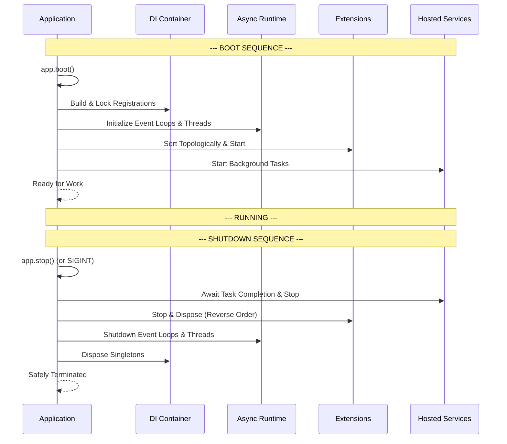

> Applies to Sagittarius Engine v1.x

# Lifecycle

## What is the Lifecycle?

The Lifecycle refers to the strict sequence of events that occur from the moment the Sagittarius Engine starts (booting) to the moment it safely terminates (shutdown). It dictates exactly when the Dependency Injection Container is built, when the Async Runtime is initialized, when Extensions are initialized and started, and when background services begin their work.

## Why does it exist?

Complex applications possess intricate dependencies. If a background service starts processing queue messages before the database connection is initialized, the application will crash.

The Engine's Lifecycle exists to guarantee a deterministic, safe, and reproducible startup and shutdown sequence. By strictly ordering these phases, the Engine ensures that infrastructure is fully ready before application logic executes, and that work is gracefully paused before infrastructure is dismantled.

## When should I use it?

You interact with the Lifecycle whenever you:
- Write an Extension (by implementing `initialize`, `start`, `stop`, `dispose`).
- Write a Hosted Service (by implementing startup and teardown hooks).
- Manage the main entry point of your application (`app.boot()` and `app.stop()`).

## When should I NOT use it?

- Do not try to bypass the Engine's lifecycle by starting background threads manually before calling `app.boot()`.
- Do not attempt to re-run the boot sequence on an application instance that is already running.

## How does it work?

The Engine executes two primary sequences: the **Boot Sequence** and the **Shutdown Sequence**. The shutdown sequence is strictly the reverse of the boot sequence, ensuring dependencies are torn down in the exact opposite order they were initialized.

### Boot and Shutdown Sequence



### Example Usage

The Application Host handles the lifecycle automatically when you call `boot()` and `stop()`.

```python
import sys
from sagittarius_engine import App
from sagittarius_engine.infrastructure.container.std_container import StdLibContainer
from sagittarius_engine.infrastructure.event_bus.memory_event_bus import MemoryEventBus

def main():
    container = StdLibContainer()
    event_bus = MemoryEventBus()
    app = App(container, event_bus)
    
    try:
        # Executes the entire Boot Sequence
        app.boot()
        
        # Block the main thread to keep the application alive
        # (Usually done via a wait mechanism provided by the Runtime)
        input("Press Enter to shutdown...\n")
        
    except KeyboardInterrupt:
        pass
    finally:
        # Executes the entire Shutdown Sequence
        app.stop()
        sys.exit(0)

if __name__ == "__main__":
    main()
```

## Best Practices

- **Graceful Shutdowns:** Always ensure your `main()` block includes a `finally:` clause or signal handlers to invoke `app.stop()`. If the process is forcefully killed, the shutdown sequence cannot run, which may lead to data loss or orphaned connections.
- **Initialization Order:** Rely on Extension dependencies (Topological Sorting) to ensure your Extension starts only after its prerequisites are fully booted.

## Common Mistakes

!!! warning "Calling APIs before Boot"
    Do not attempt to resolve services from the Container or dispatch commands before `app.boot()` has been called. The Engine context is not fully initialized until the boot sequence is complete.

!!! warning "Hanging the Shutdown Sequence"
    If a Hosted Service or an Extension `stop()` method contains an infinite loop or a non-terminating blocking call, the Shutdown Sequence will hang, and the application will fail to exit gracefully. Always respect cancellation tokens.

---

> [Found an issue? Edit this page on GitHub.](https://github.com/your-repo/edit/main/docs/concepts/lifecycle.md)
