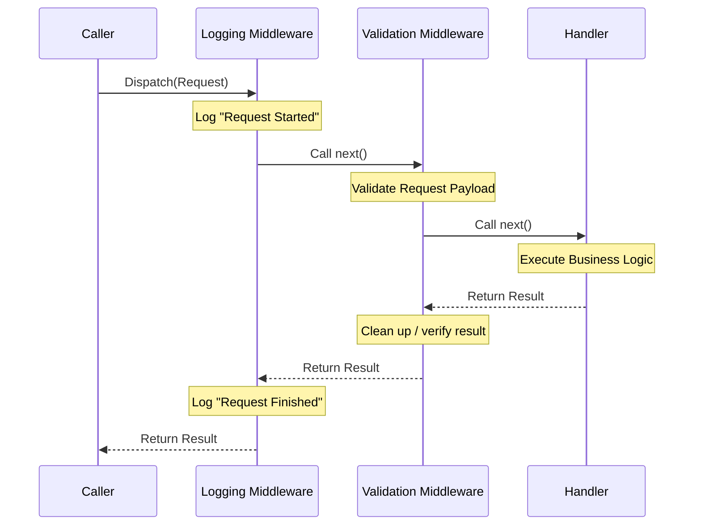

> Applies to Sagittarius Engine v1.x

# Middleware

## What is Middleware?

Middleware consists of software components assembled into an application pipeline to handle requests and responses. In the Sagittarius Engine, middleware wraps the execution of the Dispatcher. When a message is dispatched, it travels through a chain of middleware components before reaching the final handler, and the response travels back out through the same chain.

## Why does it exist?

Applications often have requirements that apply across many different use cases—such as logging, timing, performance monitoring, authentication, or input validation. These are known as cross-cutting concerns.

If you place this logic inside your individual handlers, you violate the Single Responsibility Principle and end up with massive code duplication. The Middleware pipeline exists so you can write this logic exactly once and apply it universally to all (or a subset of) requests flowing through the Dispatcher.

## When should I use it?

Use Middleware to implement:
- **Logging:** Recording every request that enters the system.
- **Validation:** Ensuring request payloads are well-formed before hitting business logic.
- **Performance Timing:** Measuring how long use cases take to execute.
- **Error Handling:** Catching exceptions globally and formatting standard error responses.
- **Transaction Management:** Wrapping operations in database transactions.

## When should I NOT use it?

Do not use Middleware for:
- Core business logic or domain rules.
- Manipulating the primary payload in ways the handler doesn't expect.
- State management for a specific user session (unless it's extracting context like an Auth token).

## How does it work?

Middleware forms a "Russian Doll" or "Onion" model. Each middleware receives the request, performs some logic, and then explicitly calls the `next()` function to pass control to the next middleware in the chain. Once the inner handler finishes, control returns back up the chain.

### Middleware Pipeline Flow



### Example Usage

```python
from typing import Any, Callable
from sagittarius_engine import App
from sagittarius_engine.infrastructure.container.std_container import StdLibContainer
from sagittarius_engine.infrastructure.event_bus.memory_event_bus import MemoryEventBus

class TimingMiddleware:
    def handle(self, request: Any, next_call: Callable) -> Any:
        import time
        start = time.time()
        
        # Pass control to the next middleware or the handler
        result = next_call(request)
        
        duration = time.time() - start
        print(f"Request took {duration:.4f} seconds")
        
        return result

def main():
    container = StdLibContainer()
    event_bus = MemoryEventBus()
    app = App(container, event_bus)
    # Register the middleware globally
    app.use_middleware(TimingMiddleware())
    app.boot()
    app.stop()

if __name__ == "__main__":
    main()
```

## Best Practices

- **Keep it Fast:** Middleware runs on every dispatched request. Keep the logic lightweight to avoid dragging down overall system performance.
- **Fail Fast:** If a middleware performs validation or authentication and determines the request should not proceed, it should raise an exception immediately rather than calling `next()`.

## Common Mistakes

!!! warning "Forgetting to call next()"
    If your middleware does not call the `next_call()` function, the request will never reach the handler, and the pipeline will silently halt. Always call `next()` unless you are intentionally short-circuiting an invalid request.

!!! warning "Catching and Swallowing Exceptions"
    If you catch an exception in a middleware (e.g., for logging purposes), make sure you re-raise it unless you are intentionally replacing it with a standard error response. Swallowing exceptions will hide critical failures from the caller.

---

> [Found an issue? Edit this page on GitHub.](https://github.com/anhembedded/Sagittarius-Engine/edit/main/docs/concepts/middleware.md)
