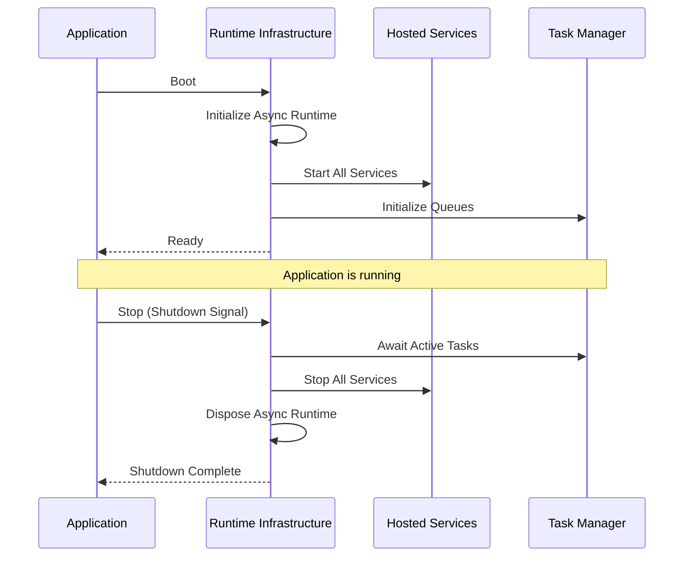

> Applies to Sagittarius Engine v1.x

# Runtime Infrastructure

## What is the Runtime?

The Runtime is the long-running execution infrastructure of the Sagittarius Engine. While the Kernel handles short-lived request orchestration (like dependency injection and dispatching), the Runtime manages the continuous, concurrent execution of background processes over the lifespan of your application.

It encompasses several core systems:
- **Hosted Services:** Managed, long-running background tasks.
- **Task Manager:** A system for executing background work items without blocking the main flow.
- **Scheduler:** A time-based execution component for recurring jobs.
- **Async Runtime:** The foundational layer that manages concurrency, threads, and asynchronous event loops.

## Why does it exist?

Modern applications rarely do just one thing at a time. They might need to listen to a message queue, perform periodic health checks, and execute background computations simultaneously. 

The Runtime exists to provide a standardized, managed way to coordinate these concurrent activities. Instead of applications manually spawning threads, creating event loops, and handling complex shutdown signals, the Runtime orchestrates all of this safely, ensuring graceful startup and shutdown sequences.

## When should I use it?

Use the Runtime when you need to:
- Run services continuously in the background (e.g., polling an API).
- Schedule tasks to run at specific intervals (e.g., daily database cleanups).
- Fire-and-forget background jobs without blocking the main execution path.
- Manage graceful shutdown and cancellation across multiple concurrent workers.

## When should I NOT use it?

Do not rely on the Runtime infrastructure if:
- Your application is a simple, synchronous script that runs to completion sequentially.
- You are writing a library rather than an executable application.

## How does it work?

The Runtime manages a strict lifecycle. When the Engine boots, it initializes the Async Runtime, loads Extensions, starts Hosted Services, and finally starts the Scheduler. When the Engine stops, this process is carefully reversed to ensure all in-flight tasks complete and resources are released.

### Runtime Lifecycle



### Example Usage

The Runtime is largely managed by the Engine automatically. As an application developer, you interact with it by registering your services during boot:

```python
from sagittarius_engine import App
from sagittarius_engine.infrastructure.container.std_container import StdLibContainer
from sagittarius_engine.infrastructure.event_bus.memory_event_bus import MemoryEventBus

def main():
    container = StdLibContainer()
    event_bus = MemoryEventBus()
    app = App(container, event_bus)
    
    # The runtime manages the lifecycle of this service automatically
    # app.use(MyBackgroundServiceExtension())
    
    app.boot()
    # The runtime is now executing background tasks
    app.stop()

if __name__ == "__main__":
    main()
```

## Best Practices

- **Respect Cancellation:** Always respect cancellation tokens within your hosted services and background tasks. The Runtime depends on this to ensure graceful shutdowns.
- **Offload Heavy Work:** Use the Task Manager to offload heavy synchronous work from the main thread or async event loops.

## Common Mistakes

!!! warning "Blocking the Main Thread"
    Do not perform long-running blocking operations directly in the main thread or during the boot sequence. This prevents the Runtime from fully initializing and can cause the application to hang.

!!! warning "Ignoring Shutdown Signals"
    Failing to handle shutdown signals or cancellation tokens in your background tasks will prevent the Runtime from shutting down gracefully, potentially leading to data corruption or orphaned processes.

---

> [Found an issue? Edit this page on GitHub.](https://github.com/your-repo/edit/main/docs/concepts/runtime.md)
