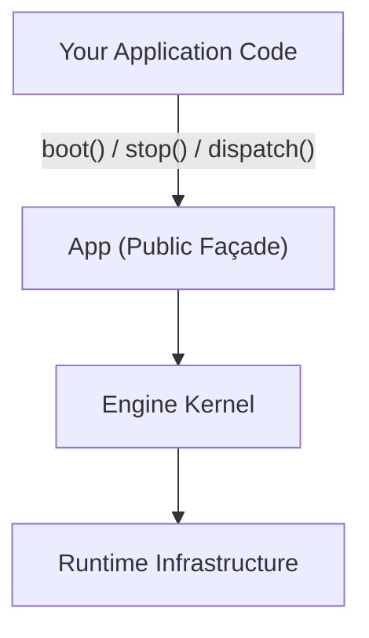

> Applies to Sagittarius Engine v1.x

# Your First Application

This guide shows how to boot and stop the Sagittarius Engine.

---

## The App is Only a Host

The most important concept to understand before writing any code:

> **The engine is a host, not a framework.**

Your application does not extend the engine. Your application **uses** the engine as a runtime host. The engine starts up, manages background components, and shuts them down cleanly. What runs inside those components is entirely your decision.



The `App` class is the only surface your code touches. It delegates everything to the engine kernel internally.

---

## Minimal Application

The following is the smallest valid Sagittarius Engine application:

```python
from sagittarius_engine import App
from sagittarius_engine.infra.std_container import StdLibContainer
from sagittarius_engine.infra.memory_event_bus import MemoryEventBus

container = StdLibContainer()
event_bus = MemoryEventBus()

app = App(container, event_bus)
app.boot()

# Your application logic runs here

app.stop()
```

**What happens during `boot()`:**

1. The DI container is initialized
2. The Async Runtime is started
3. Registered Extensions are initialized and started (in dependency order)
4. Hosted Services are started
5. The Scheduler is started
6. The engine is ready

**What happens during `stop()`:**

The shutdown sequence runs in reverse:

1. Scheduler stops
2. Hosted Services stop
3. Extensions stop and dispose
4. Task Manager shuts down
5. Async Runtime stops

---

## Dispatching a Request

Once the engine is booted, use `dispatch()` to run a handler:

```python
from sagittarius_engine import App, ICommand
from sagittarius_engine.infra.std_container import StdLibContainer
from sagittarius_engine.infra.memory_event_bus import MemoryEventBus


class GreetCommand(ICommand):
    def execute(self, dto: dict) -> str:
        return f"Hello, {dto['name']}!"


container = StdLibContainer()
event_bus = MemoryEventBus()

app = App(container, event_bus)
container.bind(GreetCommand, GreetCommand)
app.boot()

result = app.dispatch(GreetCommand, {"name": "Sagittarius"})
print(result)  # Hello, Sagittarius!

app.stop()
```

---

## Common Mistakes

**Calling `stop()` before `boot()`**
The engine must be booted before it can be stopped. Always call `boot()` first.

**Importing internal modules**
```python
# ❌ Never do this
from sagittarius_engine.kernel.app import App

# ✅ Always use public imports
from sagittarius_engine import App
```

---

## Next Step

→ [Write your first Extension](first_extension.md)

---

> [Found an issue? Edit this page on GitHub.](https://github.com/your-repo/edit/main/docs/getting-started/first_app.md)
