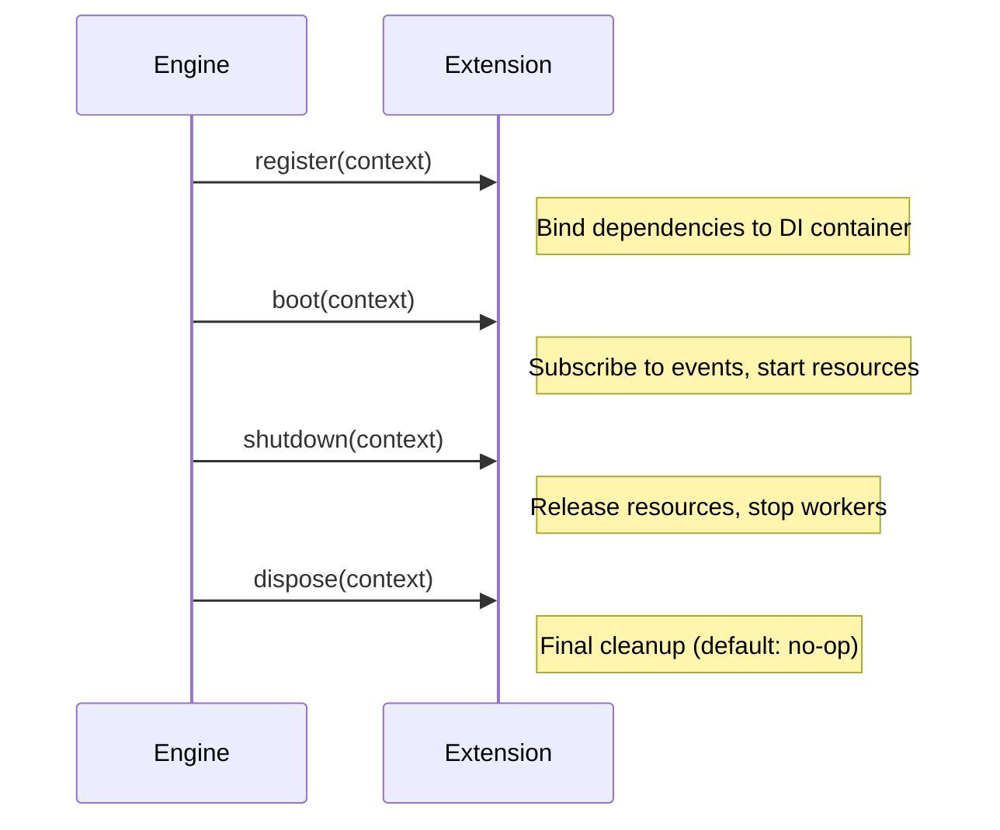

> Applies to Sagittarius Engine v1.x

# Your First Extension

This guide shows how to create and register an Extension.

---

## What is an Extension?

An Extension is a first-class plugin that participates in the engine's managed lifecycle. Extensions are the primary way to add capabilities to your application — registering dependencies, starting background services, subscribing to events.

You do not instantiate your extensions manually. You register them with `app.use()`, and the engine manages the rest.

---

## Extension Lifecycle



The engine calls these methods automatically, in the correct order, during `boot()` and `stop()`.

---

## Creating an Extension

Inherit from `IExtension` and implement the three required methods:

```python
from sagittarius_engine import IExtension, EngineContext


class LoggerExtension(IExtension):
    def register(self, context: EngineContext) -> None:
        # Bind dependencies to the DI container
        pass

    def boot(self, context: EngineContext) -> None:
        # Subscribe to events, start background logic
        context.event_bus.on("app.started", lambda e: print("Application started"))

    def shutdown(self, context: EngineContext) -> None:
        # Release resources
        pass
```

---

## Registering an Extension

Use `app.use()` before calling `app.boot()`:

```python
from sagittarius_engine import App, IExtension, EngineContext
from sagittarius_engine.infra.std_container import StdLibContainer
from sagittarius_engine.infra.memory_event_bus import MemoryEventBus


class LoggerExtension(IExtension):
    def register(self, context: EngineContext) -> None:
        pass

    def boot(self, context: EngineContext) -> None:
        print("LoggerExtension started")

    def shutdown(self, context: EngineContext) -> None:
        print("LoggerExtension stopped")


container = StdLibContainer()
event_bus = MemoryEventBus()

app = App(container, event_bus)
app.use(LoggerExtension())
app.boot()
app.stop()
```

Expected output:

```
LoggerExtension started
LoggerExtension stopped
```

---

## Best Practices

**Register bindings in `register()`, not in `boot()`.**
Other extensions may depend on your bindings. `register()` runs first across all extensions before any `boot()` is called.

**Do not start threads in `register()`.**
Side effects like spawning threads belong in `boot()`.

**Always release resources in `shutdown()`.**
Open files, sockets, or threads started in `boot()` must be closed in `shutdown()`.

---

## Common Mistakes

**Forgetting to call `app.use()` before `app.boot()`**
Extensions registered after `boot()` will not participate in the managed lifecycle.

**Starting a thread in `register()`**
This runs before dependency injection is complete. Use `boot()` for startup side effects.

---

## Next Step

→ [Explore project templates](project_templates.md)

---

> [Found an issue? Edit this page on GitHub.](https://github.com/anhembedded/Sagittarius-Engine/edit/main/docs/getting-started/first_extension.md)
