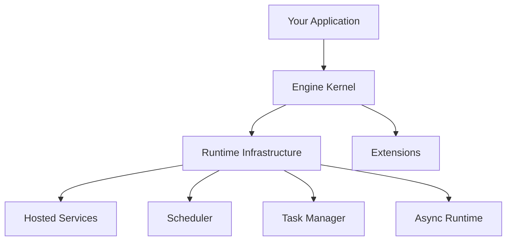

> Applies to Sagittarius Engine v1.x

# Sagittarius Engine

A lightweight, modular Python Application Engine.

---

## What is Sagittarius Engine?

Sagittarius Engine is a **runtime host** — not a framework.

It provides the infrastructure your application needs to run: dependency injection, event bus, task scheduling, background services, and a structured extension system.

Your application decides its own architecture. The engine provides the capabilities.

---

## Architecture Philosophy

> **Applications choose architecture.**
> **Kernel provides capabilities.**
> **Extensions integrate technologies.**
> **SDK accelerates development.**

The engine is intentionally unopinionated about how you structure your domain, data layer, or presentation layer. Those decisions belong to your application.

---

## Who Is This For?

| Use Case | Suitable? |
|---|---|
| Trading bots | ✅ Yes |
| Desktop applications | ✅ Yes |
| Background workers | ✅ Yes |
| Long-running automation | ✅ Yes |
| CLI tools with scheduled tasks | ✅ Yes |
| Event-driven systems | ✅ Yes |
| Simple one-file scripts | ❌ No |
| Basic CRUD web apps | ❌ No |
| ORM wrapper projects | ❌ No |

---

## Core Concepts

| Concept | Purpose |
|---|---|
| **App** | Public façade — the only entry point your code touches |
| **EngineContext** | Shared runtime state accessible to extensions |
| **Extension** | First-class plugin with a managed lifecycle |
| **Dispatcher** | Unified request handler for commands and queries |
| **Event Bus** | Decoupled event publishing and subscription |
| **Hosted Service** | Long-running component managed by the engine |
| **Scheduler** | Interval and cron-based background scheduling |
| **Task Manager** | Spawn and track background tasks |

---

## Learning Path

Follow this sequence to get productive quickly:

1. **[Installation](getting-started/installation.md)** — Set up your environment
2. **[First App](getting-started/first_app.md)** — Boot and stop the engine
3. **[First Extension](getting-started/first_extension.md)** — Register your first plugin
4. **[Project Templates](getting-started/project_templates.md)** — Generate a structured project

After getting started:

- Read **Concepts** to understand the engine's design decisions
- Explore **Runtime** guides for hosting services, scheduling, and async execution
- See **Examples** for real-world reference applications

---

> [Found an issue? Edit this page on GitHub.](https://github.com/anhembedded/Sagittarius-Engine/edit/main/docs/index.md)
