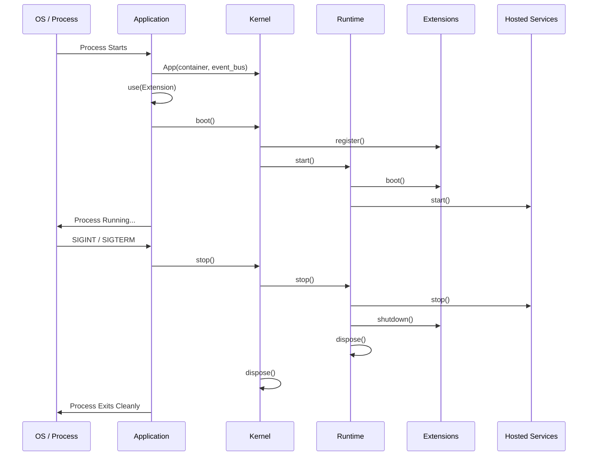

> Applies to Sagittarius Engine v1.x

# Application Lifecycle

## Runtime Component Relationships

Application -> Kernel -> Runtime -> Hosted Services -> Scheduler -> TaskManager -> AsyncRuntime

## Overview

The Application Lifecycle defines the exact sequence of events that occur from the moment the application process starts until it gracefully exits. This guide explains the actual runtime execution, including startup ordering, rollback guarantees, and shutdown ordering.

*Do NOT explain architecture philosophy, kernel responsibilities, or extension concepts here. For those, see the Core Concepts.*

## Why

Understanding the runtime execution sequence is critical for managing state transitions, allocating resources, and ensuring that application dependencies are properly initialized and safely torn down.

## When to Use

Use this knowledge when:
- Designing initialization logic.
- Registering long-running services.
- Implementing graceful shutdown handling.

## When NOT to Use

Do not rely on this guide to understand:
- Dependency injection details (see `dependency_injection.md`).
- Specific extension implementations.

## Runtime Responsibilities

The Runtime manages the state transitions of the application:
1. **Boot Sequence**: Initializes extensions and the event bus.
2. **Startup Order**: Starts the runtime environment, TaskManager, Scheduler, and Hosted Services in a strict topological order.
3. **Execution**: Maintains the active execution state and monitors for termination signals.
4. **Shutdown Order**: Stops services in the reverse order of startup.
5. **Rollback Guarantees**: If startup fails at any point, the runtime automatically rolls back, cleaning up any successfully started components.
6. **Thread Cleanup**: Joins worker threads.
7. **Async Runtime Shutdown**: Cancels pending coroutines and closes the event loop.

## Lifecycle

The runtime transitions through the following phases:
1. `Configured`
2. `Booting`
3. `Starting`
4. `Running`
5. `Stopping`
6. `Disposed`

## Architecture



## Basic Example

```python
import time
from sagittarius_engine import App
from sagittarius_engine.infrastructure.container.std_container import StdLibContainer
from sagittarius_engine.infrastructure.event_bus.memory_event_bus import MemoryEventBus

def main():
    container = StdLibContainer()
    event_bus = MemoryEventBus()
    app = App(container, event_bus)
    
    # Trigger the Boot Sequence
    app.boot()
    
    try:
        # Simulate application running
        time.sleep(0.1)
    finally:
        # Trigger the Shutdown Sequence
        app.stop()
```

## Advanced Example

```python
import time
from sagittarius_engine import App
from sagittarius_engine.infrastructure.container.std_container import StdLibContainer
from sagittarius_engine.infrastructure.event_bus.memory_event_bus import MemoryEventBus

def main():
    container = StdLibContainer()
    event_bus = MemoryEventBus()
    app = App(container, event_bus)
    app.boot()
    
    try:
        print("Application is running...")
        # Simulate waiting for an interrupt
        time.sleep(0.1)
    except KeyboardInterrupt:
        print("Received termination signal.")
    finally:
        print("Shutting down gracefully...")
        app.stop()
```

## Best Practices

- Always use a `try...finally` block or context manager to ensure `app.stop()` is called.
- Hook into termination signals (`SIGINT`, `SIGTERM`) to trigger graceful shutdown.
- Do not perform heavy work directly in the main thread after `boot()`. Delegate work to `TaskManager` or `HostedServices`.

## Common Mistakes

- **Forgetting `app.stop()`**: This will leak resources, leave worker threads dangling, and prevent the async event loop from closing.
- **Blocking the Main Thread Indefinitely**: Using a tight `while True:` loop without yielding or checking `app.context.is_running` prevents the application from responding to shutdown commands.

## Related Concepts

- [Concepts: Lifecycle](../concepts/lifecycle.md)
- [Concepts: Engine](../concepts/engine.md)

## Related Runtime Guides

- [Hosted Services](hosted_services.md)
- [Cancellation Token](cancellation_token.md)

## Related Tutorials

- *(No tutorials yet)*

## Related API Reference

- [App](../api/app.md)
- [EngineContext](../api/engine_context.md)

> [Found an issue? Edit this page on GitHub.](#)
