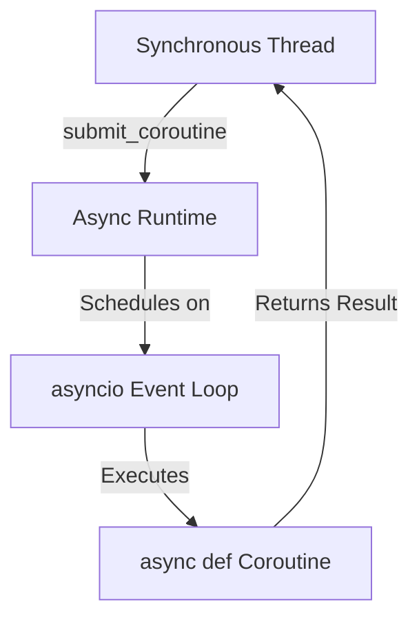

> Applies to Sagittarius Engine v1.x

# Async Runtime

## Runtime Component Relationships

Application -> TaskManager -> AsyncRuntime -> asyncio Event Loop

## Overview

The Async Runtime is the asynchronous execution environment managed by the engine. It encapsulates a dedicated `asyncio` event loop running in a background thread, allowing developers to execute asynchronous coroutines safely without interfering with the main synchronous application thread.

## Why

Modern Python applications frequently interact with asynchronous libraries (e.g., HTTP clients, WebSockets, async databases). However, bridging synchronous code and asynchronous code manually using `asyncio.run()` or `asyncio.create_task()` can lead to deadlocks, nested event loop errors, and resource leaks. The Async Runtime exists to manage this bridge seamlessly.

## When to Use

Developers benefit from the Async Runtime when:
- Executing an asynchronous function from a synchronous context.
- Offloading IO-bound work that supports `asyncio`.
- Integrating async-first extensions (like a Web Server or WebSocket handler) into a sync-first engine.

## When NOT to Use

Do NOT use the Async Runtime for:
- CPU-bound calculations (use the `TaskManager` thread pool instead).
- Synchronous blocking IO like standard file reads or `requests.get()` (use the `TaskManager` thread pool instead).

## Runtime Responsibilities

1. **Event Loop Management**: Creates and maintains a dedicated background thread running a single, persistent `asyncio` event loop.
2. **Thread-Safe Scheduling**: Provides thread-safe mechanisms to schedule coroutines from synchronous threads.
3. **Synchronization**: Allows synchronous code and asynchronous execution to cooperate safely.
4. **Graceful Shutdown**: Cancels pending coroutines and closes the event loop cleanly when the application stops.

## Lifecycle

1. `boot()`: The engine initializes the Async Runtime, spawning the dedicated event loop thread.
2. *Running*: The event loop continually processes scheduled coroutines.
3. `stop()`: The application signals shutdown. The Async Runtime cancels pending coroutines, waits for them to exit, and closes the event loop.

## Architecture



## Basic Example

```python
import asyncio
from sagittarius_engine import App
from sagittarius_engine.infrastructure.container.std_container import StdLibContainer
from sagittarius_engine.infrastructure.event_bus.memory_event_bus import MemoryEventBus

async def perform_async_work():
    print("Async work started.")
    await asyncio.sleep(0.1)
    print("Async work finished.")

def main():
    container = StdLibContainer()
    event_bus = MemoryEventBus()
    app = App(container, event_bus)
    app.boot()
    
    # Coroutines can be scheduled on the engine's async runtime
    # (Using the appropriate public API exposed by the TaskManager)
    
    app.stop()
```

## Advanced Example

```python
import asyncio
from sagittarius_engine import App
from sagittarius_engine.infrastructure.container.std_container import StdLibContainer
from sagittarius_engine.infrastructure.event_bus.memory_event_bus import MemoryEventBus

async def fetch_data_async():
    await asyncio.sleep(0.1)
    return {"status": "success"}

def main():
    container = StdLibContainer()
    event_bus = MemoryEventBus()
    app = App(container, event_bus)
    app.boot()
    
    # Synchronous code can await async results using the engine's utilities
    # result = app.context.tasks.run_sync(fetch_data_async())
    
    app.stop()
```

## Best Practices

- Do not use `asyncio.get_event_loop()` directly from synchronous threads. Always route asynchronous work through the `TaskManager`'s async utilities.
- Keep coroutines small and focused on IO.

## Common Mistakes

- **Blocking the Event Loop**: Calling `time.sleep()` or performing heavy CPU calculations inside an `async def` function will freeze the entire async runtime. Always use `await asyncio.sleep()` or offload CPU work to a thread pool.

## Related Concepts

- [Concepts: Lifecycle](../concepts/lifecycle.md)

## Related Runtime Guides

- [Task Manager](task_manager.md)

## Related Tutorials

- *(No tutorials yet)*

## Related API Reference

- [TaskManager](../api/task_manager.md)

> [Found an issue? Edit this page on GitHub.](#)
