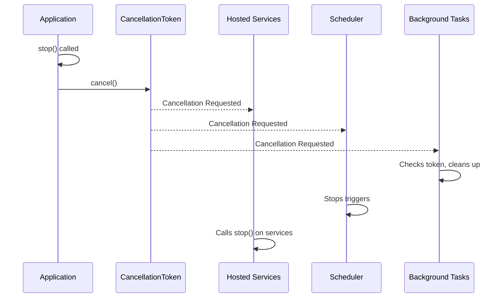

> Applies to Sagittarius Engine v1.x

# Cancellation Token

## Runtime Component Relationships

Application Stop -> CancellationToken -> Hosted Services -> Scheduler -> Background Tasks

## Overview

A `CancellationToken` is a lightweight object that signals when an operation should be cancelled. The engine uses a Cancellation Hierarchy to propagate termination signals from the top-level application down to individual background tasks, ensuring a graceful shutdown across all runtime components.

## Why

Forcefully terminating threads or processes can lead to corrupted data, unfinished database transactions, and resource leaks. Cooperative cancellation allows running code to detect that a shutdown has been requested and clean up safely before exiting.

## When to Use

Use a Cancellation Token when:
- Writing long-running background tasks.
- Implementing `IHostedService.start()`.
- Executing IO-bound operations that support timeouts.

## When NOT to Use

Do not use Cancellation Tokens for:
- Very short, immediate CPU operations that complete in less than a millisecond.

## Runtime Responsibilities

1. **Cancellation Hierarchy**: When `app.stop()` is called, the main cancellation token is triggered. This cascades down to Hosted Services, Schedulers, and TaskManagers.
2. **Cooperative Cancellation**: The runtime does not forcefully kill threads. It sets the token's state and waits for tasks to exit cooperatively.
3. **Timeouts**: The engine enforces maximum shutdown timeouts. If tasks do not respect the token within the timeout window, they may eventually be abandoned.

## Lifecycle

1. *Created*: A token is generated (e.g., during application boot).
2. *Passed*: The token is passed down into services and tasks.
3. *Checked*: The running task periodically checks `token.is_cancellation_requested`.
4. *Triggered*: The engine requests cancellation.
5. *Acknowledged*: The task detects the cancellation, cleans up, and returns.

## Architecture



## Basic Example

```python
import time
from sagittarius_engine import App
from sagittarius_engine.infrastructure.container.std_container import StdLibContainer
from sagittarius_engine.infrastructure.event_bus.memory_event_bus import MemoryEventBus

def background_work(token):
    print("Background work started.")
    # Periodically check the cancellation token
    while not token.is_cancellation_requested:
        time.sleep(0.05)
    print("Cancellation requested! Cleaning up...")

def main():
    container = StdLibContainer()
    event_bus = MemoryEventBus()
    app = App(container, event_bus)
    app.boot()
    
    # The engine injects the cancellation token automatically
    app.context.tasks.spawn(background_work)
    
    time.sleep(0.1)
    app.stop()
```

## Advanced Example

```python
import time
from sagittarius_engine import App
from sagittarius_engine.infrastructure.container.std_container import StdLibContainer
from sagittarius_engine.infrastructure.event_bus.memory_event_bus import MemoryEventBus

def batched_database_update(token):
    records = [1, 2, 3, 4, 5]
    for idx, record in enumerate(records):
        if token.is_cancellation_requested:
            print(f"Aborting batch update at record {idx}. Rolling back...")
            return
        
        # Simulate processing a record
        time.sleep(0.05)
        
    print("Batch update completed successfully.")

def main():
    container = StdLibContainer()
    event_bus = MemoryEventBus()
    app = App(container, event_bus)
    app.boot()
    
    app.context.tasks.spawn(batched_database_update)
    
    time.sleep(0.1)
    app.stop() # Triggers cancellation before all records are processed
```

## Best Practices

- Check `token.is_cancellation_requested` at safe yield points in your code, such as the beginning of a loop iteration.
- Clean up resources immediately after detecting cancellation.

## Common Mistakes

- **Ignoring the Token**: If you accept a `CancellationToken` but never check it, your task will block the application from shutting down gracefully.
- **Forceful Termination**: Relying on the OS or process manager to kill the application instead of using cooperative cancellation.

## Related Concepts

- [Concepts: Lifecycle](../concepts/lifecycle.md)

## Related Runtime Guides

- [Task Manager](task_manager.md)
- [Hosted Services](hosted_services.md)

## Related Tutorials

- *(No tutorials yet)*

## Related API Reference

- [CancellationToken](../api/cancellation_token.md)

> [Found an issue? Edit this page on GitHub.](https://github.com/your-repo/edit/main/docs/runtime/cancellation_token.md)
