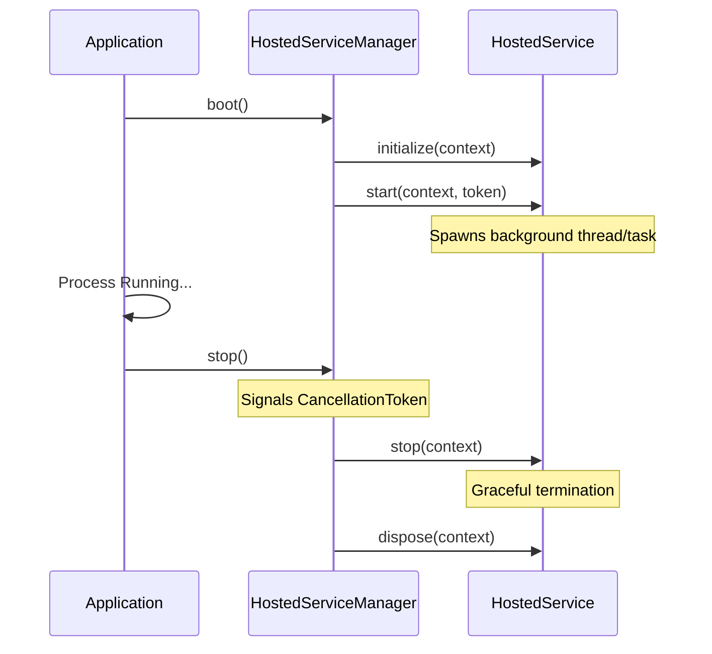

> Applies to Sagittarius Engine v1.x

# Hosted Services

## Runtime Component Relationships

Application -> HostedServiceManager -> HostedService

## Overview

A Hosted Service is a long-running background service managed directly by the engine. It has a well-defined lifecycle and executes alongside the main application. Hosted Services are owned by the `HostedServiceManager`, which itself is owned by the `Application`.

## Why

Many applications require background processes that run continuously (e.g., a message queue consumer, a WebSocket listener, a cache invalidator). Rather than manually managing the threads and lifecycle for these services, Hosted Services provide a standardized way to initialize, start, stop, and clean up background work.

## When to Use

Use Hosted Services when you need:
- A long-running process that stays alive for the duration of the application.
- To listen to external events (e.g., message brokers, socket connections).
- To manage background state that requires graceful shutdown.

## When NOT to Use

Do not use Hosted Services for:
- Short-lived, one-off tasks (use `TaskManager` instead).
- Work that simply needs to run on a timer (use `Scheduler` instead).

## Runtime Responsibilities

The runtime ensures Hosted Services behave predictably:
1. **Startup Ordering**: Services are started sequentially during the application boot phase.
2. **Shutdown Ordering**: Services are stopped in reverse order during shutdown.
3. **Rollback Behavior**: If a service fails to start, the engine automatically rolls back, calling `stop()` and `dispose()` on any services that already successfully started.
4. **Cancellation**: Services are provided a `CancellationToken` that triggers when the application shuts down, enabling cooperative cancellation.

## Lifecycle

A Hosted Service implements `IHostedService` and follows this lifecycle:
1. `initialize(context)`: Called once when the service is registered.
2. `start(context, token)`: Called during engine boot. Must not block indefinitely.
3. *Running*: The service does its work in the background.
4. `stop(context)`: Called during engine shutdown.
5. `dispose(context)`: Called to release unmanaged resources.

## Architecture



## Basic Example

```python
from sagittarius_engine import App
from sagittarius_engine.runtime.hosted import IHostedService
from sagittarius_engine.infrastructure.container.std_container import StdLibContainer
from sagittarius_engine.infrastructure.event_bus.memory_event_bus import MemoryEventBus

class WorkerService(IHostedService):
    def start(self, context, token):
        print("WorkerService starting...")
        
    def stop(self, context):
        print("WorkerService stopping...")

def main():
    container = StdLibContainer()
    event_bus = MemoryEventBus()
    app = App(container, event_bus)
    
    app.context.hosted_services.add(WorkerService())
    app.boot()
    app.stop()
```

## Advanced Example

```python
import time
import threading
from sagittarius_engine import App
from sagittarius_engine.runtime.hosted import IHostedService
from sagittarius_engine.infrastructure.container.std_container import StdLibContainer
from sagittarius_engine.infrastructure.event_bus.memory_event_bus import MemoryEventBus

class QueueConsumerService(IHostedService):
    def start(self, context, token):
        self.thread = threading.Thread(target=self._run, args=(token,))
        self.thread.start()

    def _run(self, token):
        while not token.is_cancellation_requested:
            # Simulate consuming a message
            time.sleep(0.05)
        print("QueueConsumerService shutting down gracefully...")

    def stop(self, context):
        self.thread.join(timeout=1.0)

def main():
    container = StdLibContainer()
    event_bus = MemoryEventBus()
    app = App(container, event_bus)
    app.context.hosted_services.add(QueueConsumerService())
    app.boot()
    time.sleep(0.1)
    app.stop()
```

## Best Practices

- Ensure `start()` returns quickly. Do not put an infinite loop directly in `start()`, as this will block the application boot sequence.
- Always respect the `CancellationToken` to ensure your background threads can exit cleanly when the engine shuts down.
- Catch and handle exceptions within your background loops to prevent silent failures.

## Common Mistakes

- **Blocking `start()`**: Calling `time.sleep(100)` or `while True:` inside `start()` will freeze the engine and prevent other services from starting.
- **Ignoring Cancellation**: If your background thread never checks the `CancellationToken`, the application will hang indefinitely during shutdown.

## Related Concepts

- [Concepts: Lifecycle](../concepts/lifecycle.md)

## Related Runtime Guides

- [Task Manager](task_manager.md)
- [Cancellation Token](cancellation_token.md)

## Related Tutorials

- *(No tutorials yet)*

## Related API Reference

- [IHostedService](../api/hosted_service.md)

> [Found an issue? Edit this page on GitHub.](#)
