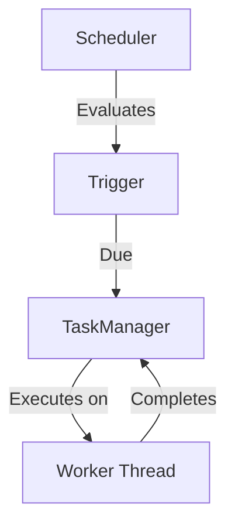

> Applies to Sagittarius Engine v1.x

# Scheduler

## Runtime Component Relationships

Application -> Scheduler -> TaskManager -> Worker Thread

## Overview

The Scheduler is a specialized runtime component that manages the execution of recurring tasks based on time intervals or Cron expressions (if supported by the current public API).

## Why

Many systems need to perform periodic background work, such as polling a database, cleaning up expired cache entries, or dispatching batched metrics. The Scheduler abstracts away the complexity of timer threads, sleep loops, and drift correction.

## When to Use

Use the Scheduler when:
- A task needs to run periodically (e.g., every 5 seconds).
- A task needs to run at specific scheduled times.

## When NOT to Use

Do NOT use the Scheduler for:
- Continuous stream processing (use a [Hosted Service](hosted_services.md) instead).
- Fire-and-forget background tasks that run exactly once (use the [Task Manager](task_manager.md) instead).

## Runtime Responsibilities

1. **Trigger Evaluation**: Continuously checks if any scheduled jobs are due for execution.
2. **Isolation**: Scheduled jobs execute in isolation. If a job throws an exception, it is caught and logged, preventing the Scheduler itself from crashing.
3. **Delegation**: When a job is triggered, the Scheduler does not execute the job synchronously on its own timer thread. Instead, it delegates the actual execution to the `TaskManager`.
4. **Graceful Shutdown**: Upon application termination, the Scheduler stops accepting new triggers and gracefully waits for currently executing jobs to finish (cooperating with the `CancellationToken`).

## Lifecycle

The Scheduler operates as a built-in Hosted Service:
1. `start()`: Initializes the internal timer loop.
2. *Running*: Evaluates schedules and dispatches work to the `TaskManager`.
3. `stop()`: Signals the internal timer loop to stop and waits for dispatched jobs to complete.

## Architecture



## Basic Example

```python
import time
from sagittarius_engine import App
from sagittarius_engine.infrastructure.container.std_container import StdLibContainer
from sagittarius_engine.infrastructure.event_bus.memory_event_bus import MemoryEventBus

def my_scheduled_job():
    print("Executing scheduled job...")

def main():
    container = StdLibContainer()
    event_bus = MemoryEventBus()
    app = App(container, event_bus)
    
    # Schedule a job to run every 1 second
    app.context.scheduler.schedule_interval(my_scheduled_job, interval_seconds=1)
    
    app.boot()
    time.sleep(1.5)  # Let it run a few times
    app.stop()
```

## Advanced Example

```python
import time
from sagittarius_engine import App
from sagittarius_engine.infrastructure.container.std_container import StdLibContainer
from sagittarius_engine.infrastructure.event_bus.memory_event_bus import MemoryEventBus

def risky_job():
    print("Executing risky job...")
    raise ValueError("Something went wrong!")

def main():
    container = StdLibContainer()
    event_bus = MemoryEventBus()
    app = App(container, event_bus)
    
    # The Scheduler will catch the exception and keep running
    app.context.scheduler.schedule_interval(risky_job, interval_seconds=1)
    
    app.boot()
    time.sleep(1.5)  # The scheduler will survive the ValueError
    app.stop()
```

## Best Practices

- Keep scheduled jobs relatively short. If a job takes longer to execute than its scheduled interval, overlapping executions may occur (depending on the engine configuration).
- Ensure your jobs are stateless, as the Scheduler may execute them on different worker threads each time.

## Common Mistakes

- **Blocking the Scheduler**: Trying to write your own custom `time.sleep()` loop instead of using `schedule_interval`.
- **Assuming Sequential Execution**: If job A is scheduled every 1 second and takes 5 seconds to run, multiple instances of job A might run concurrently. Always design jobs to be re-entrant or use a lock.

## Related Concepts

- [Concepts: Lifecycle](../concepts/lifecycle.md)

## Related Runtime Guides

- [Task Manager](task_manager.md)
- [Hosted Services](hosted_services.md)

## Related Tutorials

- *(No tutorials yet)*

## Related API Reference

- [Scheduler](../api/scheduler.md)

> [Found an issue? Edit this page on GitHub.](#)
