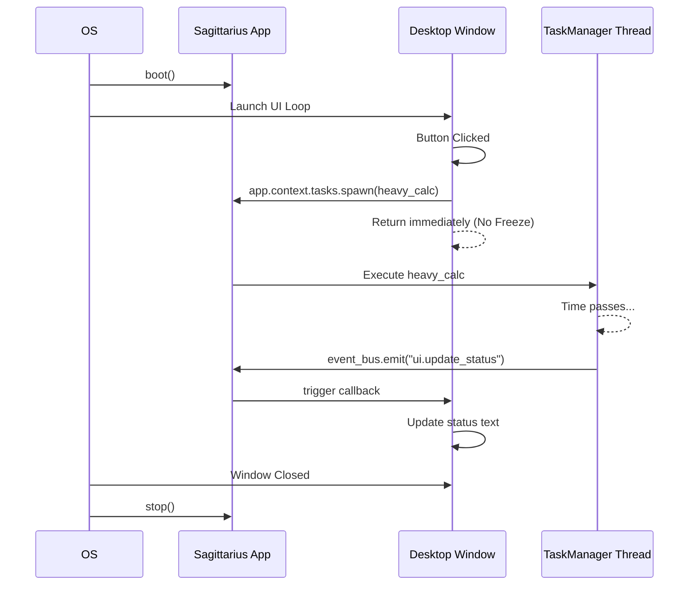

> Applies to Sagittarius Engine v1.x

# Desktop Application**Estimated Time**: 15 minutes  
**Difficulty**: Intermediate  
**Source Example**: `examples/desktop`

## Overview

This tutorial demonstrates how to integrate Sagittarius Engine into an event-driven desktop application (such as PySide6, PyQt, or Tkinter). Desktop applications present unique challenges because UI frameworks require all interface updates to happen on a specific "Main Thread". 

## Learning Outcomes

After completing this tutorial you will be able to:

- ✓ Embed Sagittarius Engine inside a Desktop Application
- ✓ Offload heavy computation to the Engine's `TaskManager`
- ✓ Safely communicate back to the UI thread using the `EventBus`
- ✓ Properly boot and shutdown the engine alongside the UI

## Why

Most desktop GUI frameworks block the main thread with their own event loops (`app.exec_()` or `mainloop()`). If you perform heavy operations directly in UI event handlers, the application will freeze and become unresponsive. 

Sagittarius Engine solves this by providing a unified `TaskManager` and `EventBus`. The UI can instantly offload work to the Engine and return to listening for user input, while the Engine computes in the background and asynchronously notifies the UI when finished.

## What You Will Build

You will build a mock desktop window that simulates a user clicking a button. The click will trigger a heavy background computation on a Sagittarius worker thread. Once complete, the background worker will use the EventBus to notify the UI to update its text.

## Prerequisites

- [Engine Concepts](../concepts/engine.md)
- [EventBus Concept Guide](../concepts/event_bus.md)
- [TaskManager Runtime Guide](../runtime/task_manager.md)

## Architecture

```mermaid
flowchart TB
    User((User)) -->|Clicks Button| Window
    
    subgraph UI Thread
        Window[Desktop Window]
    end
    
    subgraph Sagittarius Engine
        Tasks[TaskManager]
        Events[EventBus]
    end
    
    Window -->|1. spawn()| Tasks
    Tasks -->|2. Compute in background| Tasks
    Tasks -->|3. emit()| Events
    Events -->|4. on() handler| Window
```

### Runtime Lifecycle



## Project Structure

```text
examples/desktop/
├── main.py          # The core application logic
└── config.json      # Standard engine configuration
```

## Step 1: Setting up the Engine

Before launching a UI window, the engine needs to be initialized. We instantiate the required infrastructure (Container and EventBus) and boot the application.

```python
from sagittarius_engine import App
from sagittarius_engine.infrastructure.container.std_container import StdLibContainer
from sagittarius_engine.infrastructure.event_bus.memory_event_bus import MemoryEventBus
from sagittarius_engine.extensions.logger_module import LoggerModule

# Initialize Core Infrastructure
container = StdLibContainer()
event_bus = MemoryEventBus()
app = App(container, event_bus)

# Register Extensions
app.use(LoggerModule())

# Boot engine before UI launches
app.boot()
```

> **Why**: The UI layer often needs access to logging, configuration, and event systems immediately upon creation. Booting the engine first ensures the environment is fully constructed.

## Step 2: Creating the Window

We create a class to represent our Desktop window. The window takes the `app` instance so it can interact with the engine.

```python
# no-run
class MockDesktopWindow:
    def __init__(self, app: App) -> None:
        self.app = app
        self.logger = app.context.logger
        self.status_text = "Idle"

        # Register UI listener to engine event bus
        self.app.event_bus.on("ui.update_status", self.on_status_updated)

    def on_status_updated(self, event) -> None:
        self.status_text = event.text
        self.logger.info(f"[UI Thread] UI Label updated: {self.status_text}")
```

> **Why**: By subscribing to `"ui.update_status"`, the window decouples itself from *how* the status is calculated. It simply reacts to data whenever it arrives.

## Step 3: Dispatching Work

When the user interacts with the UI, we must not block. Instead, we use `app.context.tasks.spawn()` to hand the work to Sagittarius.

```python
# no-run
class Snippet:
    def simulate_button_click(self) -> None:
        self.logger.info("[UI Thread] Button clicked! Spawning background work...")
        
        # Dispatch background work to the engine TaskManager
        self.app.context.tasks.spawn(self.perform_heavy_calc, name="HeavyCalc")
```

> **Why**: `spawn()` returns instantly, leaving the UI Thread free to continue animating and listening for other clicks.

## Step 4: The Background Worker

The heavy calculation runs entirely on a background thread managed by Sagittarius.

```python
# no-run
class Snippet:
    def perform_heavy_calc(self) -> None:
        self.logger.info("[Worker Thread] Starting heavy calculations...")
        time.sleep(0.05)  # Simulated computation
        self.logger.info("[Worker Thread] Calculations finished. Notifying UI...")

        class UIEvent:
            def __init__(self, text: str) -> None:
                self.text = text

        self.app.event_bus.emit("ui.update_status", UIEvent("Task Complete!"))
```

> **Why**: Once the background thread finishes computing, it emits an event. The `EventBus` routes this back to the UI's registered handler.

For the complete implementation see: `examples/desktop/main.py`.

## Running the Application

To run the application, ensure your environment is activated, then execute:

```bash
python examples/desktop/main.py
```

### Expected Output

```text
[UI Thread] Button clicked! Spawning background work...
[Worker Thread] Starting heavy calculations...
[Worker Thread] Calculations finished. Notifying UI...
[UI Thread] UI Label updated: Task Complete!
```

## How It Works

1. **Decoupled Architecture**: The UI acts strictly as a "view". The Sagittarius Engine acts as the "controller/service" layer.
2. **Thread Safety**: The `MemoryEventBus` handles routing messages safely. (Note: in real PySide6 applications, you must bridge `MemoryEventBus` events to Qt `Signals` to strictly enter the Qt Main Thread).
3. **Graceful Shutdown**: Calling `app.stop()` at the end ensures all background tasks are cleanly terminated before the OS kills the process.

## Best Practices

| Do | Don't |
|---|---|
| Use `TaskManager` for file I/O or heavy math triggered by UI | Don't `time.sleep()` or wait for HTTP requests on the UI thread |
| Listen to Engine events to update progress bars | Don't tightly couple UI buttons directly to Database queries |
| Call `app.stop()` when the main window closes | Don't leave background threads orphaned when exiting |

## Common Mistakes

**Direct UI Updates from Background Threads**
Depending on the GUI framework (like PySide6), updating UI elements directly from a Sagittarius Worker Thread might cause crashes. You must often take the event emitted by Sagittarius and feed it into the GUI's native Signal/Slot mechanism.

## Next Steps

- Explore how to schedule recurring UI updates in the [Trading Bot Tutorial](trading_bot.md).
- Learn how to extract background work into an isolated [Worker Service](worker_service.md).

## Related Guides
- [TaskManager Guide](../runtime/task_manager.md)

## Related API Reference
- `IEventBus`
- `IEventBus`
- `TaskManager`

---
Found an issue? Edit this page on GitHub.
