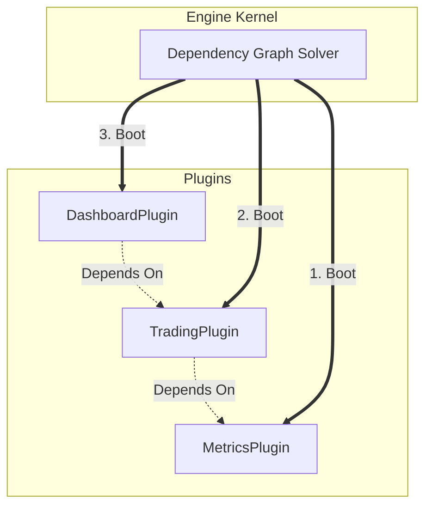
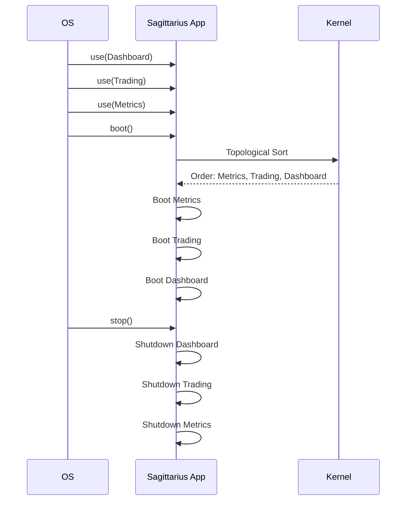

> Applies to Sagittarius Engine v1.x

# Plugin System

**Estimated Time**: 20 minutes  
**Difficulty**: Advanced  
**Source Example**: `examples/plugin_system`

## Overview

This tutorial demonstrates how to build a dynamic plugin architecture using Sagittarius Engine's Extension system. You will learn how to create independent extensions, define declarative dependencies between them, and rely on the engine to automatically compute the correct boot and shutdown order.

## Learning Outcomes

After completing this tutorial you will be able to:

- ✓ Implement the `IExtension` interface to create independent plugins
- ✓ Declare dependencies using string-based `ExtensionDescriptor` names
- ✓ Understand how the Engine automatically resolves the dependency graph
- ✓ Observe deterministic boot and shutdown ordering

## Why

As applications grow, stuffing all initialization logic into `main.py` creates a monolithic, unmaintainable mess. Different teams may own different features (e.g., Metrics, Trading, Dashboard), and these features often depend on each other.

Sagittarius Engine's Extension system solves this. Extensions are entirely decoupled. You define what an extension *needs* to run, and the Engine performs a topological sort. The Engine guarantees that an extension will never boot until all of its dependencies have fully booted, and it guarantees the reverse order during shutdown.

## What You Will Build

You will build three dummy extensions:
1. `MetricsPlugin`: Has no dependencies.
2. `TradingPlugin`: Depends on `MetricsPlugin` being active.
3. `DashboardPlugin`: Depends on `TradingPlugin` being active.

You will intentionally register them out of order in `main.py` to prove that the Engine automatically corrects the sequence.

## Prerequisites

- [Extension System Concepts](../concepts/extensions.md)
- [Extension Dependencies Advanced Guide](../advanced/extension_dependencies.md)

## Architecture



### Runtime Lifecycle



## Project Structure

```text
examples/plugin_system/
├── main.py          # The application composition
└── config.json      # Standard engine configuration
```

## Step 1: Creating a Base Plugin

Every plugin must implement the `IExtension` interface and provide an `ExtensionDescriptor`. The `MetricsPlugin` is our foundation; it has no dependencies.

```python
# no-run
from sagittarius_engine import IExtension, ExtensionDescriptor

class MetricsPlugin(IExtension):
    def __init__(self) -> None:
        self._desc = ExtensionDescriptor(name="MetricsPlugin", priority=10)
        self.initialized = False

    @property
    def descriptor(self) -> ExtensionDescriptor:
        return self._desc

    def register(self, context) -> None:
        self.initialized = True
        context.logger.info("[MetricsPlugin] Registered.")

    def boot(self, context) -> None:
        context.logger.info("[MetricsPlugin] Started.")
```

> **Why**: The `ExtensionDescriptor` provides the Engine with the metadata required to uniquely identify the extension in the dependency graph.

## Step 2: Declaring Dependencies

The `TradingPlugin` cannot function without metrics. Therefore, it declares `"MetricsPlugin"` in its `dependencies` array.

```python
# no-run
class TradingPlugin(IExtension):
    def __init__(self) -> None:
        self._desc = ExtensionDescriptor(
            name="TradingPlugin", dependencies=["MetricsPlugin"], priority=5
        )
        self.initialized = False

    @property
    def descriptor(self) -> ExtensionDescriptor:
        return self._desc

    def register(self, context) -> None:
        self.initialized = True
        context.logger.info("[TradingPlugin] Registered.")

    def boot(self, context) -> None:
        context.logger.info("[TradingPlugin] Started.")
```

> **Why**: We use string names (e.g., `"MetricsPlugin"`) rather than Python imports. This breaks circular dependencies at the module level and prevents strict coupling between plugin files.

## Step 3: Deep Dependencies

The `DashboardPlugin` requires trading data, so it depends on `"TradingPlugin"`. Transitively, this means it also depends on `"MetricsPlugin"`.

```python
# no-run
class DashboardPlugin(IExtension):
    def __init__(self) -> None:
        self._desc = ExtensionDescriptor(
            name="DashboardPlugin", dependencies=["TradingPlugin"], priority=0
        )
        self.initialized = False

    @property
    def descriptor(self) -> ExtensionDescriptor:
        return self._desc

    def register(self, context) -> None:
        self.initialized = True
        context.logger.info("[DashboardPlugin] Registered.")

    def boot(self, context) -> None:
        context.logger.info("[DashboardPlugin] Started.")
```

For the complete implementation of all lifecycle methods (including `shutdown` and `dispose`), see: `examples/plugin_system/main.py`.

## Step 4: Registering Out of Order

In `main.py`, we intentionally register the plugins in the reverse order.

```python
# no-run
class Snippet:
    # Register plugins in REVERSE dependency order
    app.use(DashboardPlugin())
    app.use(TradingPlugin())
    app.use(MetricsPlugin())

    # Boot the application
    app.boot()
```

> **Why**: This proves the engine's capability. Without a topological sort, `DashboardPlugin` would boot first and crash because `TradingPlugin` isn't ready. The Engine automatically computes the correct `Metrics -> Trading -> Dashboard` order.

## Running the Application

To run the application, ensure your environment is activated, then execute:

```bash
python examples/plugin_system/main.py
```

### Expected Output

```text
[MetricsPlugin] Registered.
[TradingPlugin] Registered.
[DashboardPlugin] Registered.
[MetricsPlugin] Started.
[TradingPlugin] Started.
[DashboardPlugin] Started.
[DashboardPlugin] Stopped.
[TradingPlugin] Stopped.
[MetricsPlugin] Stopped.
[DashboardPlugin] Disposed.
[TradingPlugin] Disposed.
[MetricsPlugin] Disposed.
```

## How It Works

1. **Registration Phase**: When you call `app.use()`, the engine merely adds the extension to a pending list. Nothing executes yet.
2. **Boot Phase**: When `app.boot()` is called, the Kernel extracts the `ExtensionDescriptor` from all pending plugins.
3. **Graph Solving**: The Kernel builds a Directed Acyclic Graph (DAG) using the `dependencies` fields. It detects cycles and performs a topological sort.
4. **Execution**: It loops through the sorted list, calling `register()` on all extensions, then `boot()` on all extensions.
5. **Shutdown Phase**: When `app.stop()` is called, the Kernel reads the sorted list in **reverse**. It calls `shutdown()`, then `dispose()`, ensuring that base infrastructure is torn down last.

## Best Practices

| Do | Don't |
|---|---|
| Use string-based names in `dependencies` | Don't use `import` inside an extension just to access another extension's class |
| Rely on the engine's topological sort | Don't manually order `app.use()` calls and hope for the best |
| Clean up resources in `shutdown()` | Don't leak background threads spawned by plugins |

## Common Mistakes

**Circular Dependencies**
If Plugin A depends on Plugin B, and Plugin B depends on Plugin A, the Kernel cannot resolve the graph. During `app.boot()`, the Engine will raise a `ModuleRegistrationError` indicating a cycle was detected. You must refactor your architecture to break the loop (usually by introducing a third, base plugin that both depend on).

## Next Steps

- Review the exact sorting algorithm rules in the [Extension Dependencies Advanced Guide](../advanced/extension_dependencies.md).
- Learn how to structure your core logic inside plugins using the [Application Lifecycle Guide](../runtime/application_lifecycle.md).

## Related Guides
- [Application Lifecycle Guide](../runtime/application_lifecycle.md)
- [Extension Dependencies Advanced Guide](../advanced/extension_dependencies.md)

## Related API Reference
- `IExtension`
- `ExtensionDescriptor`

---
> [Found an issue? Edit this page on GitHub.](https://github.com/your-repo/edit/main/docs/tutorials/plugin_system.md)
