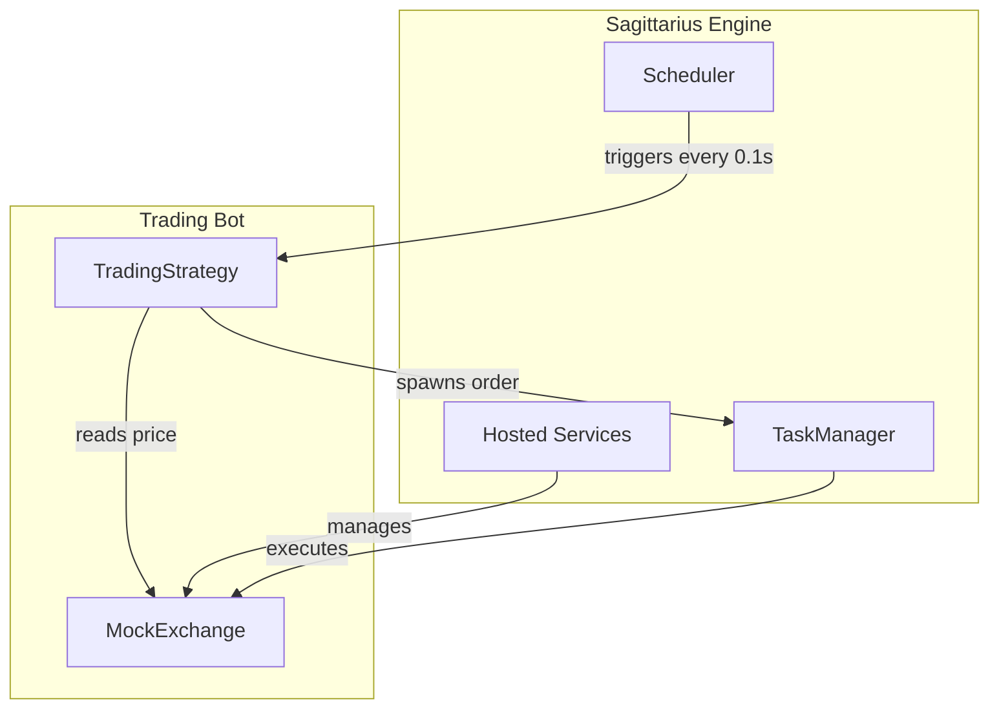
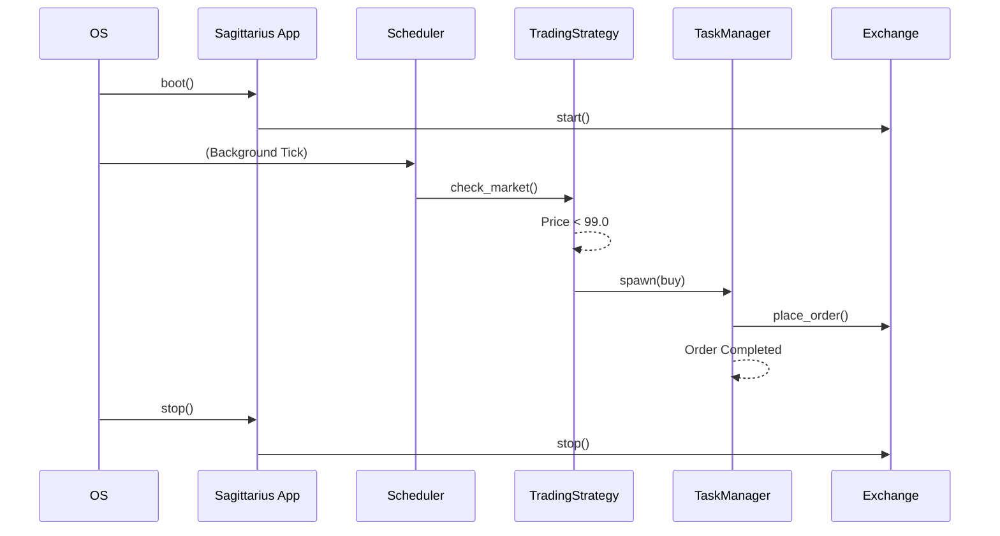

> Applies to Sagittarius Engine v1.x

# Trading Bot

**Estimated Time**: 30 minutes  
**Difficulty**: Advanced  
**Source Example**: `examples/trading_bot`

## Overview

This tutorial demonstrates how to build a long-running, autonomous trading bot using Sagittarius Engine. You will learn how to orchestrate multiple engine components—`HostedService`, `Scheduler`, and `TaskManager`—to create a system that continuously monitors market data and executes trades in the background.

## Learning Outcomes

After completing this tutorial you will be able to:

- ✓ Manage long-lived external connections using an `IHostedService`
- ✓ Schedule recurring tasks at fixed intervals using the `Scheduler`
- ✓ Offload blocking network calls (like placing orders) to the `TaskManager`
- ✓ Orchestrate a clean shutdown sequence

## Why

Algorithmic trading bots run 24/7. They must maintain stable WebSocket/REST connections to exchanges, evaluate strategies at precise intervals, and execute orders without blocking the main event loop. 

Sagittarius Engine is perfectly suited for this. Its `IHostedService` manages the exchange connection lifecycle, the `Scheduler` guarantees the strategy is evaluated precisely, and the `TaskManager` ensures that slow API calls (like `place_order`) don't delay the next market check.

## What You Will Build

You will build a simulated crypto trading bot. The application consists of:
1. A **MockExchange** (`IHostedService`) that streams simulated prices and accepts orders.
2. A **TradingStrategy** that evaluates a simple mean-reversion algorithm.
3. A **Scheduler** loop that triggers the strategy every 0.1 seconds.

## Prerequisites

- [Engine Concepts](../concepts/engine.md)
- [Hosted Services Runtime Guide](../runtime/hosted_services.md)
- [Scheduler Runtime Guide](../runtime/scheduler.md)
- [TaskManager Runtime Guide](../runtime/task_manager.md)

## Architecture



### Runtime Lifecycle



## Project Structure

```text
examples/trading_bot/
├── app/
│   ├── exchanges/
│   │   └── mock_exchange.py  # IHostedService implementation
│   └── strategies/
│       └── mean_reversion.py # Trading logic
├── main.py                   # Application composition and scheduling
└── config.json               # Engine configuration
```

## Step 1: The Exchange Connection

The exchange connection is an infrastructure dependency. We model it as an `IHostedService` so the engine can manage its lifecycle (connecting on boot, disconnecting on shutdown).

```python
# no-run
import time
import random
from sagittarius_engine.runtime import IHostedService

class MockExchange(IHostedService):
    def __init__(self) -> None:
        self.price = 100.0

    def start(self, context) -> None:
        context.logger.info("MockExchange connected. Price stream ready.")

    def stop(self, context) -> None:
        context.logger.info("MockExchange disconnected.")
        
    def get_latest_price(self) -> float:
        self.price += random.uniform(-1.0, 1.0)
        return self.price
```

> **Why**: By making the exchange an `IHostedService`, we guarantee the bot will not attempt to trade before the connection is established, and we guarantee the connection closes safely if the bot crashes.

For the complete implementation see: `examples/trading_bot/app/exchanges/mock_exchange.py`.

## Step 2: The Trading Strategy

The strategy requires both the `App` (to access the `TaskManager`) and the `MockExchange` (to read prices and place orders). 

```python
# no-run
class TradingStrategy:
    def __init__(self, app: App, exchange: MockExchange) -> None:
        self.app = app
        self.exchange = exchange
        self.logger = app.context.logger

    def check_market(self) -> None:
        price = self.exchange.get_latest_price()
        self.logger.info(f"[Strategy] Checked price: {price:.2f}")

        if price < 99.0:
            self.logger.info(f"[Strategy] Price cheap! Spawning BUY task...")
            self.app.context.tasks.spawn(self.buy)
```

> **Why**: The `check_market` function must return as fast as possible. Therefore, instead of placing the order synchronously, it uses `self.app.context.tasks.spawn()` to hand the slow network call off to a background thread.

For the complete implementation see: `examples/trading_bot/app/strategies/mean_reversion.py`.

## Step 3: Wiring It Together

In `main.py`, we construct the application, register the services, and use the `Scheduler` to set the tick rate.

```python
# no-run
class Snippet:
    # Create and register the hosted exchange connection
    exchange = MockExchange()
    app.context.hosted_services.register(exchange)

    # Boot the application
    app.boot()

    # Create strategy
    strategy = TradingStrategy(app, exchange)

    # Schedule strategy checks every 0.1 seconds
    app.context.scheduler.every(seconds=0.1).do(strategy.check_market)

    # Let the trading bot execute for 0.5 seconds
    time.sleep(0.5)

    # Shutdown gracefully
    app.stop()
```

> **Why**: We schedule `strategy.check_market` *after* `app.boot()`. This ensures the `MockExchange` is fully connected and initialized before the first strategy tick fires.

For the complete implementation see: `examples/trading_bot/main.py`.

## Running the Application

To run the application, ensure your environment is activated, then execute:

```bash
python examples/trading_bot/main.py
```

### Expected Output

```text
MockExchange connected. Price stream ready.
[Strategy] Checked price: 99.50
[Strategy] Checked price: 98.90
[Strategy] Price 98.90 is cheap! Spawning BUY order task...
[OrderExecution] Connecting to exchange to BUY...
[Strategy] Checked price: 99.10
[OrderExecution] BUY Order completed: ORDER_ID_1234
MockExchange disconnected.
```

## How It Works

1. **Initialization**: `app.boot()` iterates over all registered `IHostedService` instances and calls their `start()` methods.
2. **Scheduling**: The `Scheduler` creates a background thread that wakes up every 0.1 seconds and invokes `strategy.check_market()`.
3. **Execution**: When a condition is met, the strategy calls `spawn()`. The `TaskManager` assigns a worker thread from its pool to execute the `buy()` or `sell()` method concurrently.
4. **Shutdown**: `app.stop()` cleanly terminates the scheduler, waits for active tasks to finish, and calls `stop()` on the exchange.

## Best Practices

| Do | Don't |
|---|---|
| Manage WebSocket connections inside `IHostedService` | Don't create global socket instances |
| Spawn background tasks for slow I/O (placing orders) | Don't place network requests directly inside scheduled ticks |
| Use the `Scheduler` for recurring tasks | Don't use `time.sleep()` inside an infinite `while True` loop in `main.py` |

## Common Mistakes

**Blocking the Scheduler Tick**
If you place an order synchronously inside `check_market()`, and the exchange API takes 5 seconds to respond, your strategy will freeze and miss 50 market ticks. Always `spawn()` long-running tasks out of the scheduler thread.

## Next Steps

- Learn how to connect to real external services via asynchronous networking in the [WebSocket Client Tutorial](websocket_client.md).
- Learn how to structure complex applications into isolated modules via the [Plugin System Tutorial](plugin_system.md).

## Related Guides
- [Hosted Services Guide](../runtime/hosted_services.md)
- [Scheduler Guide](../runtime/scheduler.md)

## Related API Reference
- `IHostedService`
- `IScheduler`
- `ITaskManager`

---
> [Found an issue? Edit this page on GitHub.](https://github.com/your-repo/edit/main/docs/tutorials/trading_bot.md)
