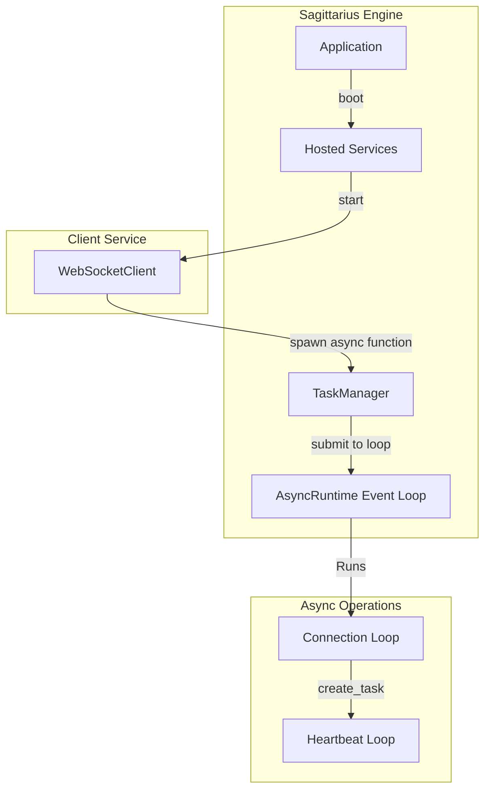
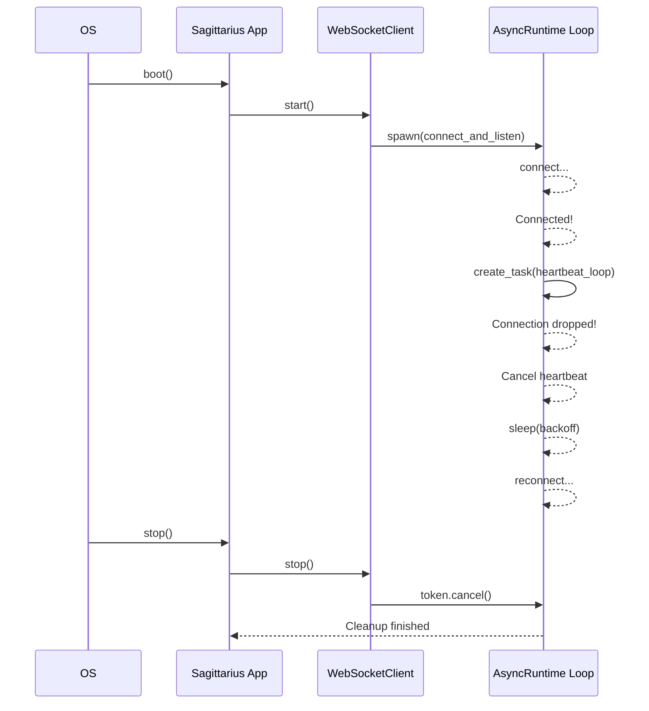

> Applies to Sagittarius Engine v1.x

# WebSocket Client**Estimated Time**: 20 minutes  
**Difficulty**: Intermediate  
**Source Example**: `examples/websocket`

## Overview

This tutorial demonstrates how to build a robust, asynchronous WebSocket client. You will learn how to leverage Sagittarius Engine's `AsyncRuntime` and `TaskManager` to manage concurrent network I/O, implement exponential backoff for reconnections, and run parallel background tasks (like heartbeats) without blocking the engine.

## Learning Outcomes

After completing this tutorial you will be able to:

- ✓ Spawn native `asyncio` coroutines through the `TaskManager`
- ✓ Implement infinite reconnection loops with exponential backoff
- ✓ Run parallel coroutines (like a Ping/Heartbeat loop)
- ✓ Gracefully cancel deep asynchronous call trees during shutdown

## Why

External network connections drop frequently. A naive WebSocket client will crash the application when the server disconnects. A slightly better client will reconnect, but might block the main application thread while trying.

Sagittarius Engine simplifies this by natively executing `async def` methods on its dedicated `AsyncRuntime` event loop. Your client can utilize standard `asyncio.sleep()` for backoff and `asyncio.create_task()` for parallel heartbeats, while remaining fully decoupled from the rest of the application logic.

## What You Will Build

You will build a `MockWebSocketClient` packaged as an `IHostedService`. When the application boots, it will spawn an asynchronous connection loop. It will simulate receiving messages, experiencing a sudden connection drop, backing off, and reconnecting—all while sending concurrent heartbeat PINGs.

## Prerequisites

- [Async Runtime Guide](../runtime/async_runtime.md)
- [Hosted Services Runtime Guide](../runtime/hosted_services.md)
- [TaskManager Guide](../runtime/task_manager.md)

## Architecture



### Runtime Lifecycle



## Project Structure

```text
examples/websocket/
├── main.py          # WebSocket client and application logic
└── config.json      # Standard engine configuration
```

## Step 1: The Hosted Service Wrapper

We wrap the entire client inside an `IHostedService`. The `start` method spawns the asynchronous coroutine. The Engine's `TaskManager` automatically detects that `connect_and_listen` is `async` and routes it to the `AsyncRuntime`.

```python
# no-run
import asyncio
from sagittarius_engine.runtime import IHostedService, CancellationToken

class MockWebSocketClient(IHostedService):
    def __init__(self, app: App) -> None:
        self.app = app
        self.logger = app.context.logger
        self.token = CancellationToken()
        self._main_task = None

    def start(self, context) -> None:
        # Spawn the async connection loop on the AsyncRuntime
        self._main_task = self.app.context.tasks.spawn(
            self.connect_and_listen, name="WebSocketClient", token=self.token
        )
        self.logger.info("WebSocket Hosted Service started.")
```

> **Why**: Using `spawn()` frees us from having to manually acquire the `asyncio` event loop.

## Step 2: Graceful Cancellation

During `stop()`, we signal the `CancellationToken`. We also use `timeout=2.0` on the `future.result()` to ensure we give the async loops time to clean up their internal sockets.

```python
# no-run
class Snippet:
    def stop(self, context) -> None:
        self.token.cancel()
        self.logger.info("WebSocket Hosted Service stopping...")
        if self._main_task and self._main_task.future:
            try:
                self._main_task.future.result(timeout=2.0)
            except Exception:
                pass
        self.logger.info("WebSocket Hosted Service stopped.")
```

## Step 3: The Connection Loop with Backoff

This loop manages connection attempts and reconnects if the socket drops.

```python
# no-run
class Snippet:
    async def connect_and_listen(self, token: CancellationToken) -> None:
        backoff = 0.01
        while not token.is_cancelled():
            try:
                self.logger.info("[WebSocket] Attempting connection...")
                await asyncio.sleep(0.01) # Simulate network connect
                self.logger.info("[WebSocket] Connected! Starting heartbeat...")
                backoff = 0.01  # Reset backoff on success

                # Start heartbeat coroutine
                heartbeat = asyncio.create_task(self.heartbeat_loop(token))

                # Listen to incoming messages
                while not token.is_cancelled():
                    await asyncio.sleep(0.05) # Simulate receiving packets
                    self.logger.info("[WebSocket] Received price tick update.")
                    
                    # Simulate unexpected connection drop
                    self.logger.warning("[WebSocket] Connection dropped by peer!")
                    break # Break inner loop to trigger reconnect

                # Cleanup heartbeat
                heartbeat.cancel()

            except Exception as e:
                self.logger.error(f"[WebSocket] Connection error: {e}")

            if not token.is_cancelled():
                self.logger.info(f"[WebSocket] Reconnecting in {backoff}s...")
                await asyncio.sleep(backoff)
                backoff = min(backoff * 2, 0.5) # Exponential backoff
```

> **Why**: We use `asyncio.sleep(backoff)` instead of `time.sleep()`. Using `time.sleep()` would completely block the Sagittarius Engine's single `AsyncRuntime` event loop, starving all other async tasks.

## Step 4: The Heartbeat Coroutine

Many WebSockets require a periodic ping to keep the connection alive. Since we are in the `AsyncRuntime`, we can simply spawn a parallel task.

```python
# no-run
class Snippet:
    async def heartbeat_loop(self, token: CancellationToken) -> None:
        while not token.is_cancelled():
            try:
                await asyncio.sleep(0.03)
                self.logger.info("[WebSocket] Heartbeat PING sent.")
            except asyncio.CancelledError:
                break
```

For the complete implementation see: `examples/websocket/main.py`.

## Running the Application

To run the application, ensure your environment is activated, then execute:

```bash
python examples/websocket/main.py
```

### Expected Output

```text
WebSocket Hosted Service started.
[WebSocket] Attempting connection...
[WebSocket] Connected! Starting heartbeat...
[WebSocket] Heartbeat PING sent.
[WebSocket] Received price tick update.
[WebSocket] Connection dropped by peer!
[WebSocket] Reconnecting in 0.01s...
[WebSocket] Attempting connection...
[WebSocket] Connected! Starting heartbeat...
WebSocket Hosted Service stopping...
WebSocket Hosted Service stopped.
```

## How It Works

1. **Async Routing**: When `tasks.spawn()` receives a coroutine function (declared with `async def`), it automatically submits it to the `AsyncRuntime` event loop via `asyncio.run_coroutine_threadsafe`.
2. **Inner Task Hierarchy**: The connection loop uses `asyncio.create_task()` to branch off the heartbeat loop. This is safe because both are now running natively within the `AsyncRuntime` loop.
3. **Backoff Math**: The `backoff = min(backoff * 2, 0.5)` logic ensures that if the server is offline, the client doesn't spam it with thousands of requests per second.

## Best Practices

| Do | Don't |
|---|---|
| Use `asyncio.sleep` for pauses in async functions | Don't use `time.sleep()` in `async def` methods |
| Cancel and await inner tasks (like heartbeats) when the main loop breaks | Don't leave orphaned `asyncio.create_task` routines running |
| Use exponential backoff for reconnections | Don't reconnect instantly in a tight loop |

## Common Mistakes

**Mixing Async and Sync**
Do not call synchronous blocking functions (like `requests.get()` or heavy CPU computations) directly inside `connect_and_listen()`. This will block the entire `AsyncRuntime`. If you receive a WebSocket packet that requires heavy processing, use `self.app.context.tasks.spawn()` to throw the work onto a synchronous thread pool worker.

## Next Steps

- Integrate the WebSocket client into a Trading Strategy using the [Trading Bot Tutorial](trading_bot.md).

## Related Guides
- [Async Runtime Guide](../runtime/async_runtime.md)

## Related API Reference
- `IAsyncRuntime`
- `CancellationToken`

---
> [Found an issue? Edit this page on GitHub.](https://github.com/your-repo/edit/main/docs/tutorials/websocket_client.md)
