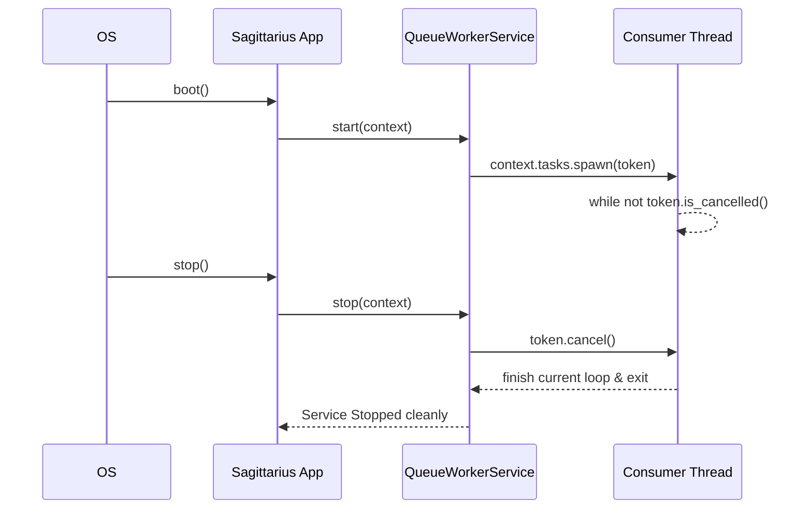

> Applies to Sagittarius Engine v1.x

# Worker Service

**Estimated Time**: 15 minutes  
**Difficulty**: Beginner  
**Source Example**: `examples/worker`

## Overview

This tutorial demonstrates how to build a background worker service that continuously consumes tasks from a queue. You will learn how to integrate long-running background loops directly into the application lifecycle, ensuring they start cleanly and shut down gracefully without losing data.

## Learning Outcomes

After completing this tutorial you will be able to:

- ✓ Register and manage an `IHostedService`
- ✓ Spawn continuous background loops using `TaskManager`
- ✓ Implement cooperative cancellation using `CancellationToken`
- ✓ Shut down gracefully, giving tasks time to finish

## Why

Many applications need background processing for things like sending emails, processing payments, or indexing data. If you simply spawn Python `threading.Thread` instances manually, your application might crash on exit or terminate while a job is half-finished. 

By using Sagittarius Engine's `IHostedService` and `CancellationToken`, your worker becomes a first-class citizen in the Engine's lifecycle. It will be instructed to pause taking new jobs and finish its current workload during application shutdown.

## What You Will Build

You will build a `QueueWorkerService` that simulates a standard producer-consumer pattern. The main application thread will push string "jobs" into a queue, and the background worker will pull them out and process them one by one.

## Prerequisites

- [Engine Concepts](../concepts/engine.md)
- [Hosted Services Runtime Guide](../runtime/hosted_services.md)
- [Cancellation Token Guide](../runtime/cancellation_token.md)

## Architecture

```mermaid
flowchart TB
    Producer((Main Thread)) -->|put()| Queue
    
    subgraph Sagittarius Engine
        App[Application]
        Host[Hosted Services]
        Tasks[TaskManager]
    end
    
    App -->|1. boot()| Host
    Host -->|2. start()| Worker[QueueWorkerService]
    Worker -->|3. spawn()| Tasks
    
    subgraph Worker Thread
        Consumer[Consumer Loop]
    end
    
    Tasks -->|4. execute| Consumer
    Queue -->|get()| Consumer
```

### Runtime Lifecycle



## Project Structure

```text
examples/worker/
├── main.py          # The queue worker logic
└── config.json      # Standard engine configuration
```

## Step 1: Implementing the Hosted Service

A Hosted Service must implement `start(context)` and `stop(context)`. Here, we initialize our queue and a `CancellationToken`.

```python
# no-run
import time
import queue
from sagittarius_engine import App
from sagittarius_engine.runtime import IHostedService, CancellationToken


class QueueWorkerService(IHostedService):
    def __init__(self, app: App) -> None:
        self.app = app
        self.logger = app.context.logger
        self.job_queue = queue.Queue()
        self.token = CancellationToken()
        self.task = None
```

> **Why**: Storing the `CancellationToken` at the class level allows the `stop()` method to signal the background loop that it's time to quit.

## Step 2: Starting the Consumer Loop

In the `start()` method, we use the `TaskManager` to spawn our continuous loop, passing the cancellation token to it.

```python
# no-run
class Snippet:
    def start(self, context) -> None:
        # Spawn the background queue consumer loop
        self.task = self.app.context.tasks.spawn(
            self.consume_loop, name="QueueConsumer", token=self.token
        )
        self.logger.info("Queue worker started.")
```

> **Why**: The `start()` method must return quickly so other Hosted Services can boot. Therefore, we push the `consume_loop` onto a separate thread managed by `TaskManager`.

## Step 3: Cooperative Cancellation

The `stop()` method is called by the Engine during shutdown. We signal cancellation and then `wait()` for the task to finish its final iteration.

```python
# no-run
class Snippet:
    def stop(self, context) -> None:
        # Signal cooperative cancellation
        self.token.cancel()
        self.logger.info("Cancellation signalled to queue worker.")

        # Wait for the consumer thread to finish processing
        if self.task and self.task.future:
            try:
                self.task.future.result(timeout=2.0)
            except Exception:
                pass
        self.logger.info("Queue worker stopped.")
```

> **Why**: Calling `token.cancel()` doesn't aggressively kill the thread. It simply flips a boolean flag that the loop can check safely.

## Step 4: The Consumer Loop

This is the code that actually processes the jobs. Notice how the `while` loop checks `token.is_cancelled()`.

```python
# no-run
class Snippet:
    def consume_loop(self, token: CancellationToken) -> None:
        while not token.is_cancelled():
            try:
                # Wait with timeout so we check cancellation regularly
                job = self.job_queue.get(timeout=0.02)
                self.logger.info(f"[Consumer] Processing job: '{job}'...")
                time.sleep(0.05)  # Simulate work
                self.logger.info(f"[Consumer] Completed job: '{job}'")
                self.job_queue.task_done()
            except queue.Empty:
                continue
```

> **Why**: We use `timeout=0.02` on `queue.get()`. If we blocked indefinitely without a timeout, the thread would never wake up to check `token.is_cancelled()`, causing the shutdown sequence to hang.

For the complete implementation see: `examples/worker/main.py`.

## Running the Application

To run the application, ensure your environment is activated, then execute:

```bash
python examples/worker/main.py
```

### Expected Output

```text
Queue worker started.
[Producer] Queued job: 'Import Transactions'
[Producer] Queued job: 'Generate Reports'
[Producer] Queued job: 'Send Email Notifications'
[Consumer] Processing job: 'Import Transactions'...
[Consumer] Completed job: 'Import Transactions'
[Consumer] Processing job: 'Generate Reports'...
[Consumer] Completed job: 'Generate Reports'
[Consumer] Processing job: 'Send Email Notifications'...
[Consumer] Completed job: 'Send Email Notifications'
Cancellation signalled to queue worker.
Queue worker stopped.
```

## How It Works

1. **Boot**: `app.boot()` invokes `start()` on the `QueueWorkerService`.
2. **Spawn**: `TaskManager` assigns a background thread to run `consume_loop`.
3. **Process**: The loop blocks momentarily on the queue, processes a job if one arrives, and repeats.
4. **Shutdown**: `app.stop()` invokes `stop()`. The token is cancelled.
5. **Exit**: The loop checks `token.is_cancelled()`, evaluates to `False`, and the thread terminates cleanly. The `stop()` method returns, and the application closes safely.

## Best Practices

| Do | Don't |
|---|---|
| Always check `token.is_cancelled()` inside long `while` loops | Don't perform infinite blocking calls (`queue.get()` without timeout) |
| Wait for the `future` to complete during `stop()` | Don't wait indefinitely in `stop()` without a timeout constraint |
| Log when a worker starts and stops for observability | Don't ignore exceptions inside the consumer loop; catch them |

## Common Mistakes

**Hanging on Shutdown**
If your background thread performs a blocking HTTP request without a timeout, and the engine attempts to shut down, the engine will hang waiting for `stop()` to return. Always use timeouts in background tasks so they can periodically check the cancellation token.

## Next Steps

- Learn how to run loops on a strict interval in the [Trading Bot Tutorial](trading_bot.md).
- Integrate third-party queue systems via the [Plugin System Tutorial](plugin_system.md).

## Related Guides
- [Hosted Services Guide](../runtime/hosted_services.md)
- [Cancellation Token Guide](../runtime/cancellation_token.md)

## Related API Reference
- `IHostedService`
- `ITaskManager`
- `ITaskManager`
- `CancellationToken`

---
> [Found an issue? Edit this page on GitHub.](https://github.com/anhembedded/Sagittarius-Engine/edit/main/docs/tutorials/worker_service.md)
