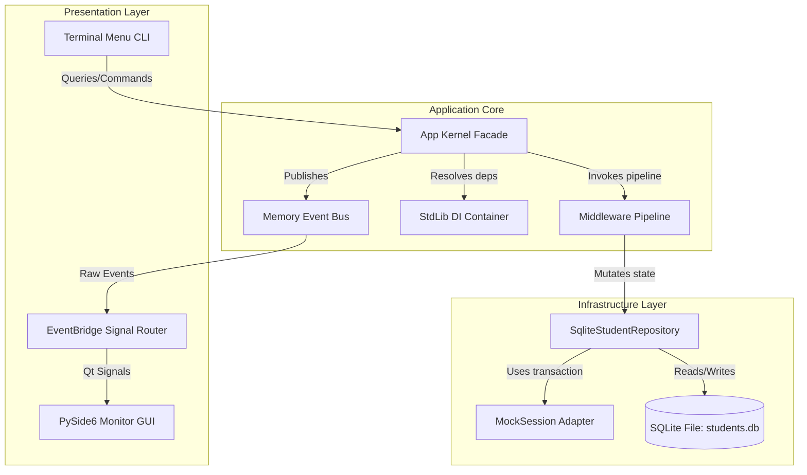
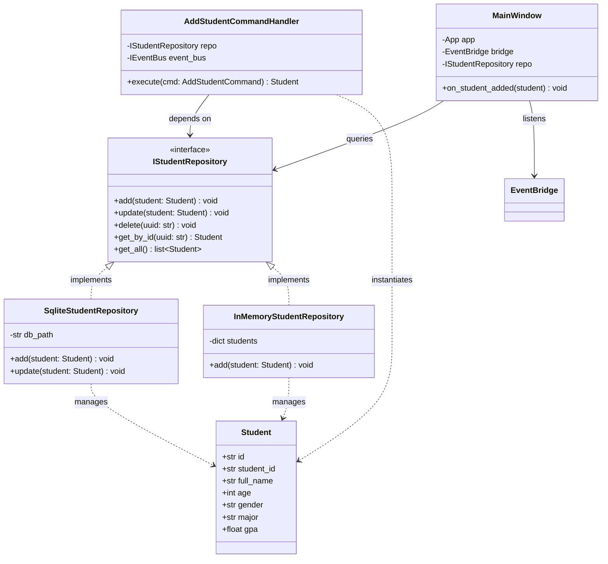
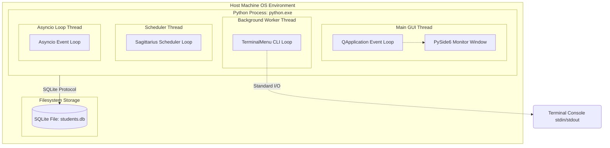
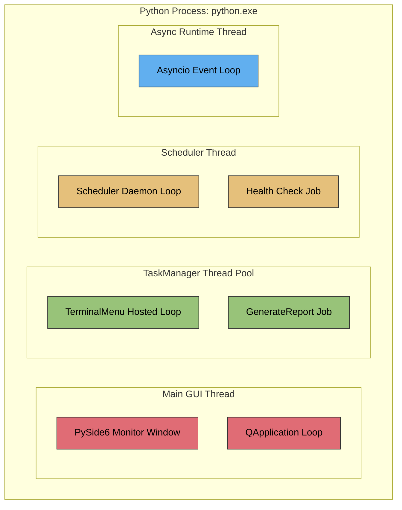
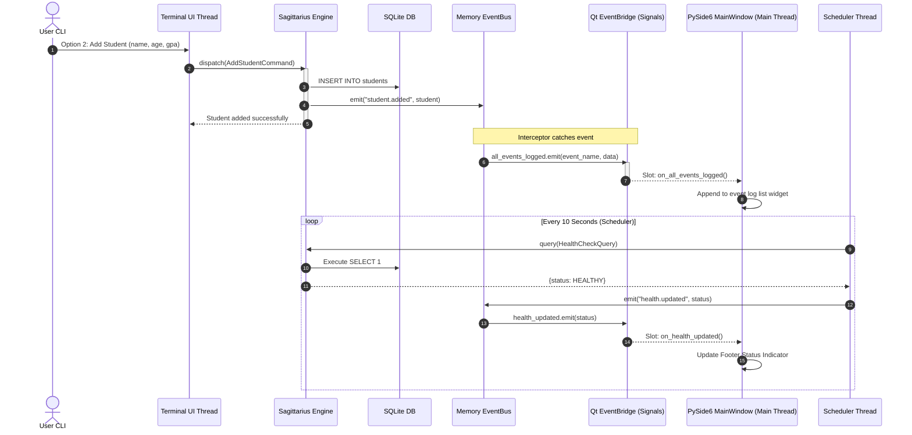

# Student Management Application

A complete, production-grade console and desktop management application demonstrating the capabilities of the **Sagittarius Engine** framework.

This application adheres strictly to **Clean Architecture** and uses a dual-UI presentation system: an interactive terminal menu and a PySide6 GUI monitor running in a single process.

---

## 📖 Architecture & Design Patterns

The project is structured according to Clean Architecture guidelines to isolate core business rules (Domain) from frameworks, user interfaces, and databases.

```
                      ┌─────────────────────────────────────────┐
                      │              Presentation               │
                      │   (TerminalMenu UI / PySide6 Window)    │
                      └────────────────────┬────────────────────┘
                                           │ (Dispatches DTOs)
                                           ▼
                      ┌─────────────────────────────────────────┐
                      │            Application Layer            │
                      │     (Commands, Queries, Handlers)       │
                      └────────────────────┬────────────────────┘
                                           │ (Injects Interfaces)
                                           ▼
                      ┌─────────────────────────────────────────┐
                      │              Domain Layer               │
                      │    (Student Model, Validation Rules)    │
                      └─────────────────────────────────────────┘
                                           ▲
                                           │ (Implements Ports)
                      ┌────────────────────┴────────────────────┐
                      │          Infrastructure Layer           │
                      │ (SQLite / In-Memory Repos, MockSession) │
                      └─────────────────────────────────────────┘
```

### Applied Design Patterns

* **Mediator Pattern / CQRS**: Commands and Queries are separated (Write vs. Read) and dispatched through the central `app.dispatch()` mediator.
* **Repository Pattern**: Business logic interacts with students via the abstract `IStudentRepository` interface, decoupling the database adapter from handlers.
* **Hosted Service Pattern**: The Terminal CLI loop is wrapped as an `IHostedService` spawned as a background task.
* **Observer Pattern**: The `IEventBus` handles asynchronous communications (e.g., student mutations, progress reports, health updates) between worker threads and UI listeners.
* **Thread-Safe Signal Bridge**: An `EventBridge` uses Qt Signals & Slots to safely marshal background multi-threaded EventBus notifications to PySide6's main GUI thread.
* **Decorator / Interceptor Pattern**: Overrides `MemoryEventBus.emit` to universally log and print every application event to the GUI.

### 🧩 Component Diagram



### 👥 Class Relationships



### 🌐 Deployment Topology



### 🧵 Module-to-Thread Mapping

The following table and diagram detail which thread runs each application module and how events are dispatched:

| Module / Extension | Thread Context | Concurrency Model & Lifecycle |
| :--- | :--- | :--- |
| **PySide6 Monitor GUI** | **Main Thread** (`MainThread`) | UI thread running the blocking `QApplication.exec()` loop. |
| **TerminalMenu UI** | **`SagittariusTask-X`** (Worker Pool Thread) | Spawned via `TaskManager` as a background hosted service to await standard input. |
| **Scheduler Module** | **`SagittariusScheduler`** (Daemon Thread) | Dedicated scheduler loop waking up on a Condition variable to trigger events. |
| **AsyncRuntime Module** | **`AsyncRuntimeLoop`** (Daemon Thread) | Event loop thread running `asyncio.run_forever()` for asyncio handlers. |
| **HealthExtension Diagnostics** | Dynamic (runs on caller's thread) | Runs synchronously on whichever thread invokes the query (TUI thread or Scheduler thread). |
| **MemoryEventBus** | Dynamic (runs on publisher's thread) | Executes handlers and maps callback loops synchronously on the publishing thread. |



---


## 🛠️ Key Features

1. **Full Student CRUD**: Add, Edit, Delete, List, and Search students with validation constraints (Name length, Age, GPA limits).
2. **Persistent Storage**: Utilizes SQLite database storage (`students.db`), reading target paths through the framework's `IConfig` provider.
3. **Middleware Pipeline**: Requests pass through a 5-layer pipeline:
   - `LoggingMiddleware`
   - `TimingMiddleware`
   - `ValidationMiddleware`
   - `TransactionMiddleware` (commits mock transactions on success, rolls back on exceptions)
   - `StudentValidationMiddleware` (Pydantic validation schemas)
4. **Asynchronous Reporting**: Select option **7** to compile GPA Analytics on a background worker. It pushes progress steps (`0%` -> `25%` -> `50%` -> `75%` -> `100%`) separated by 1-second intervals.
5. **System Diagnostics**: Native `HealthExtension` monitors container resolution, EventBus integrity, and SQLite database connectivity status.
6. **Task Scheduler**: Automatically triggers periodic diagnostics check every 10 seconds.
7. **Universal Event Logging**: Captures all application lifecycle events and logs them in real-time in the PySide6 panel.

---

## 🧬 Event-Driven Data Flow

This Mermaid diagram illustrates how background actions, scheduler events, and terminal choices sync onto the GUI thread:



---

## 📂 Directory Layout

```
examples/student_management/
├── app/
│   ├── commands/             # Write DTOs (Add, Edit, Delete, Report)
│   ├── contracts/            # IStudentRepository port
│   ├── handlers/             # CQRS command/query executors
│   ├── infrastructure/       # Persistence (SQLite, MockSession, Pydantic middlewares)
│   ├── models/               # Domain Entity (Student) and validation exceptions
│   ├── queries/              # Read DTOs (List, Search, Get)
│   └── ui/                   # UI Presentation (TerminalMenu, PySide6 GUI Monitor)
├── main.py                   # Composition Root and application startup entry
├── README.md                 # Documentation
└── tests/
    └── test_student_app.py   # Complete Unit and Integration suite
```

---

## 🚀 Getting Started

### Prerequisites

Ensure you have installed the required virtual environment dependencies:
```powershell
pip install PySide6 pydantic sqlalchemy
```

### Running the Application

Launch the application directly from the root workspace directory:
```powershell
python examples/student_management/main.py
```

* This starts the **Interactive Terminal Menu** in your terminal window and spawns the **PySide6 Monitor GUI** on the desktop simultaneously.
* Type options (1 to 9) in the terminal to view, insert, update, or remove database entries. The Desktop monitor table, logs, and footer health status indicators will update immediately in the background.

---

## 🧪 Testing

To run the verification suite:
```powershell
pytest examples/student_management/tests/test_student_app.py
```

The test suite covers:
* Strict domain validation rules (empty fields, age, or GPA limits).
* Integrity constraints (duplicate Student ID checks).
* Use-case handling (CRUD operations dispatched through `app.dispatch`).
* Multi-threaded asynchronous report generation.
* Configuration injection and cross-lifecycle persistence.
