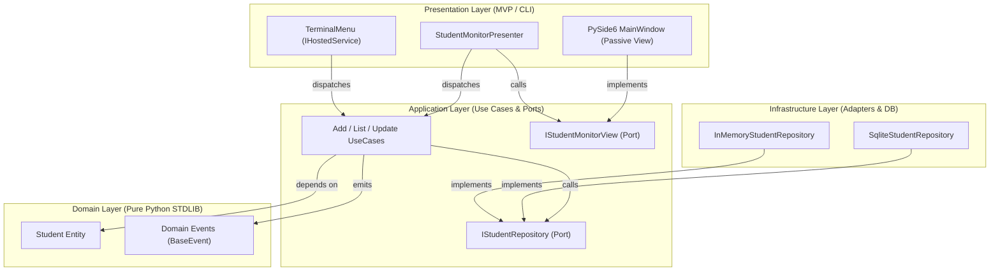
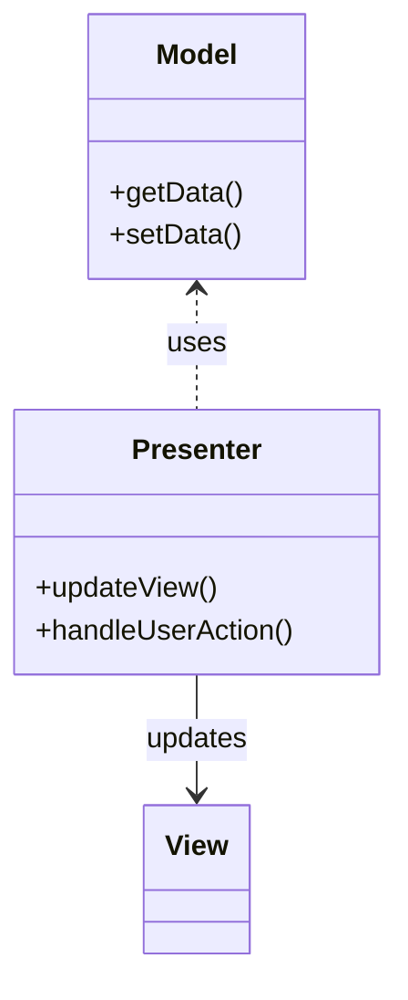

# Step-by-Step Guide: Building a Clean Architecture App with Sagittarius Framework

Welcome! As the Solutions Architect of the Sagittarius Framework, this guide will walk you step-by-step through building a complete, production-grade application (**Student Management System**) from scratch.

This guide demonstrates how **Sagittarius Framework** seamlessly integrates **Clean Architecture**, **CQRS**, **Dependency Injection**, **Event-Driven Architecture**, and the **Model-View-Presenter (MVP)** pattern.

---

## 1. Concepts & Architecture Flow

### What & Why?

Sagittarius is a lightweight, zero-boilerplate Python application framework adhering strictly to **Clean Architecture**:

* **Inward Dependency Rule**: Inner layers (Domain, Application) NEVER depend on outer layers (Infrastructure, Presentation).
* **Decoupled Business Logic**: Frameworks, databases, and UI are plugins that can be swapped without touching core logic.



---

## 2. Step-by-Step Implementation

### Step 1: Define the Domain Layer (`domain/`)

The Domain layer contains pure business rules and entities using **Python STDLIB ONLY** (no external imports).

#### 1.1 Create Domain Entity & Exceptions (`domain/student.py`)

```python
from dataclasses import dataclass

class StudentException(Exception): ...
class EmptyNameError(StudentException): ...
class InvalidGPAError(StudentException): ...

@dataclass
class Student:
    id: str
    student_id: str
    full_name: str
    age: int
    gender: str
    major: str
    gpa: float

    def __post_init__(self) -> None:
        if not self.full_name.strip():
            raise EmptyNameError("Name cannot be empty.")
        if not (0.0 <= self.gpa <= 4.0):
            raise InvalidGPAError("GPA must be between 0.0 and 4.0.")
```

#### 1.2 Create Domain Events (`domain/events.py`)

Domain events inherit from `BaseEvent` to automatically receive metadata (UUID `event_id` and UTC `occurred_on`).

```python
from sagittarius_engine.domain import BaseEvent
from examples.student_management.domain.student import Student


class StudentAddedEvent(BaseEvent):
    event_name = "student.added"

    def __init__(self, student: Student) -> None:
        super().__init__()
        self.student = student
```

---

### Step 2: Define Application Layer (`application/`)

The Application layer defines Use Cases, Ports (Abstract Interfaces), and DTOs.

#### 2.1 Define Output Ports (`application/contracts/`)

Ports define abstract interfaces required by the core application.

* `student_repository.py`:

```python
from abc import ABC, abstractmethod
from typing import Sequence
from examples.student_management.domain.student import Student


class IStudentRepository(ABC):
    @abstractmethod
    def add(self, student: Student) -> Student: ...
    @abstractmethod
    def get_all(self) -> Sequence[Student]: ...
```

* `student_monitor_view.py` (**MVP View Contract**):

```python
from typing import Sequence, Any
from examples.student_management.domain.student import Student


class IStudentMonitorView:
    def display_students(self, students: Sequence[Student]) -> None:
        raise NotImplementedError

    def update_student_row(self, student: Student) -> None:
        raise NotImplementedError

    def remove_student_row(self, uuid: str) -> None:
        raise NotImplementedError
```

#### 2.2 Define DTOs (`application/dtos/`)

Immutable dataclasses used as Command & Query payloads.

```python
from dataclasses import dataclass


@dataclass(frozen=True)
class AddStudentCommand:
    student_id: str
    full_name: str
    age: int
    gender: str
    major: str
    gpa: float
```

#### 2.3 Write Use Cases (`application/use_cases/`)

Use Cases implement CQRS interfaces (`ICommand[TInput, TOutput]` or `IQuery[TInput, TOutput]`).

```python
import uuid
from sagittarius_engine.interfaces import IEventBus
from examples.student_management.application.contracts.student_repository import (
    IStudentRepository,
)
from examples.student_management.application.contracts.use_case_ports import (
    IAddStudentUseCase,
)
from examples.student_management.application.dtos.commands import AddStudentCommand
from examples.student_management.domain.student import Student
from examples.student_management.domain.events import StudentAddedEvent


class AddStudentUseCase(IAddStudentUseCase):
    def __init__(self, repo: IStudentRepository, event_bus: IEventBus) -> None:
        self.repo = repo
        self.event_bus = event_bus

    def execute(self, command: AddStudentCommand) -> Student:
        student = Student(
            id=str(uuid.uuid4()),
            student_id=command.student_id,
            full_name=command.full_name,
            age=command.age,
            gender=command.gender,
            major=command.major,
            gpa=command.gpa,
        )
        self.repo.add(student)
        self.event_bus.emit(StudentAddedEvent(student))
        return student
```

---

### Step 3: Implement Infrastructure Adapters (`infrastructure/`)

Infrastructure implements the repository interfaces defined in the Application layer.

```python
import sqlite3
from sagittarius_engine.interfaces import IConfig
from examples.student_management.application.contracts.student_repository import IStudentRepository
from examples.student_management.domain.student import Student

class SqliteStudentRepository(IStudentRepository):
    def __init__(self, config: IConfig) -> None:
        self.db_path = config.get("database.path", "students.db")
```

---

### Step 4: Build Presentation Layer (MVP Pattern) (`presentation/`)

#### 4.1 Presenter (`presentation/presenters/student_monitor_presenter.py`)

The `StudentMonitorPresenter` mediates between `IStudentMonitorView` (Passive View) and the application layer without importing any GUI framework (PySide6).

```python
from sagittarius_engine import App
from examples.student_management.application.contracts.student_monitor_view import IStudentMonitorView
from examples.student_management.application.contracts.student_repository import IStudentRepository

class StudentMonitorPresenter:
    def __init__(self, view: IStudentMonitorView, app: App) -> None:
        self.view = view
        self.app = app
        self.repo = app.container.resolve(IStudentRepository)

    def initialize(self) -> None:
        students = self.repo.get_all()
        self.view.display_students(students)

    def on_student_added(self, student) -> None:
        self.view.update_student_row(student)
```

#### 4.2 Passive View (`presentation/ui/desktop_window.py`)

`MainWindow` inherits strictly from `QMainWindow` (Single Inheritance) and delegates `IStudentMonitorView` contract calls via `QtStudentMonitorViewAdapter`.

```python
from PySide6.QtWidgets import QMainWindow
from examples.student_management.application.contracts.student_monitor_view import IStudentMonitorView

class QtStudentMonitorViewAdapter(IStudentMonitorView):
    def __init__(self, window: "MainWindow") -> None:
        self.window = window
    # Delegates all contract calls to self.window

class MainWindow(QMainWindow):
    def __init__(self, app, bridge) -> None:
        super().__init__()
        self.view_adapter = QtStudentMonitorViewAdapter(self)
        self.presenter = StudentMonitorPresenter(self.view_adapter, app)

    def display_students(self, students) -> None:
        # Populate QTableWidget rows
        ...
```

---

### Step 5: Package into a Sagittarius Module (`student_module.py`)

Module classes inherit from `BaseModule` to configure Dependency Injection bindings.

```python
from sagittarius_engine import App
from sagittarius_engine.base import BaseModule
from examples.student_management.application.contracts.student_repository import IStudentRepository
from examples.student_management.infrastructure.sqlite_student_repo import SqliteStudentRepository
from examples.student_management.application.contracts.use_case_ports import IAddStudentUseCase
from examples.student_management.application.use_cases.add_student_use_case import AddStudentUseCase

class StudentModule(BaseModule):
    def register(self, app: App) -> None:
        # Bind IStudentRepository -> SqliteStudentRepository
        app.container.singleton(IStudentRepository, SqliteStudentRepository)

        # Bind UseCase Ports -> Concrete Implementations
        app.container.bind(IAddStudentUseCase, AddStudentUseCase)

    def boot(self, app: App) -> None:
        # Register event handlers / startup tasks here
        pass
```

---

### Step 6: Composition Root (`main.py`)

`main.py` wires all layers together, boots the `App` kernel, and starts hosted services.

```python
from sagittarius_engine import App
from sagittarius_engine.infrastructure.container.std_container import StdLibContainer
from sagittarius_engine.infrastructure.event_bus.memory_event_bus import MemoryEventBus
from sagittarius_engine.infrastructure.config.dict_config import DictConfig
from sagittarius_engine.interfaces import IConfig, IEventBus, IContainer

from examples.student_management.student_module import StudentModule
from examples.student_management.presentation.ui.desktop_window import MainWindow, EventBridge

def main() -> None:
    # 1. Composition Root Setup
    container = StdLibContainer()
    event_bus = MemoryEventBus()
    app = App(container, event_bus)

    # 2. Configuration & Interfaces Singletons
    config = DictConfig(initial_data={"database.path": "students.db"})
    container.singleton(IConfig, config)
    container.singleton(IEventBus, event_bus)
    container.singleton(IContainer, container)

    # 3. Register Modules
    app.use(StudentModule())

    # 4. Boot Kernel & Launch UI
    app.boot()
    window = MainWindow(app, EventBridge())
    window.show()

if __name__ == "__main__":
    main()
```

---

## 3. Best Practices & Common Gotchas

> [!TIP]
> **Program to Interfaces**: Always inject abstract interfaces (`IStudentRepository`, `IEventBus`) into UseCases and Presenters, never concrete implementations.

> [!IMPORTANT]
> **Registering Event Handlers**: Always register event handlers inside `boot()`, never inside `register()`. Registration phase is reserved strictly for DI container bindings.

> [!WARNING]
> **Thread Safety with GUI**: EventBus handlers may run on background thread pools or async event loops. Always use a thread-safe signal bridge (`EventBridge` via PySide6 Signals) to update GUI elements on the main UI thread.

---

## 4. Cross-References

* [Sagittarius Architecture Reference](file:///c:/Users/hoang/Documents/Sagittarius_ForkBoy/docs)
* [Example Implementation](file:///c:/Users/hoang/Documents/Sagittarius_ForkBoy/examples/student_management)


