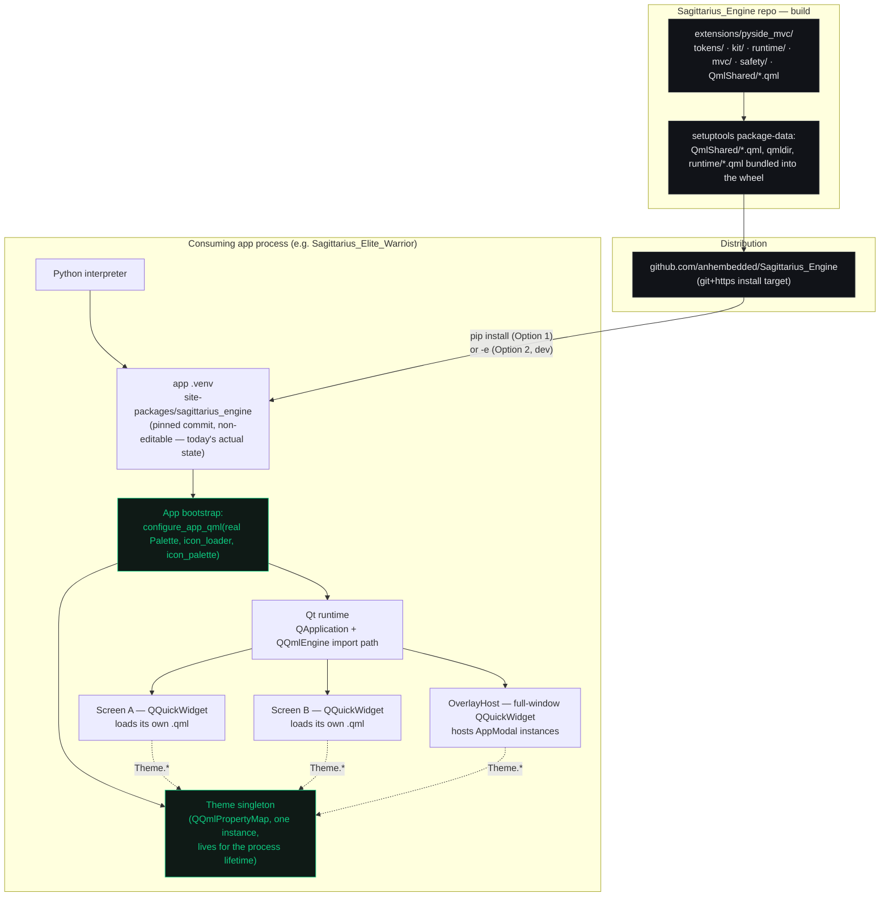

# `pyside_mvc` — Sagittarius UI Engine

An opinionated PySide6 + QML UI framework for applications built on Sagittarius Engine.
Governed by [`.agents/rules/ui-architecture.md`](../../../.agents/rules/ui-architecture.md);
tracked as [`EPIC-001 — UI Engine Foundation`](../../../Tasks/epics/EPIC-001_ui_engine_foundation/README.md).

## Ownership boundary

The extension holds three monopolies. A consuming application holds domain vocabulary and
screen composition, and nothing else.

| Layer | Package | Engine owns | App may |
| --- | --- | --- | --- |
| **Tokens** | `tokens/` | Every visual value: colour, spacing, radius, typography, motion | Supply a palette dict once, at bootstrap, filling the engine's fixed vocabulary |
| **Widget Kit** | `kit/` + `QmlShared/*.qml` | The components that render those tokens | Compose them; derive from a base primitive only through the escape hatch |
| **Runtime** | `runtime/` | Bootstrap/hosting *(built)*: `configure_app_qml()`, `create_quick_widget()`, `QmlHostView`, `OverlayHost`. Regions/slot registry/screen lifecycle *(not yet — `EPIC-001D`)* | Call the bootstrap once; never hand-build layout geometry |

The test for whether this boundary holds: change one token — accent colour, corner radius —
and count how many consumer files must change to stay visually correct. The answer must be
zero.

## Class diagram

```mermaid
classDiagram
    class TokenSpec {
      +str name
      +str category
      +str description
    }
    class MissingRequiredTokensError {
      +tuple missing
    }
    class vocabulary["tokens.vocabulary"] {
      +REQUIRED_COLOUR_TOKENS: tuple~TokenSpec~
      +REQUIRED_COLOUR_TOKEN_NAMES: frozenset
      +missing_required_tokens(palette) list~str~
    }
    class defaults["tokens.defaults"] {
      +DEFAULT_SPACING_TOKENS: dict
      +DEFAULT_RADIUS_TOKENS: dict
      +DEFAULT_TYPOGRAPHY_TOKENS: dict
      +DEFAULT_MOTION_TOKENS: dict
      +with_token_defaults(palette) dict
    }
    class LiteralColorFinding {
      +Path file
      +int line_number
      +str matched
    }
    class qml_literal_guard["tokens.qml_literal_guard"] {
      +find_literal_colors(root, exempt_dirs) list
      +format_findings(findings) str
    }
    class RawPrimitiveFinding {
      +Path file
      +int line_number
      +str control
    }
    class raw_primitive_guard["kit.raw_primitive_guard"] {
      +find_raw_primitives(root, exempt_dirs) list
      +format_findings(findings) str
    }
    class state_tokens["tokens.state_tokens"] {
      +DEFAULT_STATE_TOKENS: dict
      +with_state_token_defaults(palette) dict
    }
    class theme_bridge["tokens.theme_bridge"] {
      -_shared_theme_bridge: QQmlPropertyMap
      +get_theme_bridge(palette) QQmlPropertyMap
      +register_theme(quick_widget, palette)
    }
    class AppQmlConfig {
      +dict ui_palette
      +IIconLoader icon_loader
      +dict icon_palette
    }
    class qml_host_view["runtime.qml_host_view"] {
      -_app_qml_config: AppQmlConfig
      +configure_app_qml(ui_palette, icon_loader, icon_palette)
      +create_quick_widget() QQuickWidget
    }
    class OverlayHost {
      +load_content(source, context_properties)
      +clear_content()
      +overlay_size: tuple
      +is_click_through: bool
    }
    class QmlHostView {
      +QML_DIR: Path
      +set_view_model(vm)
      +load_qml(filename)
      +apply_ui_mode(mode)
    }

    vocabulary ..> TokenSpec : builds
    vocabulary ..> MissingRequiredTokensError : raises
    qml_literal_guard ..> LiteralColorFinding : returns
    raw_primitive_guard ..> RawPrimitiveFinding : returns
    defaults ..> state_tokens : composes
    qml_host_view ..> vocabulary : validates via
    qml_host_view ..> AppQmlConfig : stores
    theme_bridge ..> defaults : merges via
    QmlHostView --> qml_host_view : create_quick_widget()
    OverlayHost --> qml_host_view : create_quick_widget()

    class BaseCard {
      <<Rectangle root>>
      +setActive(active)
      +setDisabled(disabled)
    }
    class LogPanel {
      +string title
      +alias logModel
    }
    class TimeRangeCard {
      +bool useCustomTime
      +string fromDateTime
    }
    class AppDataTable {
      +var columns
      +alias model
      -_weightSum() int
    }
    class AppModal {
      <<Popup root>>
      +string title
      +alias bodyData
      +alias actions
      +real maxWidth
    }
    class StatefulButton {
      <<Button root>>
      +string iconSource
      +bool isActive
    }
    class FieldBackground {
      <<Rectangle root, token-exempt fallback>>
    }
    class StyledCheck {
      <<CheckBox root>>
    }
    class DateTimePicker {
      <<TextField root>>
      +Popup calendarPopup
    }
    class Gallery {
      <<top-level page, not a kit type>>
    }

    BaseCard <|-- LogPanel
    BaseCard <|-- TimeRangeCard
    BaseCard <|-- AppDataTable
    LogPanel ..> StatefulButton : uses (Copy/Clear)
    AppModal ..> StatefulButton : uses (close button)
    Gallery ..> StatefulButton : demos
    Gallery ..> FieldBackground : demos
    Gallery ..> StyledCheck : demos
    Gallery ..> TimeRangeCard : demos
    Gallery ..> LogPanel : demos
    Gallery ..> AppDataTable : demos
    Gallery ..> AppModal : demos
```



## Deployment diagram

How the extension is built, distributed, and what actually runs where at runtime — not
theoretical, this reflects the real install/import path a consuming app goes through today.




## Directory layout

Reorganized 2026-08-22 (post-`EPIC-001C`): every file now sits at the abstraction level it
actually belongs to — `QmlShared/` had accumulated pure-QML widgets *and* Python bootstrap
plumbing side by side, and the top-level directory mixed MVC lifecycle, thread safety, and
QML hosting flat together. Two files (`base_view.py`, `QmlShared/log_list_model.py`) keep a
thin backward-compatibility shim at their old path — the reference consumer imports them
directly at those exact locations, past this extension's top-level re-exports.

```text
extensions/pyside_mvc/
├── tokens/                        Values — EPIC-001B
│   ├── vocabulary.py              Required colour tokens, MissingRequiredTokensError
│   ├── defaults.py                Spacing/radius/typography/motion defaults + merge
│   ├── state_tokens.py            Hover/active/disabled state-token defaults
│   ├── theme_bridge.py            The `Theme` singleton exposed to QML
│   └── qml_literal_guard.py       Anti-literal-colour static check
├── kit/                           Widget Kit — EPIC-001C
│   └── raw_primitive_guard.py     Anti-raw-primitive static check
├── QmlShared/                     The widget kit's QML — components only, no Python
│   ├── qmldir
│   ├── BaseCard.qml               The one base primitive escapes may derive from
│   ├── StatefulButton.qml · FieldBackground.qml · StyledCheck.qml
│   ├── TimeRangeCard.qml · LogPanel.qml · DateTimePicker.qml
│   ├── AppDataTable.qml           Schema-driven table
│   ├── AppModal.qml               Dialog shell (Popup-based)
│   ├── Gallery.qml                Runnable catalog — every component, one page
│   └── log_list_model.py          Compat shim only — real impl moved to runtime/
├── runtime/                       Screen-hosting / bootstrap — seeds EPIC-001D
│   ├── qml_host_view.py           configure_app_qml() / QmlHostView / create_quick_widget()
│   ├── overlay_host.py + OverlayHost.qml   Full-window modal host (BOT-087)
│   ├── icon_image_provider.py     `image://icons/<name>/<tint>` provider
│   ├── qml_style.py               Pins Qt Quick Controls to the customizable style
│   ├── qml_value_normalizer.py    QML → Python value bridge
│   ├── base_view_model.py         `BaseQmlViewModel`
│   └── log_list_model.py          `LogListModel` (real implementation)
├── mvc/                           Presenter/View lifecycle
│   ├── base_presenter.py · base_view.py · presenter_manager.py
├── safety/                        Thread-safety + crash-visibility guardrails
│   ├── thread_affinity.py · thread_bridge.py · ui_action_events.py
│   └── ui_watchdog.py · ui_matrix_mixin.py (legacy, superseded by QmlHostView)
└── base_view.py                   Compat shim only — real impl moved to mvc/
```

## Seeing it: the Gallery

```bash
QT_QPA_PLATFORM=offscreen python scripts/render_gallery_snapshot.py [output.png]
```

Boots the engine offscreen with the reference consumer's real black/gold palette, loads
`QmlShared/Gallery.qml`, and grabs a PNG. Not a test — a way to actually *see* the kit, per
the reasoning in `ui-architecture.md` §6.2: a design system with no way to view everything it
offers in one place isn't verifiable in practice, only on paper.
