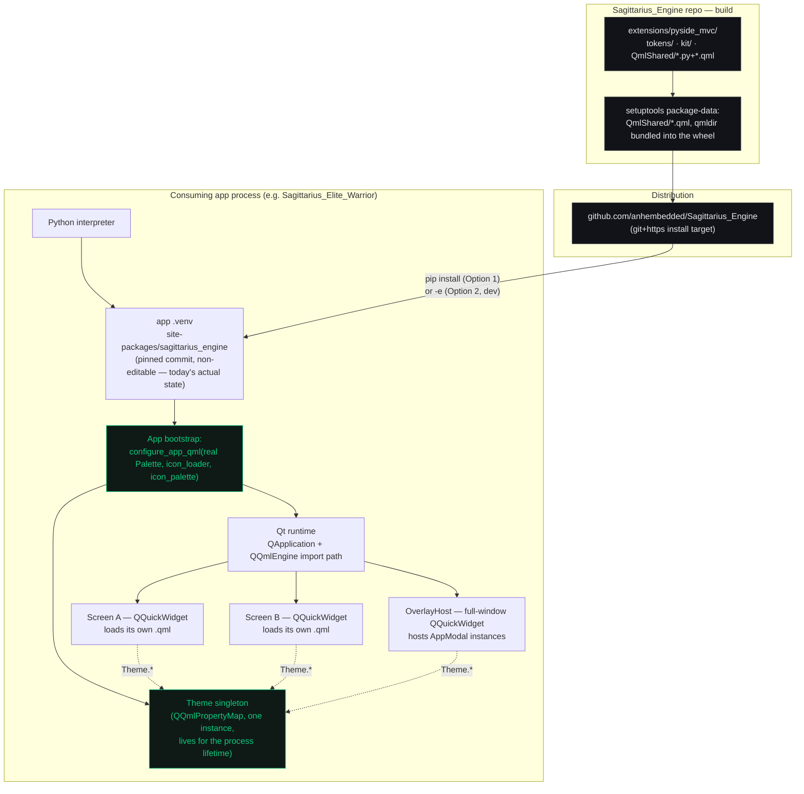

# `pyside_mvc` — Sagittarius UI Engine

An opinionated PySide6 + QML UI framework for applications built on Sagittarius Engine.
Governed by [`.agents/rules/ui-architecture.md`](../../../.agents/rules/ui-architecture.md);
tracked as [`EPIC-001 — UI Engine Foundation`](../../../Tasks/epics/EPIC-001_ui_engine_foundation/README.md).

## Ownership boundary

The extension holds three monopolies. A consuming application holds domain vocabulary and
screen composition, and nothing else.

| Layer | Package | Engine owns | App may |
| --- | --- | --- | --- |
| **Tokens** | `tokens/` | Every visual value: colour, spacing, radius, typography, motion | Supply a palette dict once, at bootstrap, filling the engine's fixed vocabulary |
| **Widget Kit** | `kit/` + `QmlShared/*.qml` | The components that render those tokens | Compose them; derive from a base primitive only through the escape hatch |
| **Runtime** | *(not yet built — `EPIC-001D`)* | Shell, regions, navigation, screen lifecycle | Declare contributions; never hand-build layout geometry |

The test for whether this boundary holds: change one token — accent colour, corner radius —
and count how many consumer files must change to stay visually correct. The answer must be
zero.

## Status

| Subtask | Delivers | State |
| --- | --- | --- |
| `EPIC-001A` | This governance doc | ✅ Done |
| `EPIC-001B` | `tokens/` — fixed vocabulary, bootstrap validation, anti-literal-colour guard | ✅ Done |
| `EPIC-001C` | `kit/` + `AppDataTable`/`AppModal` — anti-raw-primitive guard, gallery | 🟡 Substantially done — see task file for the exact remainder |
| `EPIC-001D` | Runtime shell, slot registry, screen lifecycle contract | 🔴 Not started |

## Class diagram

```mermaid
classDiagram
    class TokenSpec {
      +str name
      +str category
      +str description
    }
    class MissingRequiredTokensError {
      +tuple missing
    }
    class vocabulary["tokens.vocabulary"] {
      +REQUIRED_COLOUR_TOKENS: tuple~TokenSpec~
      +REQUIRED_COLOUR_TOKEN_NAMES: frozenset
      +missing_required_tokens(palette) list~str~
    }
    class defaults["tokens.defaults"] {
      +DEFAULT_SPACING_TOKENS: dict
      +DEFAULT_RADIUS_TOKENS: dict
      +DEFAULT_TYPOGRAPHY_TOKENS: dict
      +DEFAULT_MOTION_TOKENS: dict
      +with_token_defaults(palette) dict
    }
    class LiteralColorFinding {
      +Path file
      +int line_number
      +str matched
    }
    class qml_literal_guard["tokens.qml_literal_guard"] {
      +find_literal_colors(root, exempt_dirs) list
      +format_findings(findings) str
    }
    class RawPrimitiveFinding {
      +Path file
      +int line_number
      +str control
    }
    class raw_primitive_guard["kit.raw_primitive_guard"] {
      +find_raw_primitives(root, exempt_dirs) list
      +format_findings(findings) str
    }
    class state_tokens["QmlShared.state_tokens"] {
      +DEFAULT_STATE_TOKENS: dict
      +with_state_token_defaults(palette) dict
    }
    class theme_bridge["QmlShared.theme_bridge"] {
      -_shared_theme_bridge: QQmlPropertyMap
      +get_theme_bridge(palette) QQmlPropertyMap
      +register_theme(quick_widget, palette)
    }
    class AppQmlConfig {
      +dict ui_palette
      +IIconLoader icon_loader
      +dict icon_palette
    }
    class qml_host_view["QmlShared.qml_host_view"] {
      -_app_qml_config: AppQmlConfig
      +configure_app_qml(ui_palette, icon_loader, icon_palette)
      +create_quick_widget() QQuickWidget
    }
    class OverlayHost {
      +load_content(source, context_properties)
      +clear_content()
      +overlay_size: tuple
      +is_click_through: bool
    }
    class QmlHostView {
      +QML_DIR: Path
      +set_view_model(vm)
      +load_qml(filename)
      +apply_ui_mode(mode)
    }

    vocabulary ..> TokenSpec : builds
    vocabulary ..> MissingRequiredTokensError : raises
    qml_literal_guard ..> LiteralColorFinding : returns
    raw_primitive_guard ..> RawPrimitiveFinding : returns
    defaults ..> state_tokens : composes
    qml_host_view ..> vocabulary : validates via
    qml_host_view ..> AppQmlConfig : stores
    theme_bridge ..> defaults : merges via
    QmlHostView --> qml_host_view : create_quick_widget()
    OverlayHost --> qml_host_view : create_quick_widget()

    class BaseCard {
      <<Rectangle root>>
      +setActive(active)
      +setDisabled(disabled)
    }
    class LogPanel {
      +string title
      +alias logModel
    }
    class TimeRangeCard {
      +bool useCustomTime
      +string fromDateTime
    }
    class AppDataTable {
      +var columns
      +alias model
      -_weightSum() int
    }
    class AppModal {
      <<Popup root>>
      +string title
      +alias bodyData
      +alias actions
      +real maxWidth
    }
    class StatefulButton {
      <<Button root>>
      +string iconSource
      +bool isActive
    }
    class FieldBackground {
      <<Rectangle root, token-exempt fallback>>
    }
    class StyledCheck {
      <<CheckBox root>>
    }
    class DateTimePicker {
      <<TextField root>>
      +Popup calendarPopup
    }
    class Gallery {
      <<top-level page, not a kit type>>
    }

    BaseCard <|-- LogPanel
    BaseCard <|-- TimeRangeCard
    BaseCard <|-- AppDataTable
    LogPanel ..> StatefulButton : uses (Copy/Clear)
    AppModal ..> StatefulButton : uses (close button)
    Gallery ..> StatefulButton : demos
    Gallery ..> FieldBackground : demos
    Gallery ..> StyledCheck : demos
    Gallery ..> TimeRangeCard : demos
    Gallery ..> LogPanel : demos
    Gallery ..> AppDataTable : demos
    Gallery ..> AppModal : demos
```



## Deployment diagram

How the extension is built, distributed, and what actually runs where at runtime — not
theoretical, this reflects the real install/import path a consuming app goes through today.



**Operational note carried over from `EPIC-001A`**: the reference consumer currently installs
this engine **non-editable, pinned to a commit** (`install-rule.md` Option 1). Every commit
merged here needs a push-and-reinstall cycle before the app sees it; switching to Option 2
(editable local install) during active UI Engine development removes that lag.

## Directory layout

```text
extensions/pyside_mvc/
├── tokens/                      Design-token vocabulary + guards (EPIC-001B)
│   ├── vocabulary.py            Required colour tokens, MissingRequiredTokensError
│   ├── defaults.py              Spacing/radius/typography/motion defaults + merge
│   └── qml_literal_guard.py     Anti-literal-colour static check
├── kit/                         Widget Kit Python tooling (EPIC-001C)
│   └── raw_primitive_guard.py   Anti-raw-primitive static check
├── QmlShared/                   The widget kit itself — QML components + bootstrap glue
│   ├── BaseCard.qml             The one base primitive escapes may derive from
│   ├── StatefulButton.qml · FieldBackground.qml · StyledCheck.qml
│   ├── TimeRangeCard.qml · LogPanel.qml · DateTimePicker.qml
│   ├── AppDataTable.qml         Schema-driven table
│   ├── AppModal.qml             Dialog shell (Popup-based)
│   ├── Gallery.qml              Runnable catalog — every component, one page
│   ├── theme_bridge.py          Theme singleton exposed to QML
│   ├── qml_host_view.py         configure_app_qml() / QmlHostView / create_quick_widget()
│   └── overlay_host.py          Full-window modal host (BOT-087)
├── base_presenter.py · base_view.py · presenter_manager.py
├── thread_affinity.py · thread_bridge.py · ui_watchdog.py
└── ui_matrix_mixin.py
```

## Seeing it: the Gallery

```bash
QT_QPA_PLATFORM=offscreen python scripts/render_gallery_snapshot.py [output.png]
```

Boots the engine offscreen with the reference consumer's real black/gold palette, loads
`QmlShared/Gallery.qml`, and grabs a PNG. Not a test — a way to actually *see* the kit, per
the reasoning in `ui-architecture.md` §6.2: a design system with no way to view everything it
offers in one place isn't verifiable in practice, only on paper.
